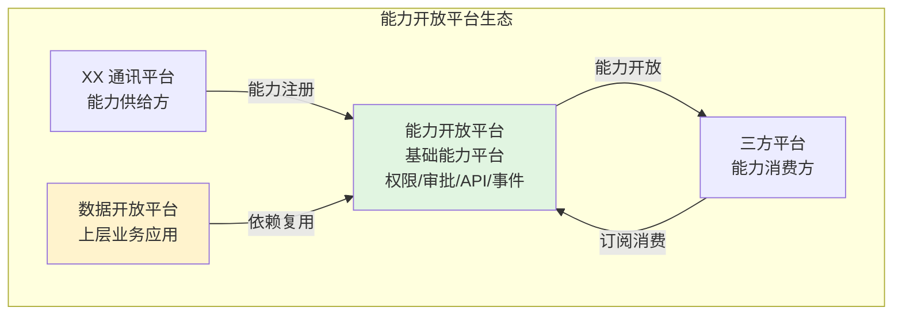
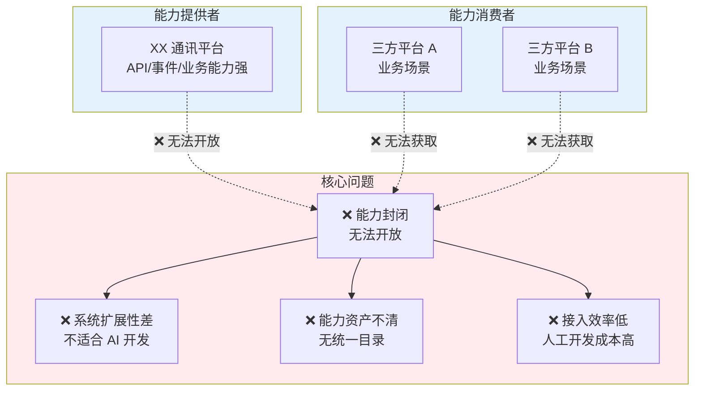
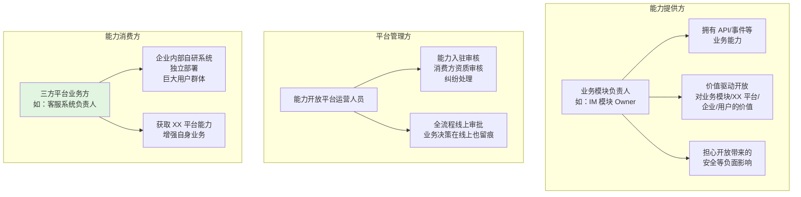
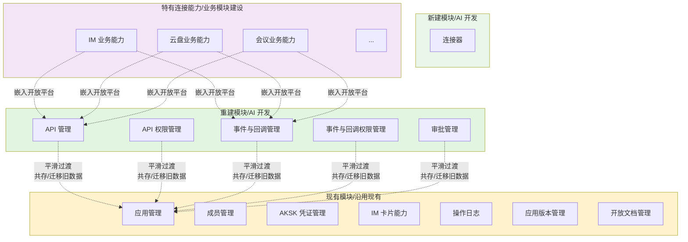
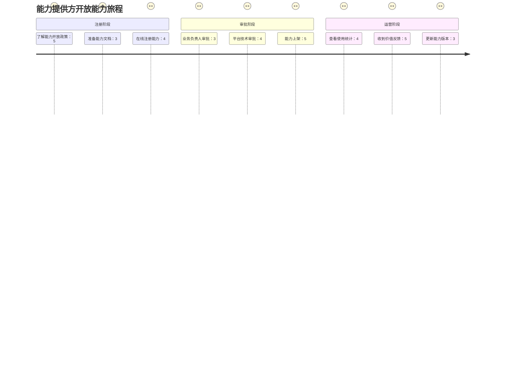
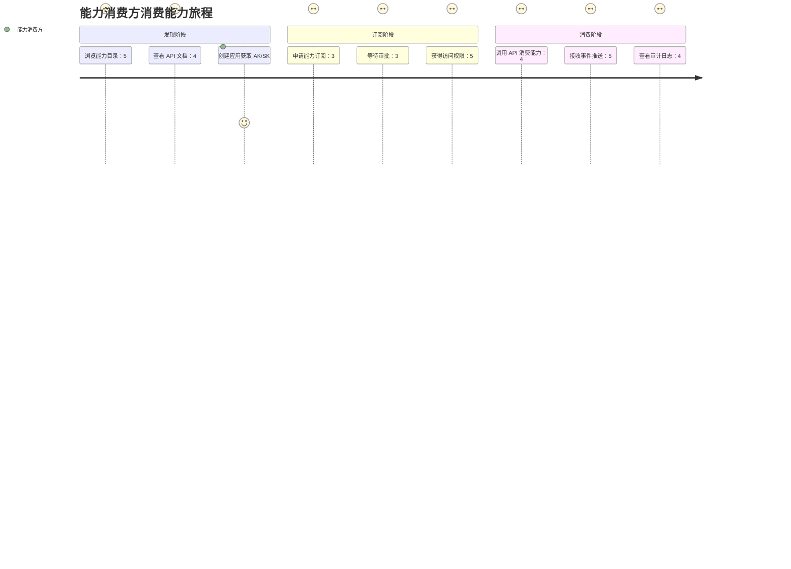
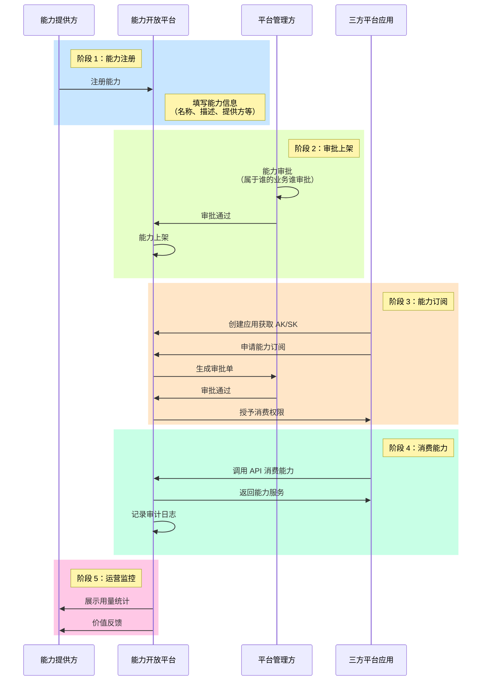
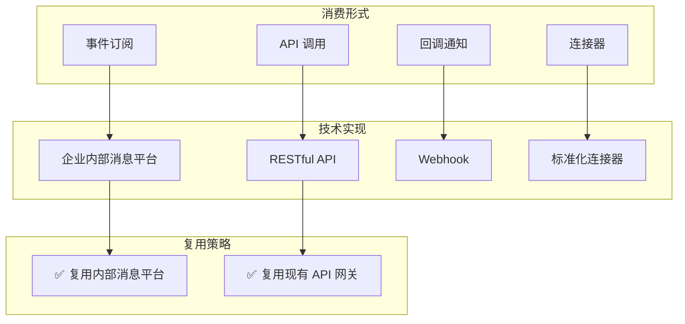
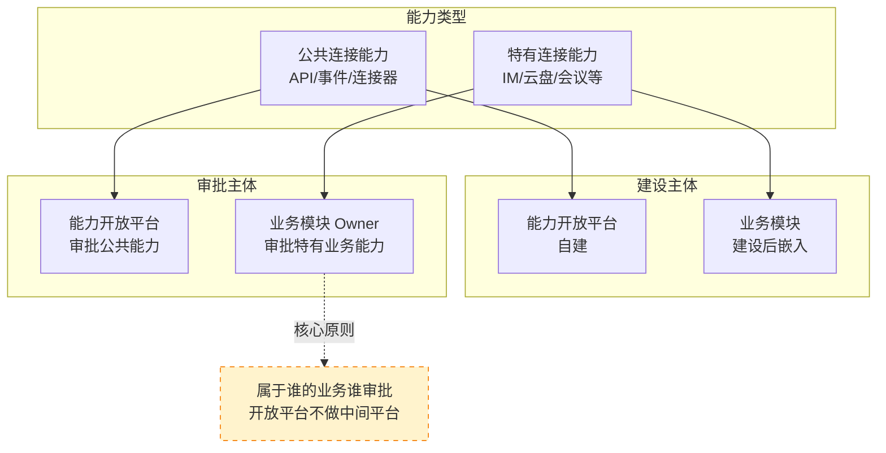
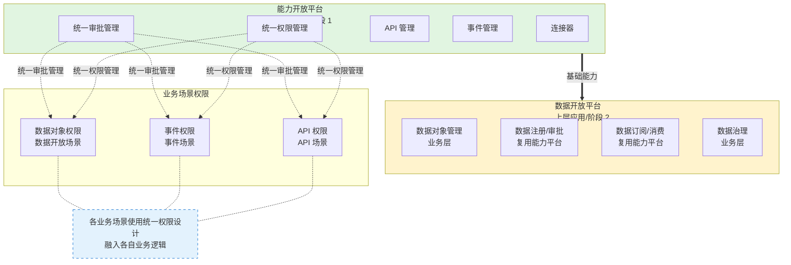

# 需求挖掘报告：能力开放平台

**报告 ID**: DISCOVERY-CAPABILITY-001  
**创建时间**: 2026-04-13  
**最后更新**: 2026-04-13  
**阶段**: 0.discovery（需求挖掘）  
**状态**: ✅ 已完成  
**会话 ID**: capability-session-001

---

## 一、执行摘要

### 1.1 核心定位

**能力开放平台**是 open-app 体系下的基础能力平台，聚焦 XX 通讯平台的能力开放管理，提供统一的能力管理框架（API、事件、回调、连接器等）和基础设施（权限管理、审批管理等），供数据开放平台等上层应用复用，构建完整的企业内部能力生态。



> 💡 **关键定位**：能力开放平台是基础设施，数据开放平台等上层应用依赖能力开放平台的能力（API/事件通道、权限管理、审批管理等）

### 1.2 核心问题

| 维度 | 描述 |
|------|------|
| **核心痛点** | 能力封闭且分散：XX 平台的能力无法被有效开放，现有系统扩展性差，不适合 AI 开发迭代 |
| **现状** | AI 时代下，XX 平台有大量能力亟需开放，但现有系统难以支撑快速构建和扩展 |
| **目标** | 生态开放：构建统一的能力开放平台，让三方平台能利用 XX 平台能力开展业务 |
| **价值主张** | 提供标准统一的能力开放通道，减少人工开发工作量，利用 AI 快速构建，快速赋能业务 |

### 1.3 目标用户

| 角色 | 职责 | 诉求 |
|------|------|------|
| **能力提供方** | 业务模块负责人（如 IM 模块 Owner） | 注册能力、生产能力强；通过开放能力实现业务价值 |
| **能力管理方** | 平台运营人员 | 审批能力注册信息；确保能力符合平台规范 |
| **能力消费方** | 企业内部自研系统负责人 | 订阅能力、消费能力；利用 XX 平台能力增强自身业务 |

> 💡 **核心用户**：能力消费方（设计以消费方体验为中心）

---

## 二、问题空间分析

### 2.1 现状痛点



| 痛点维度 | 具体描述 |
|---------|---------|
| **能力封闭** | XX 平台的能力多数局限在平台内部使用，外部无法获取 |
| **系统扩展性差** | 现有开放平台系统存在扩展性问题，不适合基于此增加其他能力开放 |
| **能力资产不清** | 没有统一的能力目录，三方平台不知道有哪些能力可用 |
| **接入效率低** | 没有统一的能力开放平台，三方平台接入能力成本高，人工开发工作量大 |

### 2.2 业务驱动

| 驱动因素 | 说明 |
|---------|------|
| **AI 时代战略** | AI 大行其道，XX 平台需要快速开放能力给三方平台，构建完整生态 |
| **能力开放迫在眉睫** | 开放平台要开放哪些能力、怎么开放是重中之重 |
| **减少人工开发** | 利用 AI 能力快速构建，达到快速赋能业务的最终目标 |
| **避免历史债** | 不在现有代码基础上继续增加历史债，相对独立的能力用 AI 完整构建 |
| **AI 开发可行性** | ✅ 已有其它产品成功使用 AI 开发上线的先例，无需预研，直接实施 |

### 2.3 不做会怎样

| 影响维度 | 后果 |
|---------|------|
| **业务影响** | 三方平台无法利用 XX 平台能力开展新业务，生态建设受阻 |
| **效率影响** | 能力对接继续依赖人工开发，效率低、成本高 |
| **技术影响** | 在历史债上继续增加历史债，系统维护成本持续上升 |
| **竞争影响** | 相比飞书/钉钉等竞品，企业通讯平台能力开放程度落后 |

---

## 三、用户画像与场景

### 3.1 用户画像



> 💡 **核心用户**：能力消费方（三方平台业务方），设计以消费方体验为中心

### 3.2 能力分类模型



| 能力大类 | 能力子类 | 建设策略 | 开发方式 | 与现有关系 |
|---------|---------|---------|---------|-----------|
| **平台本身能力** | 应用管理 | 沿用现有 | 复用 | - |
| | 成员管理 | 沿用现有 | 复用 | - |
| | 操作日志 | 沿用现有 | 复用 | - |
| | AKSK 凭证管理 | 沿用现有 | 复用 | - |
| | IM 卡片能力 | 沿用现有 | 复用 | - |
| | 应用版本管理 | 沿用现有 | 复用 | - |
| | 开放文档管理 | 沿用现有 | 复用 | - |
| **公共连接能力** | API 管理 | 重新构建 | AI 开发 | 平滑过渡，共存/迁移旧数据 |
| | API 权限管理 | 重新构建 | AI 开发 | 平滑过渡，共存/迁移旧数据 |
| | 事件与回调管理 | 重新构建 | AI 开发 | 平滑过渡，共存/迁移旧数据 |
| | 事件与回调权限管理 | 重新构建 | AI 开发 | 平滑过渡，共存/迁移旧数据 |
| | 审批管理 | 重新构建 | AI 开发 | 平滑过渡，共存/迁移旧数据 |
| | 连接器 | 完全新建 | AI 开发 | 无历史数据 |
| **特有连接能力** | IM/云盘/会议等业务能力 | 业务模块建设 | 按需 | 嵌入开放平台，复用公共能力 |

> 💡 **XX 通讯平台开放平台现有能力清单**（11 项）：
> - **沿用现有（7 项）**：应用管理、成员管理、AKSK 凭证管理、IM 卡片能力、操作日志、应用版本管理、开放文档管理
> - **重新构建（5 项）**：API 管理、API 权限管理、事件与回调管理、事件与回调权限管理、审批管理
>
> 🔄 **重新构建说明**：不是直接丢弃现有模块，而是 AI 开发新模块后，通过平滑过渡（共存/迁移旧数据）逐步替代现有功能

### 3.3 典型场景

| 场景编号 | 场景名称 | 描述 |
|---------|---------|------|
| **S1** | IM 模块开放 API | IM 模块责任人注册 IM 的 API 能力，经过审批后开放给客服系统使用 |
| **S2** | 云盘模块开放能力 | 云盘模块责任人开放云盘文件 FTP/云盘自定义能力通道，供三方平台消费 |
| **S3** | 三方平台订阅 API | 客服系统浏览能力目录，订阅 IM API 能力，用于客服会话集成 |
| **S4** | AI 应用消费能力 | AI 助手应用通过标准 API 获取日程、会议能力，用于智能问答和推荐 |

### 3.4 用户旅程地图





---

## 四、需求分层与优先级

### 4.1 需求分层


### 4.2 需求清单

#### Must Have（必备）

| 需求编号 | 需求描述 | 验收标准 |
|---------|---------|---------|
| **MH-01** | 能力提供方能够注册能力 | 支持填写能力信息（名称、描述、提供方、版本等） |
| **MH-02** | 平台管理方能够审批能力 | 支持审批通过/驳回，记录审批意见 |
| **MH-03** | 能力消费方能够创建应用 | 创建应用后获取 AK/SK |
| **MH-04** | 能力消费方能够申请能力订阅 | 申请能力权限，后台生成审批单 |
| **MH-05** | 能力消费方能够通过 API 消费能力 | 使用 AK/SK 调用 API 获取能力服务 |
| **MH-06** | 支持事件订阅形式 | 能力变更时推送给订阅方 |
| **MH-07** | 权限控制 | 能力访问需有对应权限 |
| **MH-08** | 审批流程 | 属于谁的业务都由谁去审，全流程线上审批 |

#### Should Have（期望）

| 需求编号 | 需求描述 | 验收标准 |
|---------|---------|---------|
| **SH-01** | 能力目录/市场 | 浏览可订阅的能力列表，支持搜索和分类 |
| **SH-02** | 能力分类管理 | 支持平台本身能力、公共连接能力、特有连接能力分类 |
| **SH-03** | 我的权限清单 | 应用可查看已拥有的能力权限列表 |
| **SH-04** | 用量统计 | 展示能力被调用的次数、调用方等 |
| **SH-05** | 能力资产清单 | 统一的能力目录和元数据管理 |
| **SH-06** | 能力文档 | 提供能力使用说明、API 文档、示例代码 |
| **SH-07** | 场景分类目录 | 按业务场景分类展示能力（如：HR 场景、客服场景、AI 场景） |
| **SH-08** | 技术咨询支持 | 快速响应、专业解答，有专门支持人员 |

#### Could Have（惊喜）

| 需求编号 | 需求描述 | 验收标准 |
|---------|---------|---------|
| **CH-01** | 能力价值可视化 | 能力提供方能看到开放能力带来的业务价值 |
| **CH-02** | 自动化接入 | 支持配置化的能力接入，减少人工开发 |
| **CH-03** | 开发者门户 | 提供开发者文档、SDK 下载、示例代码 |
| **CH-04** | 多消费形式支持 | 支持 API、事件、连接器等多种消费形式 |

---

## 五、核心流程设计

### 5.1 能力开放消费全流程

从平台视角展示能力从注册到消费的完整流程，涉及能力提供方、平台管理方、能力消费方三角色。



### 5.2 能力消费形式



**消费形式说明**：
| 形式 | 说明 | 技术实现 |
|------|------|---------|
| API 调用 | 消费方主动调用 | RESTful API，复用现有 API 网关 |
| 事件订阅 | 能力变更实时推送 | 企业内部消息平台 |
| 回调通知 | 异步回调 | Webhook |
| 连接器 | 标准化集成 | 标准化连接器 |

### 5.3 能力归属与治理



| 维度 | 设计决策 |
|------|---------|
| **审批原则** | 不论公共能力、特有能力，属于谁的业务都由谁去审 |
| **平台定位** | 开放平台不做中间平台，避免多重依赖 |
| **特有能力嵌入** | 业务模块建设后嵌入开放平台统一管理 |
| **审批流程** | 全流程线上审批，留痕可追溯 |

### 5.4 与数据开放平台的关系



| 维度 | 关系说明 |
|------|---------|
| **定位** | 能力开放平台是基础设施，数据开放平台是上层业务应用 |
| **依赖关系** | 数据开放平台依赖能力开放平台的能力（API/事件通道、权限管理、审批管理等） |
| **建设顺序** | 能力开放平台先构建（阶段 1），数据开放平台后构建（阶段 2） |
| **权限模型** | 能力开放平台构建统一权限管理，数据开放平台将数据对象关联到权限后复用统一权限管理和审批管理 |
| **迁移策略** | 不存在迁移，两者长期并存 |
| **部署** | 按需做独立部署 |

> 💡 **关键理解**：数据开放平台是能力开放平台的"消费方"，而非"超集"。能力开放平台提供通用的能力管理框架，数据开放平台是上层业务应用，依赖能力开放平台的基础能力。

---

## 六、竞品对标

### 6.1 飞书/钉钉对标分析

| 对标维度 | 飞书做法 | 钉钉做法 | 我们的借鉴 |
|---------|---------|---------|-----------|
| **能力目录** | API 文档中心，分类清晰 | API 文档中心，分类清晰 | ✅ 在现有 API 中心基础上增强 |
| **能力注册** | 开发者提交 API 申请 | ISV 提交应用审核 | ✅ 能力提供方在线注册 |
| **审批机制** | 平台审核 + 管理员授权 | 平台审核 + 管理员授权 | ✅ 全流程线上审批，属于谁的业务谁审批 |
| **开放形式** | API + 事件订阅 + Webhook + 连接器 | API + 事件订阅 + Webhook + 连接器 | ✅ 支持多种形式 |
| **开发者体验** | 文档完善、SDK 支持好 | 文档完善、生态成熟 | ✅ 复用现有文档中心，增强 SDK |
| **低代码** | 飞书 aPaaS + 多维表格 | 宜搭（1000 万 + 应用） | ✅ 参考连接器设计 |

### 6.2 能力类型参考

参考飞书/钉钉的能力开放实践，能力可分为：

| 能力大类 | 典型能力 | 参考 |
|---------|---------|------|
| **基础能力** | 应用管理、成员管理、权限管理 | 飞书/钉钉基础 API |
| **消息能力** | 消息发送、群管理、回调通知 | 飞书消息 API、钉钉消息推送 |
| **协作能力** | 日历、会议、文档、云盘 | 飞书日历/会议/云文档、钉钉日程/钉盘 |
| **AI 能力** | 智能问答、智能推荐、自动化 | 飞书 Aily、钉钉 AI 智能体 |
| **连接器** | 第三方系统集成、数据同步 | 飞书 AnyCross、钉钉连接器 |

---

## 七、成功标准

**核心目标**: 
1. ✅ **能力成功被企业内部三方平台使用** - 有能力被开放，有消费方在使用
2. ✅ **能力使用很便捷** - 三方平台接入能力简单、快速
3. ✅ **能力使用流程安全可控合规** - 全流程线上审批、留痕可追溯、安全合规

### 7.1 定性指标

| 维度 | 成功标准 | 对应核心目标 |
|------|---------|-------------|
| **能力开放** | 有能力提供方愿意开放能力，能力成功上架 | 能力成功被使用 |
| **能力消费** | 有消费方订阅并使用开放的能力 | 能力成功被使用 |
| **接入效率** | 三方平台接入能力的时间显著降低，流程简单 | 能力使用很便捷 |
| **用户体验** | 能力提供方觉得开放方便，消费方觉得获取容易 | 能力使用很便捷 |
| **安全合规** | 全流程线上审批、留痕可追溯、符合企业合规要求 | 安全可控合规 |
| **风险控制** | 能力使用安全可控，无安全事件 | 安全可控合规 |

### 7.2 定量指标（系统提供度量能力）

| 指标类型 | 具体的指标 | 对应核心目标 |
|---------|-----------|-------------|
| **规模指标** | 开放的能力数量、能力类型数量 | 能力成功被使用 |
| **接入规模** | 订阅能力的三方平台数量、应用数量 | 能力成功被使用 |
| **活跃指标** | 每天/每月 API 调用量、事件订阅量 | 能力成功被使用 |
| **效率指标** | 三方平台接入能力的时间（从 X 天降低到 Y 天） | 能力使用很便捷 |
| **审批效率** | 审批平均时长、审批通过率 | 能力使用很便捷 |
| **治理指标** | 经过审批的能力开放比例（目标 100%） | 安全可控合规 |
| **安全指标** | 审计日志完整率、权限违规次数（目标 0） | 安全可控合规 |
| **价值评估指标** | API 调用量统计、能力使用频次、定期价值报告 | 能力成功被使用 |

> ⚠️ **注意**: 具体目标值取决于业务运营推广的投入力度，系统首先需要具备度量能力。

---

## 八、风险与假设

### 8.1 关键假设

| 假设 | 风险等级 | 验证方式/状态 |
|------|---------|---------|
| 能力提供方有开放能力的意愿 | 中 | 试点项目验证 |
| 企业内部三方平台有使用 XX 平台能力的需求 | 低 | 已有私下对接案例 |
| AI 开发可以满足质量和效率要求 | 低 | ✅ 已有其它产品成功使用 AI 开发上线的先例，无需预研 |
| 业务模块接受"属于谁的业务谁审批"原则 | 低 | 与业务方沟通确认 |

### 8.2 潜在风险

| 风险 | 影响 | 缓解措施 |
|------|------|---------|
| 能力提供方担心能力开放后的责任问题 | 高 | 提供完善的权限控制和审计日志 |
| 能力归属边界模糊导致管理混乱 | 中 | 明确"属于谁的业务谁审批"原则，开放平台不做中间平台 |
| AI 开发质量不稳定 | 低 | ✅ 已有其它产品成功案例，建立 AI 开发质量标准和审查机制即可 |
| 与现有系统集成复杂度高 | 中 | 分阶段实施，优先核心能力，明确集成边界，详细设计后置 |
| 平滑过渡挑战 | 中 | 重建模块需具备共存/迁移旧代码系统业务数据的能力，设计好与现有模块的对接 |

---

## 九、下一步建议

### 9.1 进入规范编写阶段

运行 `@sdd-spec 能力开放平台` 进入规范编写阶段，产出：
- 产品需求文档（PRD）
- 用户故事地图
- 详细功能规格
- 技术架构设计

### 9.2 并行业务调研

**能力清单梳理**（✅ 已完成）：
XX 通讯平台开放平台现有能力清单如下：

| 能力名称 | 建设策略 |
|---------|---------|
| 应用管理 | 沿用现有 |
| AKSK 凭证管理 | 沿用现有 |
| IM 卡片能力 | 沿用现有 |
| API 管理 | 重新构建（AI 开发） |
| API 权限管理 | 重新构建（AI 开发） |
| 事件与回调 | 重新构建（AI 开发） |
| 事件与回调权限管理 | 重新构建（AI 开发） |
| 操作日志 | 沿用现有 |
| 应用版本管理 | 沿用现有 |
| 审批管理 | 重新构建（AI 开发） |
| 开放文档管理 | 沿用现有 |

**提供方/消费方访谈**（⏳ 未来处理）：
- 暂缓安排，未来根据业务需要再进行

### 9.3 技术预研

**技术策略**（✅ 已确认）：

| 事项 | 策略 |
|------|------|
| **AI 开发** | 无需预研，已有其它产品成功使用 AI 开发上线的先例，直接实施 |
| **系统集成** | 需求挖掘阶段明确边界，详细设计后置到设计阶段 |
| **能力元数据** | 前期弱化，核心是将能力开放本身逻辑搭建起来 |
| **外部依赖** | 复用现有系统（内部消息平台、API 网关等），不重复搭建 |

**建设边界**：
- **现有模块**（沿用现有代码）：应用管理、成员管理、AKSK 凭证管理、IM 卡片能力、操作日志、应用版本管理、开放文档管理
- **重建模块**（AI 开发，需共存/迁移旧数据）：API 管理、事件/回调管理、权限管理、审批管理
- **外部依赖**（复用现有系统）：企业内部消息平台、API 网关、其他非开放平台系统

**关键设计点**：
- 设计好与现有模块（应用管理、成员管理等）的对接
- 处理与现有人工开发模块（API 管理等）的关系，实现平滑过渡
- 重建模块需具备共存/迁移旧代码系统业务数据的能力

### 9.4 与数据开放平台的协同

**平台关系**（✅ 已确认）：

| 维度 | 关系说明 |
|------|---------|
| **依赖关系** | 数据开放平台依赖能力开放平台的能力（API/事件通道等） |
| **建设顺序** | 能力开放平台先构建，数据开放平台后构建，先后依赖关系 |
| **迁移策略** | 不存在迁移，两者长期并存 |

**权限模型设计原则**：
- **能力开放平台**：构建统一的权限管理，适配不局限于 API、事件、数据等类型的权限管理
- **数据开放平台**：将数据对象关联到权限后，后续流程（审批、审计等）交给统一权限管理
- **复用关系**：各业务场景（API、事件、数据等）使用统一权限设计，将各自场景的业务逻辑设计进去

**架构关系**：
```
能力开放平台（基础）
├── 统一权限管理 ←────────────┐
├── 统一审批管理 ←──┐         │
├── API 管理        │         │
└── 事件/回调管理   │         │
                    │         │
        ┌───────────┘         │
        ↓                     ↓
┌───────────────┐   ┌─────────────────┐
│ API 权限      │   │ 数据对象权限    │
│ (API 场景)    │   │ (数据开放场景)  │
└───────────────┘   └─────────────────┘
        ↓                     ↓
    各业务场景使用统一权限设计，融入各自业务逻辑
```

---

## 附录

### A. 会话记录

完整对话记录见：`.sdd/specs-tree-root/specs-tree-capability-open-platform/discovery-session-log.md`

### B. 分析笔记

分析总结见：`.sdd/specs-tree-root/specs-tree-capability-open-platform/discovery-analysis.md`

### C. 参考资料

- 数据开放平台需求挖掘报告
- 飞书开放平台文档
- 钉钉开放平台文档
- open-app 业务架构文档
- 代码仓库：https://github.com/give-my-dreams/OpenPlatform

---

**报告状态**: ✅ 需求挖掘完成  
**下一步**: 运行 `@sdd-spec 能力开放平台` 开始规范编写

---

## 修订记录

| 版本 | 日期 | 修订内容 | 修订人 |
|------|------|---------|--------|
| v1.0 | 2026-04-13 | 初始版本 - 完成需求挖掘报告 | AI Assistant |
| v1.1 | 2026-04-13 | 更新第 9 章：并行业务调研（9.2）、技术预研（9.3）、与数据开放平台协同（9.4），基于用户逐项确认 | AI Assistant |
| v1.2 | 2026-04-13 | 全文审查与修正：<br>- 1.1 核心定位：明确能力开放平台是基础设施，数据开放平台是上层应用<br>- 2.2 业务驱动：补充 AI 开发可行性（无需预研）<br>- 3.2 能力分类：补充现有能力清单（11 项）<br>- 5.4 与数据开放平台关系：纠正为"依赖关系"而非"超集"，补充权限模型设计原则<br>- 8.1 关键假设：AI 开发风险降级为低（已有成功案例）<br>- 8.2 潜在风险：AI 开发风险降级，新增平滑过渡挑战 | AI Assistant |

---

**最后更新**: 2026-04-13（能力开放平台需求挖掘完成，第 9 章已确认，全文审查修正完成）
