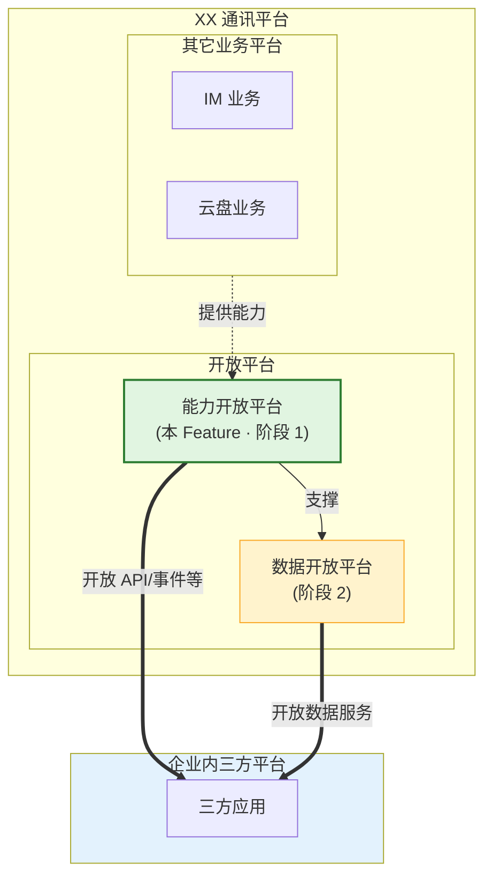
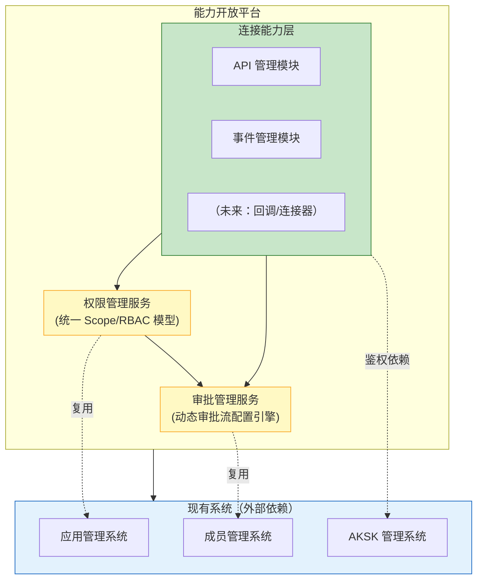
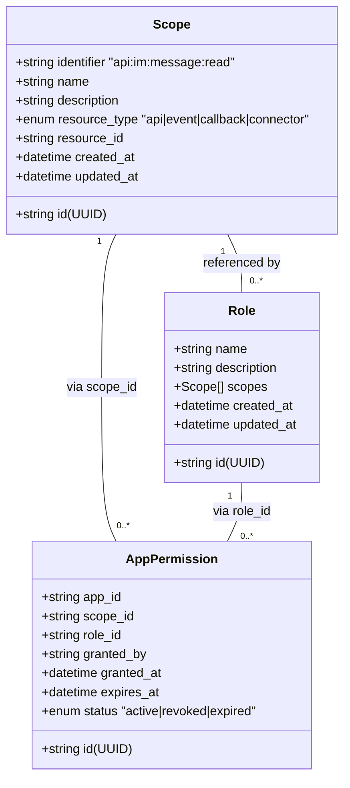
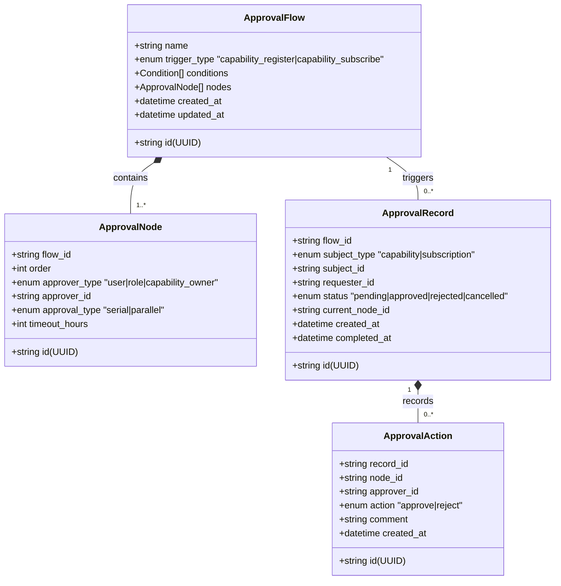
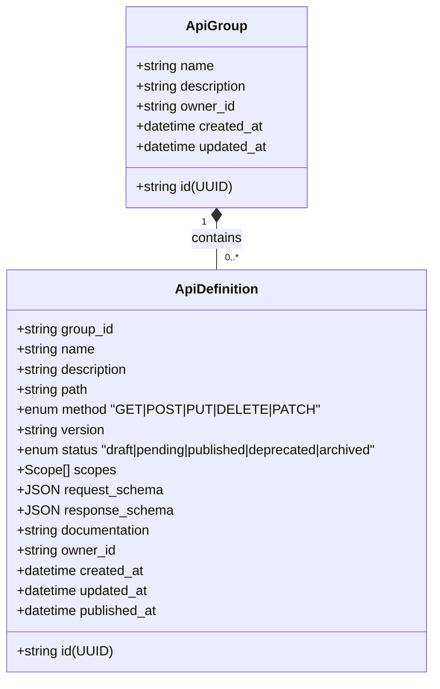
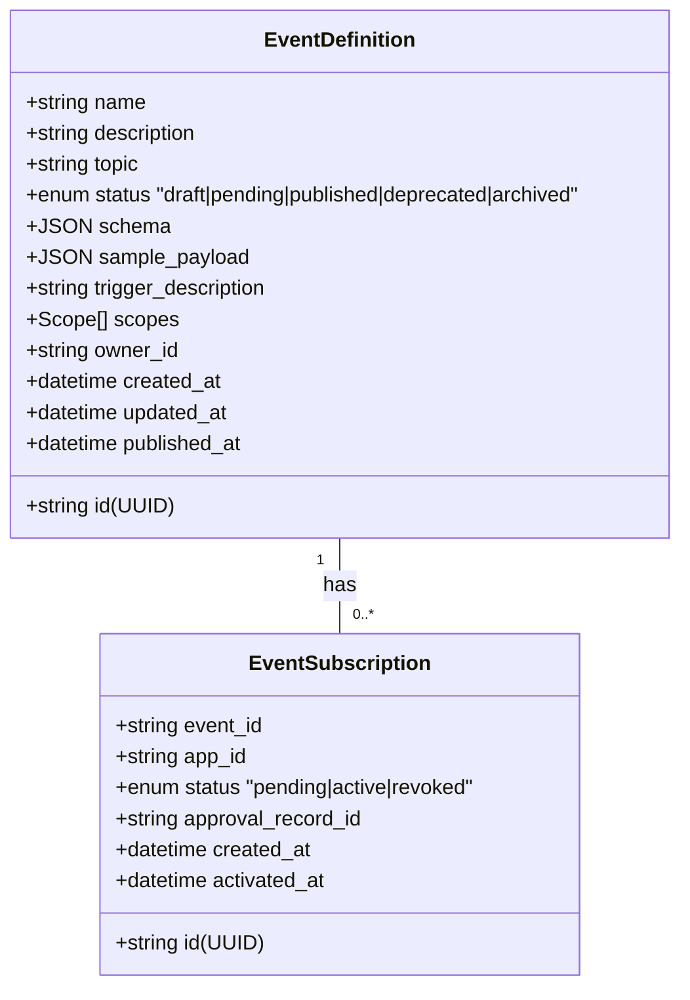

# 规范文档：能力开放平台

**Feature ID**: CAP-OPEN-001  
**名称**: 能力开放平台（Capability Open Platform）  
**状态**: specified  
**优先级**: P0  
**作者**: Summer  
**创建日期**: 2026-04-14  
**最后更新**: 2026-04-14  
**需求挖掘报告**: discovery-report.md (v2.0)

---

## 1. 概述

### 1.1 问题陈述

XX 通讯平台内部拥有丰富的业务能力（IM、云盘、邮件等），但缺乏统一的开放载体，导致：
- 能力封闭在平台内部，企业内三方平台无法获取
- 没有统一的能力目录，消费方不知道有哪些能力可用
- 能力对接依赖人工开发，效率低、成本高
- 在历史代码基础上继续迭代会增加技术债务

### 1.2 解决方案

构建**能力开放平台**作为统一的能力开放底座，提供：
- **统一的能力管理框架**：API、事件、回调、连接器的注册与治理
- **统一的基础设施**：权限管理、审批管理、嵌入能力
- **标准化的开放流程**：能力提供方注册 → 审批上架 → 消费方订阅 → 权限消费

### 1.3 定位



> 💡 **说明**：能力开放平台和数据开放平台**均面向企业内三方平台**开放能力，区别在于开放的内容类型不同（API/事件 vs 数据服务）。能力开放平台同时为数据开放平台提供底层支撑。

### 1.4 Goals

> 📐 **本章写作标准**
> - **视角**：业务目标（回答"这个 Feature 要达成什么业务目的"）
> - **粒度**：一句话 + 关键词覆盖能力边界
> - **不写什么**：不展开具体功能、不写用户角色、不写字段细节
> - **读者**：决策者/PM，快速了解 Feature 范围
>
> | 维度 | 写法 | 本 spec 示例 |
> |------|------|-------------|
> | ✅ 正确 | 关键词列举能力边界 | "支持 API 的注册、编辑、关联分组、分类、打标签…" |
> | ❌ 错误 | 写成用户故事 | ~~"作为业务负责人，我想要注册 API"~~ |
> | ❌ 错误 | 写成验收标准 | ~~"支持填写名称、描述、路径、方法、参数"~~ |

| # | 目标 | 衡量标准 |
|---|------|---------|
| G1 | 提供统一的权限管理底座 | 支持基于权限资源（API/事件/数据等）创建权限并关联到资源，申请权限即代表申请了权限关联的资源；衍生的权限可授予开放应用（业务应用、个人应用） |
| G2 | 提供统一的审批管理底座 | 支持动态审批流配置，覆盖 API 注册审批、事件注册审批、权限申请审批；支持同意、驳回、撤销操作 |
| G3 | 提供 API 管理能力 | 支持 API 的**注册、订阅、取消订阅**、编辑、关联分组、分类、树形分组管理；分类维度：应用类型（业务/个人）、凭证类型（应用类 A/B、开放应用凭证），多对多关系 |
| G4 | 提供事件管理能力 | 支持事件的**注册、订阅、取消订阅**、分组、分类；事件消费区分通道类型（企业内部消息队列/WebSocket/WebHook），区分凭证类型（应用类 A/B）；支持按应用隔离消费 |

### 1.5 Non-Goals

| # | 非目标 | 原因 |
|---|--------|------|
| NG1 | 实现能力消费网关（API 网关/流控） | Should Have，已有代码涉及较多企业内部逻辑，可能人工开发 |
| NG2 | 实现回调管理 | Should Have，非 MVP 范围 |
| NG3 | 实现连接器管理 | Should Have，非 MVP 范围 |
| NG4 | 实现特有连接能力（IM 卡片、云盘、邮件） | 由业务模块建设，通过嵌入能力接入，本阶段仅搭建框架 |
| NG5 | 实现能力目录/市场、开发者工具链、用量统计、操作审计日志 | Should Have，非 MVP 范围 |
| NG6 | 替代现有应用管理、成员管理、AKSK 管理 | 沿用现有系统，不重复建设 |

---

## 2. 用户故事

> 📐 **本章写作标准**
> - **视角**：用户场景（回答"谁会用它、用来做什么、为什么需要"）
> - **格式**：`作为 [角色]，我想要 [功能]，以便 [价值]`
> - **粒度**：一个场景一条，不涉及系统字段、参数、状态
> - **读者**：产品/业务方，理解用户视角的价值
>
> | 维度 | 写法 | 本 spec 示例 |
> |------|------|-------------|
> | ✅ 正确 | 角色 + 动作 + 价值 | "作为 IM 模块负责人，我想要注册 API，以便三方平台使用" |
> | ❌ 错误 | 写成技术描述 | ~~"系统需要提供 REST API 注册接口"~~ |
> | ❌ 错误 | 写字段细节 | ~~"支持填写名称、描述、路径、方法"~~ |
>
> **三章节递进示例（以 API 注册为例）**:
> ```
> §1.4 Goals:     "支持 API 注册"                                    ← 关键词
> §2 用户故事:    "作为 IM 负责人，我想注册 API，以便三方平台使用"    ← 场景
> §3 功能需求:    "支持填写名称、定义路径、定义方法、定义参数…"       ← 验收标准
> ```

### 2.1 能力提供方（业务模块负责人）

| ID | 用户故事 | 优先级 | 验收标准 |
|----|---------|--------|---------|
| US-01 | 作为 **业务模块负责人**，我想要 **将 API/事件注册到能力开放平台**，以便 **三方平台可以发现和使用我模块的能力** | P0 | 提供方可以提交 API 或事件的注册申请，填写相关信息 |
| US-02 | 作为 **业务模块负责人**，我想要 **审批消费方的权限申请**，以便 **控制能力开放的风险** | P0 | 提供方可以查看待审批列表，执行同意/驳回操作，审批记录留痕 |

### 2.2 能力消费方（三方平台负责人）

| ID | 用户故事 | 优先级 | 验收标准 |
|----|---------|--------|---------|
| US-04 | 作为 **三方平台负责人**，我想要 **浏览 API/事件权限目录**，以便 **找到我需要的能力权限** | P0 | 消费方可以浏览已上架的 API/事件及其关联权限，了解分类和标签 |
| US-05 | 作为 **三方平台负责人**，我想要 **申请能力权限**，以便 **获得调用权限** | P0 | 消费方可以发起权限申请，选择应用和需要的 API/事件权限，提交后等待审批 |
| US-06 | 作为 **三方平台负责人**，我想要 **配置事件的消费方式与凭证**，以便 **正确接收事件通知** | P0 | 支持针对不同事件配置消费类型（WebHook、WebSocket 等）及关联凭证（AKSK、应用类凭证等） |

### 2.3 平台管理方（开放平台运营人员）

| ID | 用户故事 | 优先级 | 验收标准 |
|----|---------|--------|---------|
| US-07 | 作为 **平台运营人员**，我想要 **审批 API/事件的注册申请**，以便 **确保上架能力的合规性** | P0 | 运营人员可以查看 API/事件注册申请，执行同意/驳回/撤销操作 |

---

## 3. 功能需求 (FR)

> 📐 **本章写作标准**
> - **视角**：系统行为（回答"系统必须实现什么、怎么验证"）
> - **格式**：表格形式，按模块分表，列：FR | 名称 | 描述 | 验收标准
> - **粒度**：每个 FR 是一个可独立实现和测试的功能单元，验收标准每条可测
> - **读者**：研发（据此实现）、测试（据此验证）
>
> | 维度 | 写法 | 本 spec 示例（FR-009 API 注册） |
> |------|------|-------------------------------|
> | ✅ 正确 | 具体行为 + 可验证 | "支持填写 API 基本信息（名称、描述、提供方）" |
> | ❌ 错误 | 太模糊 | ~~"支持 API 管理"~~ |
> | ❌ 错误 | 写技术实现 | ~~"用 MySQL 存储 API 定义"~~ |
>
> **三章节递进示例（以 API 注册为例）**:
> ```
> §1.4 Goals:     "支持 API 注册"                                    ← 关键词
> §2 用户故事:    "作为 IM 负责人，我想注册 API，以便三方平台使用"    ← 场景
> §3 功能需求:    "支持填写名称、定义路径、定义方法、定义参数…"       ← 验收标准（可测试）
> ```

### 3.1 权限管理

| FR | 名称 | 描述 | 验收标准 |
|----|------|------|---------|
| FR-001 | 统一权限模型定义 | 系统提供统一的权限模型，支持 Scope/RBAC 两种模式 | • 支持定义 Scope 格式的权限标识（如 `api:im:message:read`）<br/>• 支持定义角色（Role），角色可关联多个 Scope<br/>• 支持将 Scope 或角色分配给应用（AppID）<br/>• 权限标识遵循 `资源:操作:实例` 或 `模块:资源:操作` 格式<br/>• 支持权限的 CRUD 操作 |
| FR-002 | 能力权限绑定 | 每个能力（API/事件）注册时需关联对应的权限标识 | • API 注册时可指定所需的 Scope<br/>• 事件注册时可指定订阅所需的 Scope<br/>• 能力上架后，其关联权限对消费方可见（用于申请）<br/>• 支持一个能力关联多个 Scope |
| FR-003 | 权限鉴权服务 | 提供权限鉴权服务，供 API 网关/事件订阅时调用 | • 提供鉴权 API 接口，输入 AppID + Scope，返回是否授权<br/>• 支持缓存权限数据以提升鉴权性能<br/>• 权限变更后，缓存需在合理时间内失效（可配置 TTL）<br/>• 鉴权失败时返回明确的错误码 |
| FR-004 | 权限分配审批流 | 消费方申请能力权限时，触发权限分配流程 | • 消费方发起权限申请后，自动生成待办任务给能力提供方<br/>• 权限分配记录与审批记录关联<br/>• 权限分配成功后，消费方应用获得对应 Scope |

### 3.2 审批管理

| FR | 名称 | 描述 | 验收标准 |
|----|------|------|---------|
| FR-005 | 审批流程配置 | 支持动态配置审批流程，根据能力类型、敏感度等条件生成审批链 | • 支持配置审批节点（审批人、审批角色、审批方式）<br/>• 支持条件路由（如：高敏感度能力需要平台运营人员审批）<br/>• 支持串行/并行审批<br/>• 支持审批流程模板的 CRUD 操作 |
| FR-006 | 能力注册审批 | 能力提供方注册能力后，需经过审批才能上架 | • 能力提交注册后自动生成审批单<br/>• 审批单包含能力基本信息、提供方信息<br/>• 审批通过：能力状态变为「已上架」<br/>• 审批拒绝：能力状态变为「已拒绝」，提供方可查看拒绝原因<br/>• 审批记录永久保存，支持审计查询 |
| FR-007 | 能力订阅审批 | 消费方申请订阅能力时，需经过能力提供方审批 | • 消费方发起订阅申请后自动生成审批单<br/>• 审批单包含消费方应用信息、申请的能力列表、申请理由<br/>• 审批通过：消费方应用获得对应权限<br/>• 审批拒绝：消费方可查看拒绝原因<br/>• 审批记录永久保存 |
| FR-008 | 审批状态查询与通知 | 审批相关方可查询审批状态，系统提供通知机制 | • 提供审批状态查询 API（待审批、已通过、已拒绝）<br/>• 审批状态变更时通知相关方（可通过系统消息/邮件）<br/>• 支持审批超时提醒（可配置超时时间） |

### 3.3 API 管理

| FR | 名称 | 描述 | 验收标准 |
|----|------|------|---------|
| FR-009 | API 注册 | 能力提供方可以将 RESTful API 注册到平台 | • 支持填写 API 基本信息（名称、描述、提供方）<br/>• 支持定义 API 路径（Path）和 HTTP 方法（GET/POST/PUT/DELETE 等）<br/>• 支持定义请求参数（Header、Query、Path、Body）<br/>• 支持定义响应格式（Schema）<br/>• 支持设置文档信息（作为 API 属性，非独立功能）<br/>• 注册后进入「待审批」状态 |
| FR-010 | API 编辑 | 能力提供方可以编辑已注册的 API 信息 | • 支持修改 API 基本信息（名称、描述、路径、方法等）<br/>• 支持修改请求参数和响应格式<br/>• 已上架的 API 编辑后需重新审批<br/>• 编辑历史记录可追溯（操作人、变更时间、变更内容） |
| FR-011 | API 关联分组 | API 可关联到指定的分组 | • API 注册/编辑时可选择关联的分组<br/>• 支持将一个 API 从一个分组移动到另一个分组<br/>• 分组信息随 API 一起展示 |
| FR-012 | API 分类 | API 支持多维度分类 | • 支持按**调用的应用类型**分类（如：企业内部应用、第三方应用、个人应用等）<br/>• 支持按**凭证类型**分类（如：AKSK、OAuth Token 等）<br/>• 分类信息在 API 注册/编辑时设置<br/>• 分类信息在能力目录中可见，供消费方筛选 |
| FR-013 | API 打标签 | API 支持打标签，标记特殊属性 | • 支持标签**「运行时需用户授权」**，标记该 API 调用时需要最终用户授权<br/>• 支持自定义标签扩展<br/>• 标签信息在 API 注册/编辑时设置<br/>• 标签信息在能力目录中可见 |
| FR-014 | API 版本管理 | API 支持版本管理 | • 支持 API 版本号（如 v1、v2）<br/>• 支持版本间的属性差异展示<br/>• 支持标记 API 版本为「已废弃」（Deprecated）<br/>• 版本信息在能力目录中可见 |
| FR-015 | API 状态管理 | API 支持全生命周期状态管理 | • 支持状态流转：草稿 → 待审批 → 已上架 → 已下架 → 已废弃<br/>• 状态变更需记录操作人和变更时间<br/>• 已下架的 API 不再出现在能力目录中<br/>• 已废弃的 API 在目录中标记为 Deprecated |
| FR-016 | API 分组管理（树形） | 支持树形分组的创建与管理 | • 支持**新增**分组，可指定父节点形成树形结构<br/>• 支持**编辑**分组信息（名称、描述等）<br/>• 支持**删除**分组（有子节点或关联 API 时提示处理）<br/>• 分组支持层级展示，消费方可按树形结构浏览 |

### 3.4 事件管理

| FR | 名称 | 描述 | 验收标准 |
|----|------|------|---------|
| FR-017 | 事件源注册 | 能力提供方可以将事件源注册到平台 | • 支持填写事件基本信息（名称、描述、提供方、Topic）<br/>• 支持定义事件 Schema（事件数据结构）<br/>• 支持填写事件示例（Sample Payload）<br/>• 支持填写事件触发条件说明<br/>• 注册后进入「待审批」状态 |
| FR-018 | 事件订阅管理 | 消费方可以订阅已上架的事件 | • 消费方可浏览可订阅的事件列表<br/>• 消费方可发起事件订阅申请（选择事件 Topic）<br/>• 订阅申请需经过审批（复用 FR-007）<br/>• 订阅通过后，消费方可接收事件推送<br/>• 支持取消订阅 |
| FR-019 | 事件分发 | 平台支持按 Topic 进行事件广播分发 | • 事件发布时，根据 Topic 路由到所有已订阅的消费方<br/>• 支持事件分发的可靠投递（至少一次）<br/>• 支持事件重播（Replay）机制（消费方指定起始位点）<br/>• 事件分发状态可查询（已发送、已确认、失败） |
| FR-020 | 事件状态管理 | 事件支持全生命周期状态管理 | • 支持状态流转：草稿 → 待审批 → 已上架 → 已下架 → 已废弃<br/>• 状态变更规则与 API 管理一致（FR-015） |

---

## 4. 非功能需求 (NFR)

### 4.1 性能要求

| ID | 需求 | 目标值 |
|----|------|--------|
| NFR-001 | 权限鉴权响应时间 | P99 < 50ms（含缓存命中场景） |
| NFR-002 | API 目录查询响应时间 | P99 < 200ms |
| NFR-003 | 事件分发延迟 | P99 < 1s（从发布到消费方接收） |
| NFR-004 | 系统可用性 | ≥ 99.9% |

### 4.2 安全性要求

| ID | 需求 | 描述 |
|----|------|------|
| NFR-005 | 身份认证 | 所有管理操作需通过现有 AK/SK 认证 |
| NFR-006 | 权限控制 | 操作权限基于角色（RBAC），提供方/消费方/管理方角色隔离 |
| NFR-007 | 审计日志 | 所有配置变更（注册/审批/权限分配）需记录审计日志 |
| NFR-008 | 数据传输安全 | 所有 API 调用需使用 HTTPS |

### 4.3 可用性要求

| ID | 需求 | 描述 |
|----|------|------|
| NFR-009 | 操作可回滚 | 关键操作（权限分配、审批决策）支持撤销/回滚 |
| NFR-010 | 错误提示 | 所有操作失败时提供明确的错误码和错误信息 |
| NFR-011 | 操作指引 | 能力提供方和消费方首次使用时有引导流程 |

### 4.4 兼容性要求

| ID | 需求 | 描述 |
|----|------|------|
| NFR-012 | 现有系统集成 | 复用现有应用管理、成员管理、AKSK 管理系统，不破坏现有功能 |
| NFR-013 | 数据开放平台兼容 | 权限模型和审批流程设计需支持数据开放平台复用 |
| NFR-014 | API 格式兼容 | API 管理支持 RESTful 标准，响应格式支持 JSON |

### 4.5 可扩展性要求

| ID | 需求 | 描述 |
|----|------|------|
| NFR-015 | 权限模型扩展 | 权限模型需支持未来扩展（如数据对象权限） |
| NFR-016 | 事件类型扩展 | 事件管理需支持未来扩展新的消费形式（如回调、连接器） |
| NFR-017 | 审批流程扩展 | 审批流程配置需支持未来扩展新的审批节点类型 |

---

## 5. 技术设计

### 5.1 架构设计



### 5.2 数据模型

#### 5.2.1 权限模型



#### 5.2.2 审批模型



#### 5.2.3 API 管理模型



#### 5.2.4 事件管理模型



### 5.3 API 接口设计（管理面）

#### 5.3.1 权限管理 API

| 方法 | 路径 | 描述 | 权限 |
|------|------|------|------|
| POST | `/api/v1/admin/scopes` | 创建 Scope | 平台管理方 |
| GET | `/api/v1/admin/scopes` | 查询 Scope 列表 | 平台管理方 |
| GET | `/api/v1/admin/scopes/{id}` | 查询 Scope 详情 | 平台管理方 |
| PUT | `/api/v1/admin/scopes/{id}` | 更新 Scope | 平台管理方 |
| DELETE | `/api/v1/admin/scopes/{id}` | 删除 Scope | 平台管理方 |
| POST | `/api/v1/admin/permissions/grant` | 分配权限给应用 | 平台管理方/审批流 |
| POST | `/api/v1/admin/permissions/revoke` | 撤销应用权限 | 平台管理方/审批流 |
| POST | `/api/v1/auth/check` | 鉴权检查（供网关调用） | 内部服务 |

#### 5.3.2 审批管理 API

| 方法 | 路径 | 描述 | 权限 |
|------|------|------|------|
| POST | `/api/v1/admin/approval-flows` | 创建审批流程模板 | 平台管理方 |
| GET | `/api/v1/admin/approval-flows` | 查询审批流程列表 | 平台管理方 |
| PUT | `/api/v1/admin/approval-flows/{id}` | 更新审批流程 | 平台管理方 |
| POST | `/api/v1/approvals` | 发起审批 | 系统自动/用户 |
| GET | `/api/v1/approvals/{id}` | 查询审批详情 | 相关方 |
| POST | `/api/v1/approvals/{id}/actions` | 执行审批操作 | 审批人 |
| GET | `/api/v1/approvals/pending` | 查询待审批列表 | 当前用户 |

#### 5.3.3 API 管理 API

| 方法 | 路径 | 描述 | 权限 |
|------|------|------|------|
| POST | `/api/v1/api-groups` | 创建 API 分组 | 能力提供方 |
| GET | `/api/v1/api-groups` | 查询 API 分组列表 | 所有用户 |
| POST | `/api/v1/apis` | 注册 API | 能力提供方 |
| GET | `/api/v1/apis` | 查询 API 列表（目录） | 所有用户 |
| GET | `/api/v1/apis/{id}` | 查询 API 详情 | 所有用户 |
| PUT | `/api/v1/apis/{id}` | 更新 API | 能力提供方 |
| POST | `/api/v1/apis/{id}/publish` | 发布 API | 能力提供方（审批后） |
| POST | `/api/v1/apis/{id}/deprecate` | 废弃 API | 能力提供方 |

#### 5.3.4 事件管理 API

| 方法 | 路径 | 描述 | 权限 |
|------|------|------|------|
| POST | `/api/v1/events` | 注册事件 | 能力提供方 |
| GET | `/api/v1/events` | 查询事件列表（目录） | 所有用户 |
| GET | `/api/v1/events/{id}` | 查询事件详情 | 所有用户 |
| PUT | `/api/v1/events/{id}` | 更新事件 | 能力提供方 |
| POST | `/api/v1/events/{id}/publish` | 发布事件 | 能力提供方（审批后） |
| POST | `/api/v1/event-subscriptions` | 申请事件订阅 | 能力消费方 |
| GET | `/api/v1/event-subscriptions` | 查询订阅列表 | 消费方/提供方 |
| POST | `/api/v1/event-subscriptions/{id}/revoke` | 取消订阅 | 消费方 |

### 5.4 第三方依赖

| 依赖 | 用途 | 集成方式 |
|------|------|---------|
| 应用管理系统 | 应用身份（AppID）、应用生命周期管理 | API 集成，复用现有接口 |
| AKSK 管理系统 | 应用凭证（AccessKey/SecretKey） | API 集成，复用现有接口 |
| 成员管理系统 | 用户身份、组织架构 | API 集成，复用现有接口 |
| 内部消息平台 | 事件分发、审批通知 | API 集成，调用消息发送接口 |
| 操作日志系统 | 审计日志记录 | API 集成，写入审计日志 |

---

## 6. 边界情况 (EC)

### 6.1 权限相关

| ID | 场景 | 处理策略 |
|----|------|---------|
| EC-001 | 消费方调用未授权的 API | 返回 403 Forbidden，错误码 `PERMISSION_DENIED`，提示申请权限 |
| EC-002 | 应用 AK/SK 已过期或被吊销 | 返回 401 Unauthorized，错误码 `CREDENTIAL_INVALID` |
| EC-003 | 权限分配后被撤销 | 下次鉴权时生效，已建立的连接不受影响（最终一致性） |
| EC-004 | 多个权限冲突（如 Role 和 Scope 同时分配） | 取并集，任一授权即允许访问 |

### 6.2 审批相关

| ID | 场景 | 处理策略 |
|----|------|---------|
| EC-005 | 审批人不在系统中（已离职） | 自动转交给审批人的上级或角色替代者 |
| EC-006 | 审批超时未处理 | 发送超时提醒，超时后可配置自动通过/拒绝/转交 |
| EC-007 | 消费方在审批期间撤销申请 | 审批流程终止，状态标记为 `cancelled` |
| EC-008 | 能力提供方在审批期间下架能力 | 审批继续，通过后权限生效但能力不可见（需重新上架） |

### 6.3 API/事件管理相关

| ID | 场景 | 处理策略 |
|----|------|---------|
| EC-009 | 已发布的 API 有消费方正在使用 | 不允许直接删除，需先标记为 Deprecated，等待消费方迁移 |
| EC-010 | API 路径变更（Breaking Change） | 需创建新版本（v2），旧版本保持兼容 |
| EC-011 | 事件 Topic 命名冲突 | 系统校验 Topic 唯一性，冲突时拒绝注册 |
| EC-012 | 消费方订阅已废弃的事件 | 提示事件已废弃，推荐替代事件（如有） |

### 6.4 并发与一致性

| ID | 场景 | 处理策略 |
|----|------|---------|
| EC-013 | 并发权限分配（同一应用、同一 Scope） | 幂等处理，重复分配返回已有记录 |
| EC-014 | 并发审批（同一审批单、多个审批人） | 基于审批流配置（串行需等待，并行可并行处理） |
| EC-015 | 权限缓存与数据库不一致 | 缓存设置合理 TTL，支持主动失效 |

---

## 7. 开放问题

| ID | 问题 | 影响范围 | 建议方案 | 状态 |
|----|------|---------|---------|------|
| OQ-001 | 事件分发使用哪种消息中间件？ | 事件管理模块 | 复用企业内部消息平台，待确认具体平台 | ⏳ 待确认 |
| OQ-002 | API 网关是否在本阶段实现？ | 能力消费 | 已有代码涉及内部逻辑，建议人工开发，本阶段仅定义接口规范 | ⏳ 待确认 |
| OQ-003 | 审批流程是否需要集成现有 OA 系统？ | 审批管理模块 | 若现有 OA 支持 API 集成则可对接，否则自建轻量审批引擎 | ⏳ 待确认 |
| OQ-004 | 权限模型的 Scope 格式是否遵循特定规范？ | 权限管理模块 | 建议采用 `module:resource:action` 格式，待业务方确认 | ⏳ 待确认 |
| OQ-005 | 与数据开放平台的接口契约如何定义？ | 跨平台集成 | 在数据开放平台规范中定义，本阶段保持权限模型可扩展 | ⏳ 待确认 |

---

## 8. 附录

### 8.1 术语表

| 术语 | 定义 |
|------|------|
| **能力 (Capability)** | 可开放的业务功能，包括 API、事件、回调、连接器等 |
| **能力提供方 (Provider)** | 拥有业务能力并注册到开放平台的业务模块负责人 |
| **能力消费方 (Consumer)** | 使用开放平台能力的三方平台/应用 |
| **平台管理方 (Admin)** | 开放平台的运营/研发人员 |
| **Scope** | 细粒度的权限标识符，格式如 `api:im:message:read` |
| **AK/SK** | Access Key / Secret Key，应用身份凭证 |
| **Topic** | 事件的主题标识，用于事件订阅和分发 |

### 8.2 与数据开放平台的关系

| 维度 | 关系说明 |
|------|---------|
| **定位** | 能力开放平台是基础设施（阶段 1），数据开放平台是上层应用（阶段 2） |
| **依赖** | 数据开放平台复用能力开放平台的权限管理、审批管理、API/事件通道 |
| **权限模型** | 统一权限模型，数据开放平台将数据对象映射到 Scope 后复用 |
| **不存在迁移** | 两者长期并存，非替代关系 |

### 8.3 参考文档

- 需求挖掘报告: `discovery-report.md` (v2.0)
- 需求挖掘分析: `discovery-analysis.md`
- 数据开放平台规范: `specs-tree-data-open-platform/spec.md`

---

**文档状态**: ✅ 规范编写完成  
**下一步**: 运行 `@sdd-plan 能力开放平台` 开始技术规划
