# 数据开放平台规范文档

**Feature 名称**: 数据开放平台  
**Feature ID**: DATA-OPEN-001  
**文档版本**: v1.0  
**创建时间**: 2026-04-07  
**最后更新**: 2026-04-07  
**状态**: specified  
**作者**: SDD 规范编写专家  
**关联文档**: 
- [需求挖掘报告](./discovery-report.md)
- [分析笔记](./discovery-analysis.md)
- [会话日志](./session-log.md)

---

## 目录

1. [产品概述](#一产品概述)
2. [功能规格](#二功能规格)
3. [核心流程设计](#三核心流程设计)
4. [数据治理规范](#四数据治理规范)
5. [接口规范](#五接口规范)
6. [验收标准](#六验收标准)
7. [非功能性需求](#七非功能性需求)
8. [开放问题](#八开放问题)

---

## 一、产品概述

### 1.1 核心定位

**数据开放平台**是 open-app 体系下的子平台，聚焦 XX 通讯平台的数据开放管理，将企业内部 XX 平台的数据开放给企业内部其它三方平台消费使用。

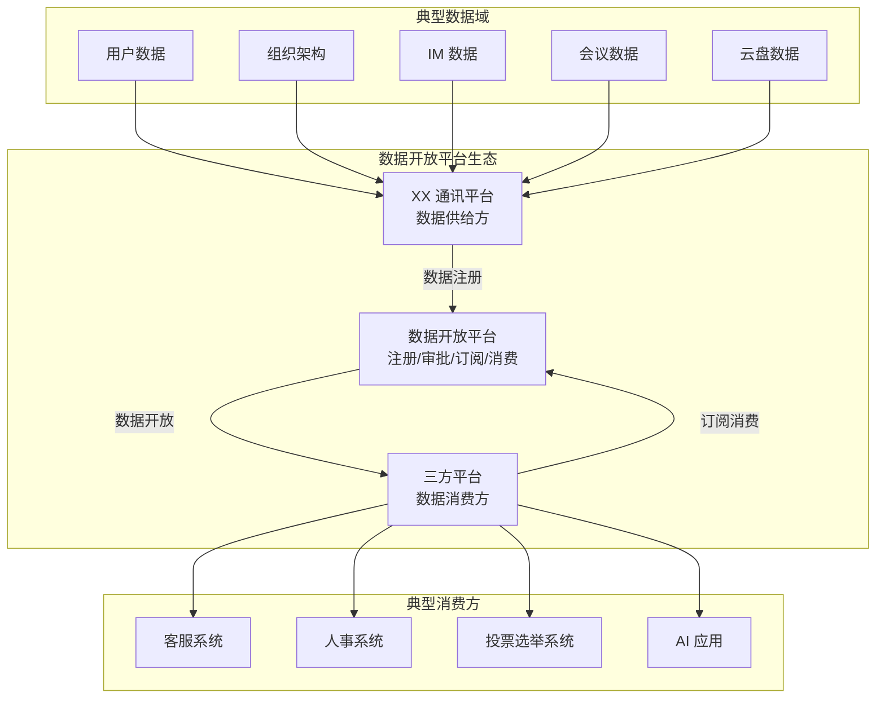

### 1.2 目标用户

| 角色 | 职责 | 诉求 |
|------|------|------|
| **数据 Owner** | 业务模块负责人 | 注册数据、生产数据；通过开放数据实现业务价值 |
| **开放平台管理员** | 平台运营人员 | 审批数据注册信息；确保数据符合平台规范 |
| **三方平台业务方** | 企业内部自研系统负责人 | 订阅数据、消费数据；利用 XX 平台数据增强自身业务 |

### 1.3 价值主张

| 维度 | 描述 |
|------|------|
| **解决痛点** | 能力封闭：XX 平台的数据和能力无法被企业内部其他三方平台有效利用 |
| **提供价值** | 标准统一的数据开放通道，解决数据孤岛和接口混乱问题 |
| **业务目标** | 生态开放：让三方平台能利用 XX 平台资源开展业务，形成企业内部的能力生态 |

### 1.4 与 open-app 的关系

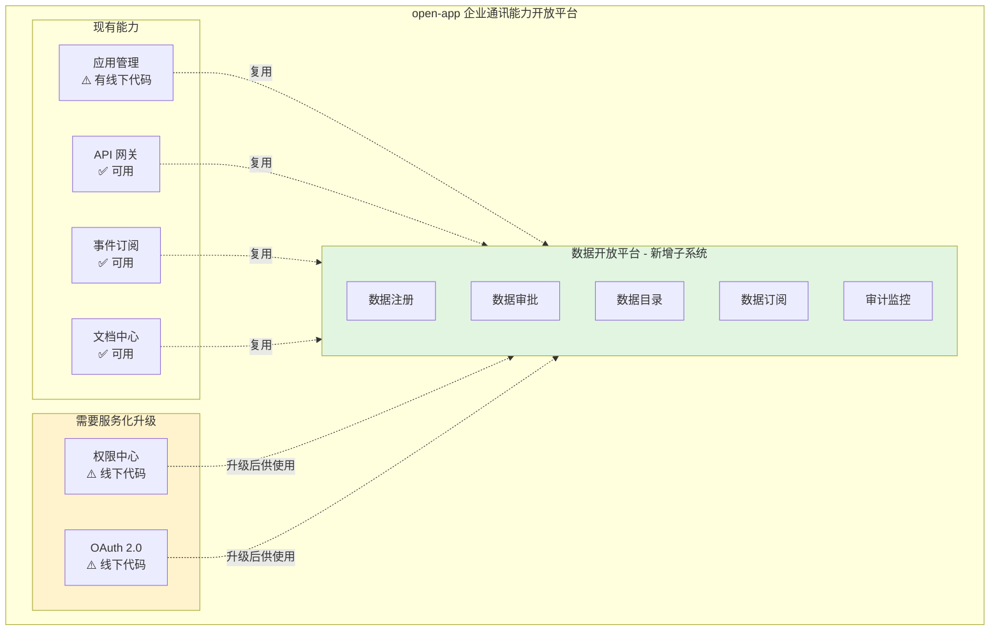

### 1.5 成功标准

**核心目标**: 
1. ✅ **数据成功开放出去** - 有数据被开放，有消费方在使用
2. ✅ **数据接入使用很便捷** - 三方平台接入数据简单、快速
3. ✅ **整个流程安全可控合规** - 全流程线上审批、留痕可追溯、安全合规

---

## 二、功能规格

### 2.1 需求分层

```mermaid
graph LR
    subgraph Must_Have[必备需求 - 没有无法使用]
        M1[数据注册]
        M2[数据审批]
        M3[数据订阅]
        M4[数据消费]
        M5[应用管理]
        M6[权限控制]
        M7[事件订阅]
    end
    
    subgraph Should_Have[期望需求 - 显著提升体验]
        S1[数据目录]
        S2[敏感度分级]
        S3[审计日志]
        S4[用量统计]
        S5[数据资产清单]
        S6[数据字典]
        S7[场景分类]
        S8[案例库]
        S9[技术支持]
    end
    
    subgraph Could_Have[惊喜需求 - 超出预期]
        C1[价值可视化]
        C2[自动化同步]
        C3[开发者门户]
        C4[多形式支持]
    end
    
    Must_Have -.-> Should_Have
    Should_Have -.-> Could_Have
    
    style Must_Have fill:#e1f5e1,stroke:#2e7d32,stroke-width:2px
    style Should_Have fill:#fff3cd,stroke:#f57c00,stroke-width:2px
    style Could_Have fill:#f3e5f5,stroke:#7b1fa2,stroke-width:2px
```

### 2.2 Must Have 需求清单（必备）

| 需求编号 | 需求名称 | 需求描述 | 验收标准 |
|---------|---------|---------|---------|
| **MH-01** | 数据注册 | 数据 Owner 能够注册数据 | 支持填写数据描述、字段定义、开放形式、敏感度级别 |
| **MH-02** | 数据审批 | 平台管理员能够审批数据注册 | 支持审批通过/驳回，记录审批意见 |
| **MH-03** | 应用管理 | 三方平台能够创建应用 | 创建应用后获取 AK/SK |
| **MH-04** | 数据订阅 | 三方平台能够订阅数据 | 选择数据后提交订阅申请 |
| **MH-05** | API 消费 | 三方平台能够通过 API 消费数据 | 使用 AK/SK 调用 API 获取数据 |
| **MH-06** | 事件订阅 | 支持事件订阅形式 | 数据变更时推送给订阅方 |
| **MH-07** | 权限控制 | 基础权限控制 | 未授权应用无法访问数据 |

### 2.3 Should Have 需求清单（期望）

| 需求编号 | 需求名称 | 需求描述 | 验收标准 |
|---------|---------|---------|---------|
| **SH-01** | 数据目录 | 数据目录/市场 | 浏览可订阅的数据列表，支持搜索和分类 |
| **SH-02** | 敏感度分级 | 数据敏感度分级管理 | 支持定义和管理数据敏感度级别（数据对象级别），支持基于敏感度动态审批 |
| **SH-03** | 审计日志 | 审计日志记录 | 记录所有数据访问行为 |
| **SH-04** | 用量统计 | 用量统计展示 | 展示数据被调用的次数、调用方等 |
| **SH-05** | 数据资产清单 | 数据资产统一管理 | 统一记录 XX 平台有哪些数据对象 |
| **SH-06** | 数据字典 | 数据字典/数据地图 | 提供数据含义、关系、使用建议（数据来源、加工逻辑、更新频率、推荐使用场景） |
| **SH-07** | 场景分类 | 场景分类目录 | 按业务场景分类展示数据（如：HR 场景、客服场景、AI 场景） |
| **SH-08** | 案例库 | 成功案例分享 | 收集并分享成功案例，提供场景化引导 |
| **SH-09** | 技术支持 | 技术咨询支持 | 快速响应、专业解答，有专门支持人员平等服务所有消费方 |

### 2.4 Could Have 需求清单（惊喜）

| 需求编号 | 需求名称 | 需求描述 | 验收标准 |
|---------|---------|---------|---------|
| **CH-01** | 价值可视化 | 数据价值可视化 | 数据 Owner 能看到开放数据带来的业务价值 |
| **CH-02** | 自动化同步 | 自动化数据同步 | 支持配置数据管道，自动同步到消费方 |
| **CH-03** | 开发者门户 | 开发者门户 | 提供开发者文档、SDK 下载、示例代码 |
| **CH-04** | 多形式支持 | 多开放形式支持 | 支持批量导出、数据同步等形式 |

---

## 三、核心流程设计

### 3.1 数据开放消费全流程

从平台视角展示数据从注册到消费的完整流程，涉及数据 Owner、平台管理员、消费方三方角色。

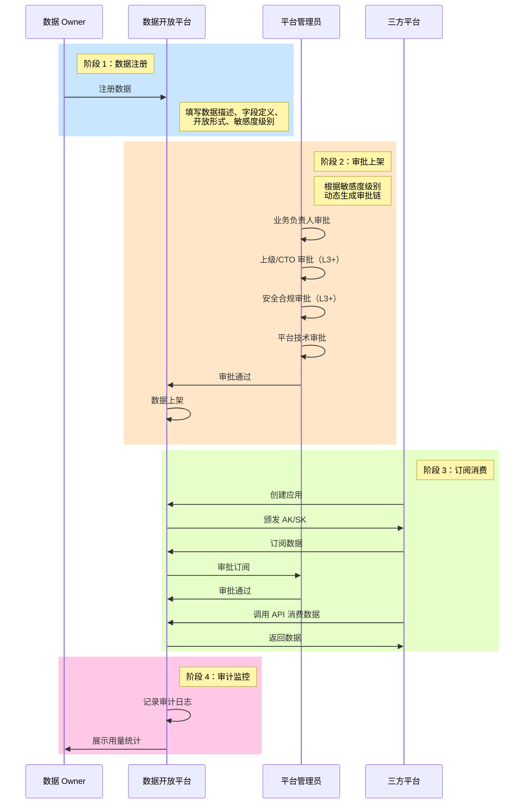

### 3.2 数据注册流程

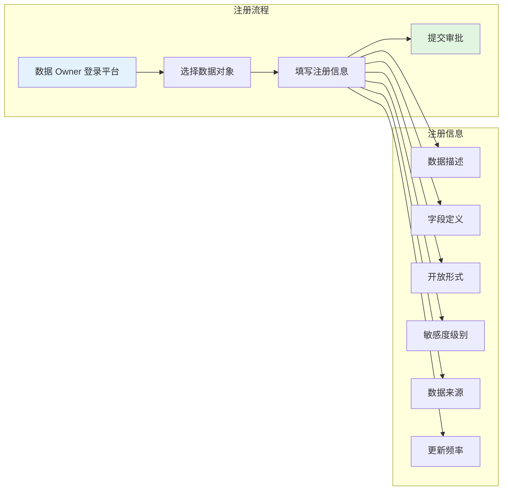

### 3.3 数据审批流程

基于敏感度等级的动态审批流程：

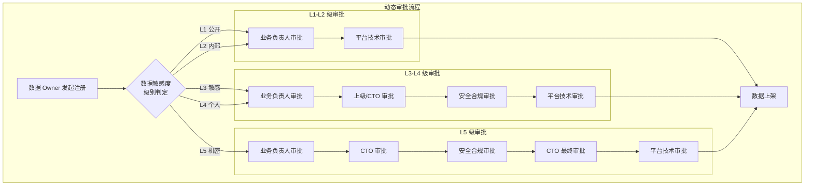

| 敏感度级别 | 审批链 | 审批角色 |
|-----------|--------|---------|
| **L1-公开** | 2 级审批 | 业务负责人 → 平台管理员 |
| **L2-内部** | 2 级审批 | 业务负责人 → 平台管理员 |
| **L3-敏感** | 4 级审批 | 业务负责人 → 上级/CTO → 安全合规 → 平台管理员 |
| **L4-个人** | 4 级审批 | 业务负责人 → 上级/CTO → 安全合规 → 平台管理员 |
| **L5-机密** | 5 级审批 | 业务负责人 → CTO → 安全合规 → CTO 最终审批 → 平台管理员 |

### 3.4 数据订阅流程

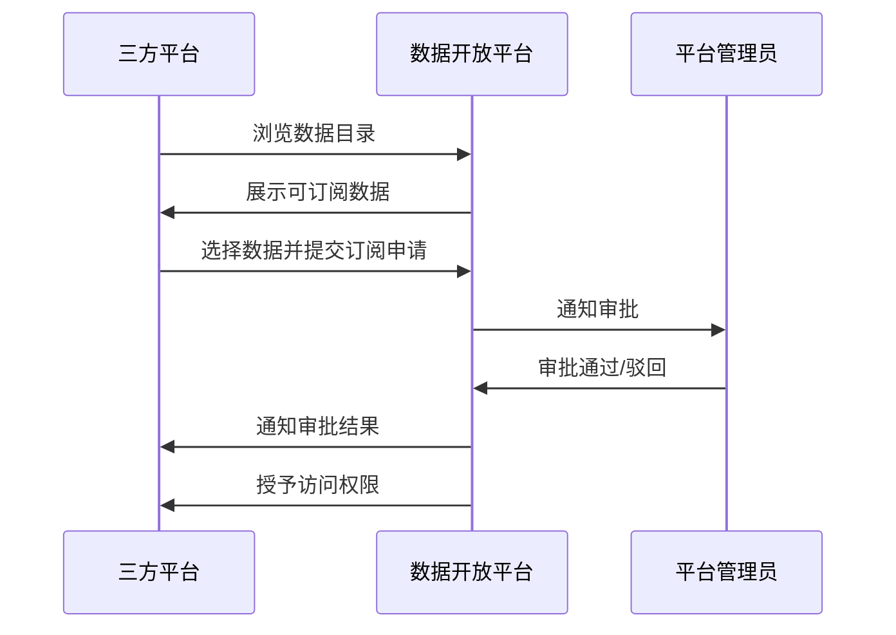

### 3.5 数据消费流程

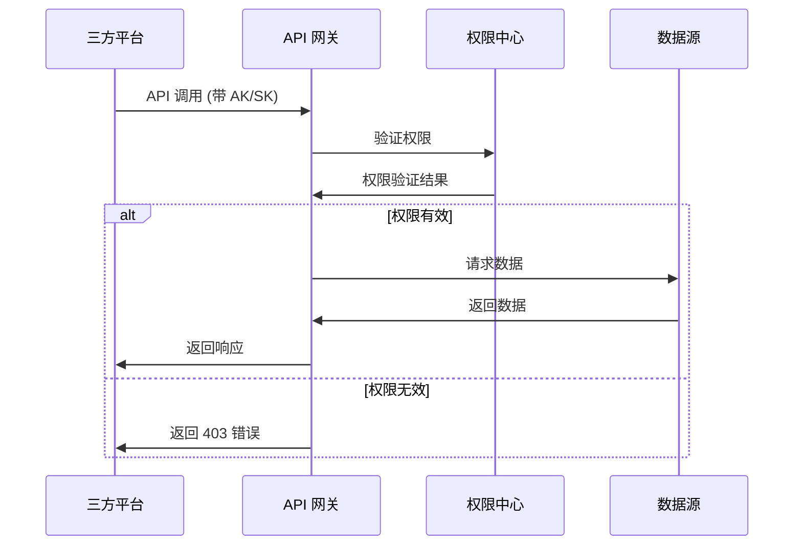

### 3.6 数据开放形式

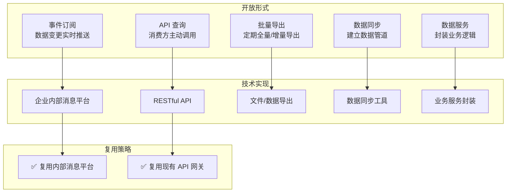

### 3.7 典型消费场景

#### 场景一：业务系统集成

| 消费方 | 使用场景 | 消费的数据 | 敏感度 |
|--------|---------|-----------|--------|
| 人事系统 | 新员工入职自动同步组织架构信息 | 用户基本信息、部门信息 | L2 |
| 财务系统 | 考勤数据同步用于薪资计算 | 考勤记录、请假审批 | L3 |
| 客服系统 | 客服人员查看用户所属部门和职务 | 用户基本信息、组织架构 | L2 |

#### 场景二：应用功能嵌入

| 消费方 | 使用场景 | 消费的数据/能力 | 敏感度 |
|--------|---------|----------------|--------|
| CRM 系统 | 销售在 CRM 中直接发起会议 | 会议能力、日程能力 | L2-L3 |
| HR 招聘系统 | 招聘流程中发起视频面试 | 视频会议能力 | L2 |
| 项目管理工具 | 任务提醒发送到 XX 消息 | 消息推送能力 | L2 |

#### 场景三：数据分析与 AI 应用

| 消费方 | 使用场景 | 消费的数据 | 敏感度 |
|--------|---------|-----------|--------|
| BI 报表系统 | 企业运营分析报表 | 会议数量、文档活跃度、用户活跃度 | L2 |
| AI 智能助手 | 智能问答，查询企业信息 | 用户信息、组织架构、日程 | L2-L3 |

---

## 四、数据治理规范

### 4.1 数据敏感度分级

| 级别 | 定义 | 典型数据示例 | 开放策略 |
|------|------|-------------|---------|
| **L1-公开** | 可对企业内所有用户公开 | 公司组织架构、部门名称 | 所有认证应用可访问 |
| **L2-内部** | 限于企业内部使用 | 用户基本信息、邮箱、电话 | 需要审批，限制使用场景 |
| **L3-敏感** | 涉及个人隐私或业务敏感 | 薪资、绩效、考勤记录 | 严格管控，仅限特定场景 |
| **L4-个人** | 个人私密数据 | 聊天记录、日程、私人文件 | 需要用户授权，或完全不开放 |
| **L5-机密** | 商业机密、战略信息 | 未公开的战略信息 | 不开放 |

> ⚠️ **注意**: 
> - 敏感度定义的最小粒度为**数据对象级别**（如：用户数据、组织架构、IM 消息），不做字段级别的细粒度定义
> - 当前 XX 平台没有统一的数据敏感度定义，需要建立数据资产清单和分级标准

### 4.2 数据定级流程

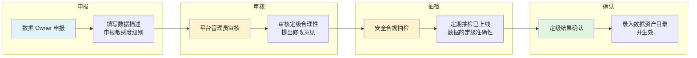

**定级责任界定**：
- **数据 Owner**：负责准确申报数据敏感度，提供数据字段清单和样例
- **平台管理员**：负责审核定级合理性，对明显错误的定级提出修改意见
- **安全合规团队**：负责定期抽检已上线数据的定级准确性
- **最终责任**：数据 Owner 对定级结果负主要责任，平台负审核责任

### 4.3 审批机制

#### 设计原则

- **所有审批环节在线上完成**，确保流程可追溯、可审计
- 线下仅作为**补充沟通手段**，用于重大事项的讨论或争议解决
- 线下沟通结果**必须在线上留痕**，确保审批记录的完整性

#### 审批流程配置

| 配置项 | 说明 |
|--------|------|
| 审批链规则 | 根据敏感度级别动态生成审批链 |
| 审批人映射 | 各角色审批人可配置（如：业务负责人、CTO、安全合规负责人） |
| 审批超时 | 可配置审批超时时间，超时自动提醒或升级 |
| 审批意见 | 必填字段，支持附件上传 |

### 4.4 权限控制

| 控制维度 | 说明 |
|---------|------|
| **应用级权限** | 三方平台需创建应用，获取 AK/SK |
| **数据级权限** | 不同敏感度数据有不同的访问权限 |
| **用户级权限** | 消费个人数据时可能需要用户 OAuth 授权 |
| **场景级权限** | 限制数据使用场景（如：仅限内部使用） |

### 4.5 审计监控

| 审计内容 | 说明 |
|---------|------|
| **访问日志** | 记录每次 API 调用的时间、调用方、数据对象、结果 |
| **审批日志** | 记录所有审批操作的操作人、时间、意见 |
| **变更日志** | 记录数据注册信息的变更历史 |
| **异常告警** | 检测异常访问行为并告警 |

---

## 五、接口规范

### 5.1 API 设计规范

#### 5.1.1 通用规范

| 规范项 | 要求 |
|--------|------|
| **协议** | HTTPS |
| **认证方式** | AK/SK 签名认证 |
| **数据格式** | JSON |
| **字符编码** | UTF-8 |
| **时间格式** | ISO 8601 (YYYY-MM-DDTHH:mm:ssZ) |

#### 5.1.2 认证流程

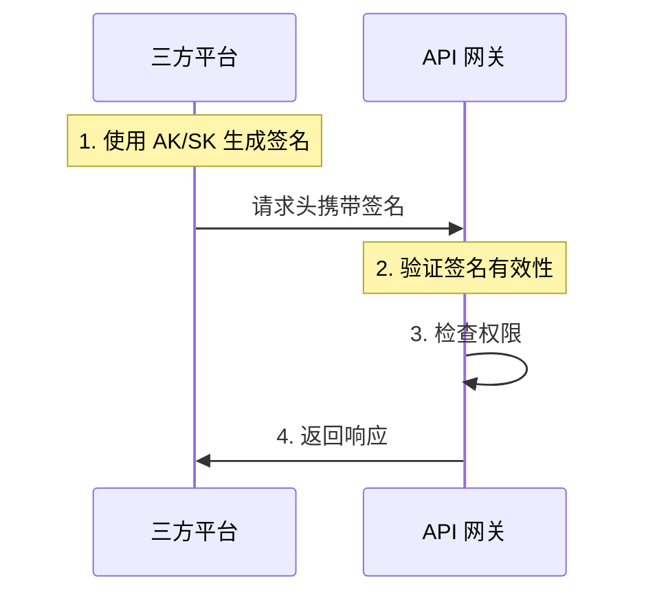

#### 5.1.3 错误码规范

| 错误码 | 含义 | 处理建议 |
|--------|------|---------|
| 200 | 成功 | - |
| 400 | 请求参数错误 | 检查请求参数 |
| 401 | 认证失败 | 检查 AK/SK |
| 403 | 权限不足 | 申请数据订阅 |
| 404 | 资源不存在 | 检查资源 ID |
| 429 | 请求超限 | 降低调用频率 |
| 500 | 服务器错误 | 联系平台支持 |

### 5.2 事件订阅规范

#### 5.2.1 事件格式

```json
{
  "eventId": "string",
  "eventType": "string",
  "eventTime": "ISO8601",
  "dataSource": "string",
  "data": {}
}
```

#### 5.2.2 推送流程

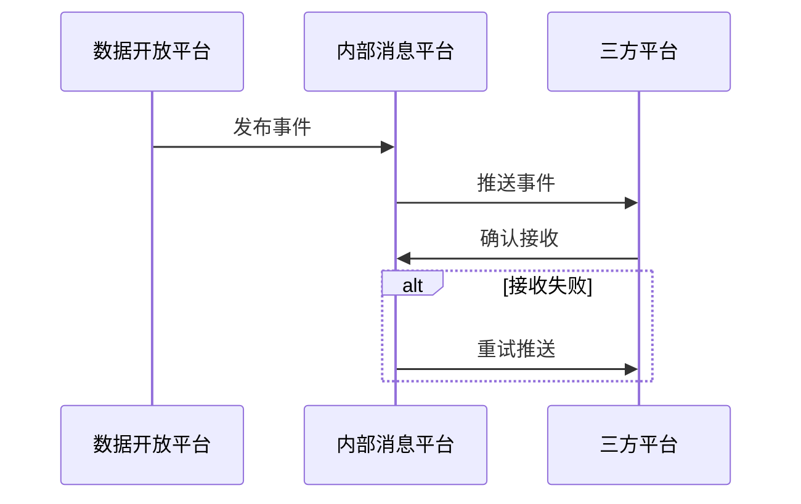

### 5.3 API 接口清单

#### 5.3.1 数据管理 API

| 接口 | 方法 | 描述 |
|------|------|------|
| /api/v1/data-objects | GET | 获取数据对象列表 |
| /api/v1/data-objects/{id} | GET | 获取数据对象详情 |
| /api/v1/data-objects | POST | 注册数据对象 |
| /api/v1/data-objects/{id} | PUT | 更新数据对象 |

#### 5.3.2 应用管理 API

| 接口 | 方法 | 描述 |
|------|------|------|
| /api/v1/apps | GET | 获取应用列表 |
| /api/v1/apps | POST | 创建应用 |
| /api/v1/apps/{id} | GET | 获取应用详情 |
| /api/v1/apps/{id}/credentials | POST | 刷新 AK/SK |

#### 5.3.3 订阅管理 API

| 接口 | 方法 | 描述 |
|------|------|------|
| /api/v1/subscriptions | GET | 获取订阅列表 |
| /api/v1/subscriptions | POST | 创建订阅 |
| /api/v1/subscriptions/{id} | DELETE | 取消订阅 |

---

## 六、验收标准

### 6.1 Must Have 验收标准

| 需求编号 | 验收条件 | 验证方法 |
|---------|---------|---------|
| **MH-01** | 数据 Owner 能够成功注册数据对象 | 模拟数据 Owner 完成注册流程，验证数据入库 |
| **MH-02** | 平台管理员能够审批通过/驳回注册申请 | 模拟管理员审批，验证状态流转和通知 |
| **MH-03** | 三方平台创建应用后能获取 AK/SK | 模拟创建应用，验证 AK/SK 生成和存储 |
| **MH-04** | 三方平台能够提交数据订阅申请 | 模拟订阅流程，验证申请记录和状态 |
| **MH-05** | 使用有效 AK/SK 能调用 API 获取数据 | 模拟 API 调用，验证数据返回 |
| **MH-06** | 数据变更时能推送事件给订阅方 | 模拟数据变更，验证事件推送 |
| **MH-07** | 无效 AK/SK 无法访问数据 | 模拟未授权调用，验证返回 401/403 |

### 6.2 Should Have 验收标准

| 需求编号 | 验收条件 | 验证方法 |
|---------|---------|---------|
| **SH-01** | 能够浏览和搜索数据目录 | 模拟用户浏览，验证搜索和分类功能 |
| **SH-02** | 能够配置和管理敏感度级别 | 模拟配置敏感度，验证审批链动态生成 |
| **SH-03** | 所有数据访问行为被记录 | 模拟 API 调用，验证审计日志生成 |
| **SH-04** | 能够查看数据调用统计 | 模拟调用后查看统计，验证数据准确性 |
| **SH-05** | 有统一的数据资产清单 | 验证数据对象清单的完整性 |
| **SH-06** | 数据字典提供完整元数据 | 验证数据含义、来源、更新频率等信息 |
| **SH-07** | 数据按场景分类展示 | 验证场景分类的准确性和完整性 |
| **SH-08** | 案例库展示成功案例 | 验证案例内容的完整性和可读性 |
| **SH-09** | 技术支持渠道可用 | 验证咨询入口和响应机制 |

### 6.3 Could Have 验收标准

| 需求编号 | 验收条件 | 验证方法 |
|---------|---------|---------|
| **CH-01** | 数据 Owner 能看到价值数据 | 验证价值可视化图表和数据准确性 |
| **CH-02** | 支持配置自动化数据同步 | 模拟配置同步任务，验证数据同步 |
| **CH-03** | 开发者门户提供完整文档 | 验证文档、SDK、示例代码的完整性 |
| **CH-04** | 支持多种数据开放形式 | 验证批量导出、数据同步等功能 |

---

## 七、非功能性需求

### 7.1 性能需求

| 指标 | 要求 | 说明 |
|------|------|------|
| **API 响应时间** | P95 < 500ms | 95% 的 API 调用在 500ms 内返回 |
| **事件推送延迟** | < 5 秒 | 数据变更后 5 秒内推送给订阅方 |
| **并发能力** | 支持 1000+ QPS | 支持高并发 API 调用 |
| **数据同步延迟** | 分钟级 | 批量数据同步延迟在分钟级别 |

### 7.2 安全需求

| 要求 | 说明 |
|------|------|
| **认证安全** | AK/SK 签名认证，支持定期轮换 |
| **传输安全** | 全链路 HTTPS 加密 |
| **权限控制** | 细粒度权限控制，最小权限原则 |
| **审计追溯** | 完整的操作审计日志，保留至少 6 个月 |
| **数据脱敏** | 敏感数据按需脱敏后开放 |

### 7.3 可用性需求

| 指标 | 要求 |
|------|------|
| **系统可用性** | 99.9% |
| **故障恢复时间** | < 30 分钟 |
| **数据备份** | 每日备份，保留 30 天 |
| **灾难恢复** | 支持异地容灾 |

### 7.4 可扩展性需求

| 要求 | 说明 |
|------|------|
| **水平扩展** | 支持水平扩展以应对业务增长 |
| **数据域扩展** | 支持新数据域快速接入 |
| **开放形式扩展** | 支持新增数据开放形式 |
| **审批流程扩展** | 支持审批流程灵活配置 |

### 7.5 兼容性需求

| 要求 | 说明 |
|------|------|
| **API 版本** | 支持 API 版本管理，向后兼容 |
| **消息平台** | 复用企业内部消息平台 |
| **API 网关** | 复用现有 API 网关 |

---

## 八、开放问题

### 8.1 待决策事项

| 问题 | 说明 | 优先级 | 责任方 |
|------|------|--------|--------|
| **数据资产清单** | XX 平台内部有哪些数据对象，需要梳理统一清单 | P1 | 数据 Owner |
| **敏感度定级标准** | 需要建立统一的数据敏感度分级标准 | P1 | 安全合规 |
| **审批人配置** | 各角色的具体审批人需要明确 | P1 | 平台运营 |
| **服务化改造范围** | open-app 现有能力的服务化改造范围评估 | P2 | 技术团队 |

### 8.2 待调研事项

| 事项 | 说明 | 优先级 | 状态 |
|------|------|--------|------|
| **消费方业务场景** | 三方平台具体想用数据做什么业务 | P1 | ⏳ 待调研 |
| **当前替代方案** | 没有平台之前，三方平台如何获取数据 | P1 | ⏳ 待调研 |
| **具体 AI 应用规划** | 企业内部是否有具体的 AI 应用需求 | P2 | ⏳ 待调研 |

### 8.3 外部依赖

| 依赖项 | 说明 | 状态 |
|--------|------|------|
| **API 网关** | 复用现有 API 网关能力 | ✅ 可用 |
| **事件订阅** | 复用现有事件订阅能力 | ✅ 可用 |
| **文档中心** | 复用现有文档中心 | ✅ 可用 |
| **内部消息平台** | 用于事件推送 | ⏳ 待对接 |
| **权限中心** | 需要服务化改造 | ⏳ 待改造 |
| **OAuth 2.0** | 需要服务化改造 | ⏳ 待改造 |

---

## 附录

### A. 术语表

| 术语 | 定义 |
|------|------|
| **数据 Owner** | 业务模块负责人，拥有数据对象的管理权 |
| **AK/SK** | Access Key / Secret Key，API 访问凭证 |
| **数据对象** | 数据开放的最小粒度单位（如：用户数据、组织架构） |
| **敏感度级别** | 数据敏感程度的分级（L1-L5） |
| **事件订阅** | 数据变更时主动推送给订阅方的机制 |

### B. 参考资料

- [需求挖掘报告](./discovery-report.md)
- [分析笔记](./discovery-analysis.md)
- [飞书开放平台数据价值赋能报告](../../../docs/feishu-dingtalk-data-value-research/飞书开放平台数据价值赋能报告.md)
- [钉钉开放平台数据价值赋能报告](../../../docs/feishu-dingtalk-data-value-research/钉钉开放平台数据价值赋能报告.md)
- [代码仓库](https://github.com/give-my-dreams/OpenPlatform)

### C. 修订记录

| 版本 | 日期 | 修订内容 | 修订人 |
|------|------|---------|--------|
| v1.0 | 2026-04-07 | 初始版本 - 基于 discovery 报告创建正式规范 | SDD 规范编写专家 |

---

**文档状态**: ✅ 规范编写完成  
**下一步**: 运行 `@sdd-plan 数据开放平台` 开始技术规划
