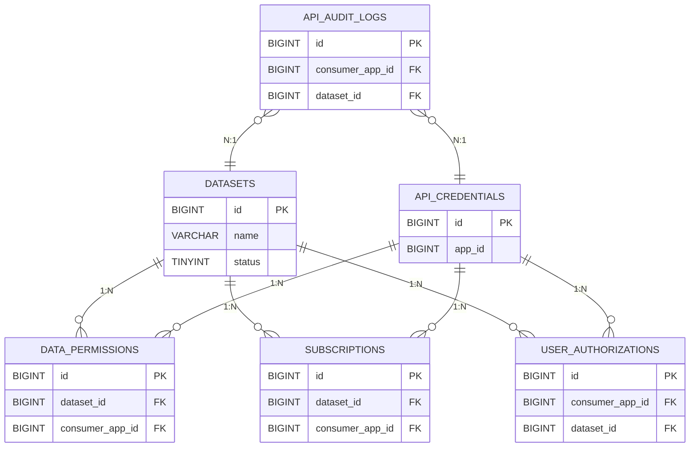

# Feature Specification: 数据开放平台

## 元数据

| 字段 | 值 |
|------|------|
| **标识符** | `DATA-OPEN-001` |
| **名称** | 数据开放平台 |
| **版本** | 1.0.35 |
| **创建日期** | 2026-03-31 |
| **作者** | Summer |
| **优先级** | P0 |
| **状态** | `specified` |

---

## 1. 概述

### 1.1 背景

**open-app** 是一个开放平台体系，**数据开放平台** 是其核心子平台之一，作为企业数据 API 网关，帮助企业内部各业务系统将生产的数据开放到外部三方系统消费。

平台遵循"数据 Owner 自主决策"原则：各业务模块的数据 Owner 可自主决定开放哪些数据、开放给谁、开放条件是什么，并通过平台提供的数据注册、权限管理、API 网关、审计监控、频次限制等能力实现。

### 1.2 问题陈述

数据开放平台主要解决：
- **数据孤岛**：打破企业内部系统与外部三方系统之间的数据壁垒，实现跨系统数据共享
- **接口规范**：提供统一的数据访问接口标准和规范
- **数据安全**：实现细粒度的数据访问控制和安全保障机制
- **开发效率**：提升三方系统获取企业内部系统数据的效率

### 1.3 目标用户

| 用户类型 | 说明 |
|----------|------|
| **内部开发团队** | 业务模块数据 Owner，负责注册和开放数据，审批外部团队的数据使用申请 |
| **外部合作伙伴** | 第三方开发者，申请数据访问权限，并消费已开放的数据 |
| **企业管理员** | IT 管理员/安全管理员，仅审批开放数据注册的申请 |

### 1.4 技术栈

| 层级 | 技术 | 版本 | 说明 |
|------|------|------|------|
| **后端框架** | Spring Boot | 3.4.x | REST API 服务 |
| **语言** | Java | 21 | LTS 版本 |
| **ORM** | MyBatis | 3.5.x | 数据访问层 |
| **数据库** | MySQL | 5.7+ | 数据持久化 |
| **缓存** | Redis | 6.0+ | 缓存层 |
| **消息队列** | Kafka / RabbitMQ / 企业内部消息服务 | - | 实时数据流推送，支持多种消息中间件选型 |
| **安全认证** | Cookie / JWT / OAuth2 | - | Cookie 用于普通用户登录（企业内/外部系统通用），JWT/OAuth2 用于用户数据授权场景 |

### 1.5 模块规划

数据开放平台 Feature 包含以下模块工程：

| 模块标识 | 模块名称 | 类型 | 说明 | 状态 |
|----------|----------|------|------|------|
| `data-open-platform` | 数据开放平台核心服务 | 后端 | 本模块，提供数据 API 能力 | **本次** |
| `web-producer-console` | 生产者管理控制台 | 前端 | 数据 Owner 注册数据、审批访问申请 | **本次** |
| `web-consumer-portal` | 消费者开发者门户 | 前端 | 外部开发者查看 API 文档、申请数据权限 | **本次** |
| `web-admin-console` | 平台管理控制台 | 前端 | 企业管理员审批数据注册申请 | **本次** |
| `sdk-producer` | 数据开放平台生产者 SDK | 工具包 | 内部系统发布数据用的 SDK | 不在本次范围 |
| `sdk-consumer` | 数据开放平台消费者 SDK | 工具包 | 外部系统消费数据用的 SDK | 不在本次范围 |

**Spec 范围**: 本 Spec 覆盖数据开放平台 Feature 的所有模块。后端服务（`data-open-platform`）和前端管理界面（`web-producer-console` / `web-consumer-portal` / `web-admin-console`）为**本次范围**；开发者 SDK（`sdk-producer` / `sdk-consumer`）为**规划中**，不在本次范围。

### 1.6 业务流程

```
┌─────────────────────────────────────────────────────────────────────────────────────────────────────────┐
│                                        数据开放平台业务流程图                                           │
└─────────────────────────────────────────────────────────────────────────────────────────────────────────┘

                                          ┌──────────────────┐
                                          │   企业管理员     │
                                          │  配置平台参数    │
                                          └────────┬─────────┘
                                                   │
                                                   ▼
┌─────────────────────────────────────────────────────────────────────────────────────────────────────────┐
│                                             第一阶段：数据注册                                           │
│                                                                                                         │
│   ┌─────────────┐     ┌─────────────┐     ┌─────────────┐     ┌─────────────┐     ┌─────────────┐    │
│   │  填写数据集  │────▶│  配置生产   │────▶│  配置访问   │────▶│  提交审批   │────▶│  管理员     │    │
│   │  元数据     │     │  方式       │     │  权限       │     │             │     │  审批       │    │
│   │             │     │             │     │             │     │             │     │             │    │
│   │ - 名称描述  │     │ - REST API  │     │ - 数据对象  │     │             │     │ ✓ 批准      │    │
│   │ - 数据源    │     │ - WebSocket │     │ - 字段      │     │             │     │ ✗ 拒绝      │    │
│   │ - 更新频率  │     │ - Kafka     │     │ - 范围      │     │             │     │             │    │
│   │             │     │ - RabbitMQ  │     │ - 量/频率   │     │             │     │             │    │
│   │             │     │ - 企业消息  │     │             │     │             │     │             │    │
│   │             │     │ - Webhook   │     │             │     │             │     │             │    │
│   └─────────────┘     └─────────────┘     └─────────────┘     └─────────────┘     └─────────────┘    │
│                                                                                          │              │
│                                                                                          ▼              │
│                                                                                  ┌─────────────┐      │
│                                                                                  │   数据集    │      │
│                                                                                  │   已开放    │      │
│                                                                                  │  (可被订阅) │      │
│                                                                                  └─────────────┘      │
└─────────────────────────────────────────────────────────────────────────────────────────────────────────┘
                                                   │
                                                   ▼
┌─────────────────────────────────────────────────────────────────────────────────────────────────────────┐
│                                            第二阶段：数据订阅                                           │
│                                                                                                         │
│   ┌─────────────┐     ┌─────────────┐     ┌─────────────┐     ┌─────────────┐     ┌─────────────┐    │
│   │  浏览数据集  │────▶│  申请访问   │────▶│  配置推送   │────▶│  提交审批   │────▶│  生产者     │    │
│   │  目录       │     │  权限       │     │  目标       │     │             │     │  审批       │    │
│   │             │     │             │     │             │     │             │     │             │    │
│   │ - 查看已开放│     │ - 数据对象  │     │ - Webhook   │     │             │     │ ✓ 批准      │    │
│   │   数据集    │     │ - 字段      │     │ - Kafka     │     │             │     │ ✗ 拒绝      │    │
│   │ - 查看权限  │     │ - 范围      │     │ - RabbitMQ  │     │             │     │             │    │
│   │   要求      │     │             │     │ - 企业消息  │     │             │     │             │    │
│   └─────────────┘     └─────────────┘     └─────────────┘     └─────────────┘     └─────────────┘    │
│                                                                                          │              │
│                                                                                          ▼              │
│                                                                                  ┌─────────────┐      │
│                                                                                  │   订阅      │      │
│                                                                                  │   已生效    │      │
│                                                                                  │  (可消费)   │      │
│                                                                                  └─────────────┘      │
└─────────────────────────────────────────────────────────────────────────────────────────────────────────┘
                                                   │
                                                   ▼
┌─────────────────────────────────────────────────────────────────────────────────────────────────────────┐
│                                           第三阶段：用户授权（仅用户数据需要）                           │
│                                                                                                         │
│   ┌─────────────┐     ┌─────────────┐     ┌─────────────┐     ┌─────────────┐                         │
│   │  生产者配置  │────▶│  消费者     │────▶│  用户确认   │────▶│  生成       │                         │
│   │  授权要求   │     │  获取授权码  │     │  授权       │     │  授权码     │                         │
│   │             │     │             │     │             │     │             │                         │
│   │ - 标记需要  │     │ - 生成授权  │     │ - 查看申请  │     │ - 一次性    │                         │
│   │   用户授权  │     │   请求链接  │     │ - 批准/拒绝 │     │ - 有效期    │                         │
│   │   的数据集  │     │             │     │             │     │   30 分钟    │                         │
│   └─────────────┘     └─────────────┘     └─────────────┘     └─────────────┘                         │
└─────────────────────────────────────────────────────────────────────────────────────────────────────────┘
                                                   │
                                                   ▼
┌─────────────────────────────────────────────────────────────────────────────────────────────────────────┐
│                                            第四阶段：数据消费                                           │
│                                                                                                         │
│   ┌─────────────┐     ┌─────────────┐     ┌─────────────┐     ┌─────────────┐                         │
│   │  生产者     │────▶│  平台       │────▶│  权限       │────▶│  消费者     │                         │
│   │  推送数据   │     │  路由分发   │     │  管控       │     │  获取数据   │                         │
│   │             │     │             │     │             │     │             │                         │
│   │ - REST API  │     │ - 根据订阅  │     │ - 生产者    │     │ - REST API  │                         │
│   │ - WebSocket │     │   关系路由  │     │   配置权限  │     │ - WebSocket │                         │
│   │ - Kafka     │     │ - 协议转换  │     │ - 消费者    │     │ - Kafka     │                         │
│   │ - RabbitMQ  │     │ - 缓存/存储 │     │   申请权限  │     │ - RabbitMQ  │                         │
│   │ - 企业消息  │     │             │     │ - 用户授权  │     │ - 企业消息  │                         │
│   │ - Webhook   │     │             │     │   (如需要)  │     │ - Webhook   │                         │
│   └─────────────┘     └─────────────┘     └─────────────┘     └─────────────┘                         │
│                                                                                                         │
│   **数据消费模式**:                                                                                     │
│   - **拉取 (Pull)**: REST API - 消费者主动查询，按需获取                                               │
│   - **推送 (Push)**: WebSocket/Kafka/RabbitMQ/Webhook - 平台主动推送，实时同步                          │
└─────────────────────────────────────────────────────────────────────────────────────────────────────────┘
                                                   │
                                                   ▼
┌─────────────────────────────────────────────────────────────────────────────────────────────────────────┐
│                                              全程：审计监控                                             │
│                                                                                                         │
│   ┌─────────────────────────────────────────────────────────────────────────────────────────────────┐   │
│   │  记录所有操作的审计日志：数据注册、权限配置、订阅申请、审批操作、数据生产、数据消费、授权管理  │   │
│   │  支持按应用/时间/状态/用户等条件查询，日志保留 ≥ 6 个月                                              │   │
│   └─────────────────────────────────────────────────────────────────────────────────────────────────┘   │
└─────────────────────────────────────────────────────────────────────────────────────────────────────────┘
```

**关键业务节点说明**：

| 阶段 | 关键节点 | 说明 |
|------|----------|------|
| **数据注册** | 更新频率 | **实时**: 数据产生后立即推送（订单创建/用户注册）<br>**定时**: 按 cron 表达式同步（每天 2:00 同步昨日数据）<br>**手动**: 按需触发（初始化数据/补录数据） |
| **数据订阅** | 推送目标 | **Webhook**: 配置回调 URL，平台主动推送<br>**Kafka/RabbitMQ**: 配置 Topic/Queue，消费者订阅<br>**企业消息**: 配置企业自研消息服务 |
| **用户授权** | 授权码 | 仅用户数据需要，授权码一次性使用，有效期 30 分钟 |
| **数据消费** | 拉取 vs 推送 | **拉取**: REST API，消费者主动查询<br>**推送**: WebSocket/Kafka/RabbitMQ/Webhook，平台主动推送 |

---

## 2. 目标与非目标

### 2.1 本次要做的

#### 数据注册管理

| 编号 | 功能 | 说明 |
|------|------|------|
| **G1** | 数据集注册 | 生产者注册要开放的数据集，配置数据源、更新频率、数据描述等 |
| **G2** | 权限配置 | 配置消费者可访问的数据对象/字段/范围/量/频率等权限 |
| **G3** | 审批流程 | 企业管理员审批数据注册申请和消费者访问申请 |

#### 数据订阅管理

| 编号 | 功能 | 说明 |
|------|------|------|
| **G4** | 数据订阅 | 消费者订阅感兴趣的数据集 |
| **G5** | 订阅管理 | 管理订阅关系、配置推送目标（Webhook URL、MQ Topic 等） |

#### 数据通道

##### 数据生产者通道（内部系统 → 平台）

| 编号 | 功能 | 技术栈 | 说明 |
|------|------|--------|------|
| **G6** | REST API 数据生产通道 | REST API | 内部系统主动调用平台 API 推送数据 |
| **G7** | WebSocket 数据生产通道 | WebSocket | 内部系统通过 WebSocket 长连接实时推送数据到平台 |
| **G8** | Kafka 数据生产通道 | Apache Kafka | 内部系统将数据发布到 Kafka Topic，平台作为消费者订阅 |
| **G9** | RabbitMQ 数据生产通道 | RabbitMQ | 内部系统将数据发布到 RabbitMQ Exchange，平台作为消费者订阅 |
| **G10** | 企业内部消息数据生产通道 | 企业内部消息服务 | 内部系统通过企业自研消息服务推送数据，平台对接消费 |
| **G11** | Webhook 数据生产通道 | Webhook | 平台配置内部系统的 Webhook URL，按需主动拉取数据 |

##### 平台内部数据处理

| 编号 | 功能 | 说明 |
|------|------|------|
| **G12** | 数据接入网关 | 统一接收各生产者通道的数据，进行协议转换和标准化 |
| **G13** | 数据路由与分发 | 根据数据订阅关系，将数据路由到对应的消费者通道 |
| **G14** | 数据缓存与存储 | 支持实时数据缓存和历史数据持久化，支持按需查询 |
| **G15** | 数据转换与映射 | 支持数据格式转换、字段映射、数据脱敏等处理 |

##### 数据消费者通道（平台 → 外部系统）

| 编号 | 功能 | 技术栈 | 说明 |
|------|------|--------|------|
| **G16** | REST API 数据消费通道 | REST API | 消费者通过 REST API 查询已开放的数据 |
| **G17** | WebSocket 数据消费通道 | WebSocket | 消费者通过 WebSocket 长连接接收平台实时推送的数据 |
| **G18** | Kafka 数据消费通道 | Apache Kafka | 消费者通过订阅 Kafka Topic 获取实时数据流 |
| **G19** | RabbitMQ 数据消费通道 | RabbitMQ | 消费者通过订阅 RabbitMQ Queue 获取实时数据流 |
| **G20** | 企业公共消息数据消费通道 | 企业公共消息服务 | 消费者通过企业公共消息服务获取实时数据流 |
| **G21** | Webhook 数据消费通道 | Webhook | 消费者配置 Webhook 接收平台推送的数据变更事件 |

#### 数据权限管控

| 编号 | 功能 | 说明 |
|------|------|------|
| **G22** | 数据对象权限 | 控制消费者可访问哪些数据集（如用户数据、订单数据、产品数据等） |
| **G23** | 数据字段权限 | 控制消费者可访问数据集中的哪些字段（如可访问姓名但不可访问手机号） |
| **G24** | 数据范围权限 | 控制消费者可访问数据的范围（如只能访问本部门数据、只能访问最近 3 个月数据等） |
| **G25** | 数据访问量限制 | 控制单次查询的最大数据量（如单次最多 1000 条）和每日/月总访问配额 |
| **G26** | 数据访问频率限制 | 控制 API 调用频率（如每分钟 100 次、每小时 5000 次等），支持多级限流 |
| **G27** | 用户授权码管理 | 外部三方系统需获取数据归属用户的授权码才能访问用户数据 |

#### 数据使用审计

| 编号 | 功能 | 说明 |
|------|------|------|
| **G28** | 访问审计日志 | 记录所有 API 调用的详细日志（时间戳、用户、IP、请求路径、返回状态、耗时、访问数据量等），用于合规和安全分析 |
| **G29** | 审计日志查询 | 支持按应用/时间/状态/用户等条件查询审计日志，日志保留 ≥ 6 个月 |

### 2.2 本次不做

| 编号 | 功能 | 归属/说明 |
|------|------|------|
| **NG1** | 数据血缘分析 | 独立的数据治理服务 |
| **NG2** | 自助数据探索和发现 | 独立的数据门户系统 |
| **NG3** | 脱敏配置 UI | 独立安全控制平台 |
| **NG4** | 数据可视化报表功能 | 数据分析平台 |
| **NG5** | 生产者 SDK | 独立 SDK 仓库（sdk-producer） |
| **NG6** | 消费者 SDK | 独立 SDK 仓库（sdk-consumer） |

---

## 3. 用户故事

### 3.1 数据注册管理

| ID | 用户故事 | 验收标准 |
|----|----------|----------|
| **US-001** | 作为生产者（内部系统数据 Owner），我想要注册数据集（填写名称、描述、数据源、更新频率），以便创建数据开放申请 | 1. 平台提供数据集注册接口 2. 可填写数据集元数据 3. 可配置数据源连接信息 4. 可设置数据更新频率 5. 注册后进入待审批状态 |
| **US-002** | 作为生产者（内部系统数据 Owner），我想要配置数据生产方式（REST API/WebSocket/Kafka/RabbitMQ/企业消息/Webhook），以便控制数据如何推送到平台 | 1. 可选择一种或多种生产方式 2. 可配置各生产方式的连接信息 3. 支持测试连接 4. 配置支持保存和修改 |
| **US-003** | 作为生产者（内部系统数据 Owner），我想要配置数据访问权限（对象/字段/范围/量/频率），以便控制哪些消费者可以访问数据 | 1. 可选择开放的数据集 2. 可配置字段级权限 3. 可设置访问量和频率限制 4. 权限配置支持保存和修改 |

### 3.2 数据订阅管理

| ID | 用户故事 | 验收标准 |
|----|----------|----------|
| **US-004** | 作为消费者（外部系统），我想要订阅数据集（选择数据集并提交申请），以便申请数据访问权限 | 1. 可浏览已开放的数据集目录 2. 可查看数据集详情和权限要求 3. 可提交订阅申请 4. 订阅申请进入审批流程 |
| **US-005** | 作为消费者（外部系统），我想要配置数据访问权限（需要的对象/字段/范围），以便按需申请数据 | 1. 可选择需要的数据对象/字段/范围 2. 可查看权限申请详情 3. 配置支持保存和修改 |
| **US-006** | 作为消费者（外部系统），我想要配置数据推送目标（Webhook URL/MQ Topic），以便接收平台推送的数据 | 1. 可配置 Webhook 回调地址 2. 可配置消息队列订阅信息 3. 推送目标配置支持测试验证 4. 配置变更即时生效 |

### 3.3 审批管理

| ID | 用户故事 | 验收标准 |
|----|----------|----------|
| **US-007** | 作为企业管理员，我想要审批数据注册申请，以便确保开放数据符合企业规范和安全要求 | 1. 可查看数据注册申请详情 2. 可批准或拒绝申请 3. 审批记录被完整审计 4. 审批通过后数据集对消费者可见 |
| **US-008** | 作为生产者（内部系统数据 Owner），我想要审批消费者的数据订阅申请，以便确保数据被合规使用 | 1. 可查看订阅申请详情 2. 可批准或拒绝申请 3. 可填写审批意见 4. 审批结果通知申请人 |

### 3.4 用户授权管理

| ID | 用户故事 | 验收标准 |
|----|----------|----------|
| **US-009** | 作为生产者（内部系统数据 Owner），我想要配置用户授权要求（哪些数据需要用户授权、授权范围等），以便保护用户隐私数据 | 1. 可标记需要用户授权的数据集 2. 可配置授权范围（字段/用途） 3. 可设置授权有效期 4. 授权要求支持修改 |
| **US-010** | 作为消费者（外部系统），我想要获取数据归属用户的授权码，以便合法访问用户数据 | 1. 可生成授权请求链接 2. 用户确认后返回授权码 3. 授权码有有效期限制（如 30 分钟） 4. 授权码一次性使用 5. 支持授权撤销 |
| **US-011** | 作为普通用户，我想要管理第三方应用的数据访问授权，以便保护个人隐私 | 1. 可查看授权请求详情（数据范围、用途等） 2. 可批准或拒绝授权 3. 可查看已授权的应用列表 4. 可随时撤销授权 |

### 3.5 数据权限管控

| ID | 用户故事 | 验收标准 |
|----|----------|----------|
| **US-012** | 作为平台，我想要根据生产者配置的访问权限、消费者申请的访问权限、用户授权的范围，综合控制消费者的数据访问，以便保障数据安全 | 1. 数据对象权限生效 2. 字段级权限自动过滤 3. 数据范围限制有效 4. 访问量和频率限制生效 5. 用户授权范围生效 6. 权限变更即时生效 |

### 3.6 数据通道

| ID | 用户故事 | 验收标准 |
|----|----------|----------|
| **US-013** | 作为生产者（内部系统），我想要通过 REST API / WebSocket / Kafka / RabbitMQ / 企业消息 / Webhook 推送数据到平台，以便将数据同步到开放平台 | 1. 支持多种数据推送方式 2. 数据推送支持认证和鉴权 3. 推送失败有重试机制 4. 推送状态可查询 |
| **US-014** | 作为消费者（外部系统），我想要通过 REST API / WebSocket / Kafka / RabbitMQ / 企业消息 / Webhook 获取数据，以便进行业务集成 | 1. 支持多种数据获取方式 2. 数据获取支持认证和鉴权 3. 返回数据符合权限配置 4. 响应时间满足性能要求 |
| **US-015** | 作为平台，我想要将生产者推送的数据路由到对应的消费者，以便实现数据分发 | 1. 根据订阅关系自动路由 2. 支持多种协议转换 3. 支持数据缓存和持久化 4. 支持数据格式转换和脱敏 |

### 3.7 数据使用审计

| ID | 用户故事 | 验收标准 |
|----|----------|----------|
| **US-016** | 作为企业管理员，我想要查询数据访问审计日志，以便进行合规分析和安全审计 | 1. 可查询所有 API 调用日志 2. 支持按应用/时间/状态等条件过滤 3. 日志保留 ≥ 6 个月 4. 日志数据不可篡改 |

---

## 4. 功能需求

### 4.1 数据注册管理

#### 4.1.1 数据集注册 (FR-001)

**描述**: 生产者注册要开放的数据集，配置数据源、更新频率、数据描述等

**需求**:
- FR-001.1: 系统必须提供数据集注册接口，支持 REST API 和前端界面两种方式
- FR-001.2: 注册信息必须包含：数据集名称、描述、数据源类型、数据源连接信息、更新频率、字段定义
- FR-001.3: 数据源类型必须支持：
  - **数据库**: 当前仅支持 MySQL，后续可扩展支持 Oracle/PostgreSQL 等
  - **API 接口**: 支持外部 API 作为数据源
  - **文件**: 支持文件上传作为数据源（CSV/Excel/JSON 等）
  - **消息队列**: 支持 Kafka/RabbitMQ/企业消息服务作为数据源
- FR-001.4: 更新频率必须支持：实时、定时（cron 表达式）、手动触发
- FR-001.5: 数据集注册后必须进入待审批状态，审批通过后才能开放给消费者
- FR-001.6: 必须支持数据集的修改、删除、停用操作
- FR-001.7: 必须记录数据集的变更历史

**验收标准**:
- ✅ 能够成功注册数据集
- ✅ 支持多种数据源类型
- ✅ 支持多种更新频率配置
- ✅ 审批流程正常工作
- ✅ 变更历史可追溯

#### 4.1.2 数据生产方式配置 (FR-002)

**描述**: 生产者配置数据生产方式（REST API/WebSocket/Kafka/RabbitMQ/企业消息/Webhook）

**需求**:
- FR-002.1: 系统必须支持生产者选择一种数据生产方式（一个数据集只能选择一种生产方式）
- FR-002.2: 必须支持配置各生产方式的连接信息
  - **REST API**: 配置 API 端点 URL
  - **WebSocket**: 配置 WebSocket 服务端地址
  - **Kafka**: 配置 Kafka Topic、Broker 地址、消费组信息
  - **RabbitMQ**: 配置 RabbitMQ Exchange/Queue 名称、Broker 地址
  - **企业消息**: 配置企业自研消息服务的连接参数
  - **Webhook**: 配置内部系统的 Webhook URL
- FR-002.3: 必须支持连接测试功能
- FR-002.4: 配置必须支持保存和修改
- FR-002.5: 配置变更必须即时生效

**验收标准**:
- ✅ 支持多种生产方式配置
- ✅ 各生产方式连接信息可保存和测试
- ✅ 配置变更即时生效

#### 4.1.3 数据访问权限配置 (FR-003)

**描述**: 生产者配置消费者可访问的数据对象/字段/范围/量/频率等权限

**需求**:
- FR-003.1: 系统必须支持数据对象权限配置（选择哪些数据集可访问）
- FR-003.2: 系统必须支持字段级权限配置（选择数据集中哪些字段可访问）
- FR-003.3: 系统必须支持数据范围权限配置（如部门范围、时间范围等）
- FR-003.4: 系统必须支持访问量限制配置（单次查询量、每日/月配额）
- FR-003.5: 系统必须支持访问频率限制配置（每分钟/小时/天调用次数）
- FR-003.6: 权限配置必须支持按消费者粒度分配
- FR-003.7: 权限变更必须即时生效

**验收标准**:
- ✅ 数据对象权限配置生效
- ✅ 字段级权限自动过滤
- ✅ 数据范围限制有效
- ✅ 访问量和频率限制生效
- ✅ 权限变更即时生效

---

### 4.2 数据订阅管理

#### 4.2.1 数据订阅 (FR-004)

**描述**: 消费者订阅感兴趣的数据集

**需求**:
- FR-004.1: 系统必须提供数据集目录，展示已开放的数据集
- FR-004.2: 消费者必须能够查看数据集详情（字段、权限要求、更新频率等）
- FR-004.3: 消费者必须能够提交订阅申请
- FR-004.4: 订阅申请必须经过审批流程
- FR-004.5: 订阅审批通过后，消费者才能获取数据

**验收标准**:
- ✅ 数据集目录正常展示
- ✅ 数据集详情可查看
- ✅ 订阅申请提交成功
- ✅ 订阅审批流程正常

#### 4.2.2 数据访问权限配置 (FR-005)

**描述**: 消费者配置需要的数据对象/字段/范围

**需求**:
- FR-005.1: 系统必须支持消费者选择需要的数据对象/字段/范围
- FR-005.2: 必须支持查看权限申请详情
- FR-005.3: 配置必须支持保存和修改
- FR-005.4: 权限配置必须作为订阅申请的一部分提交审批

**验收标准**:
- ✅ 支持消费者配置数据访问权限
- ✅ 配置可保存和修改
- ✅ 权限配置随订阅申请提交

#### 4.2.3 数据推送目标配置 (FR-006)

**描述**: 消费者配置数据推送目标（Webhook URL、MQ Topic 等）

**需求**:
- FR-006.1: 系统必须支持配置 Webhook 推送地址
- FR-006.2: 系统必须支持配置消息队列订阅信息（Kafka Topic / RabbitMQ Queue）
- FR-006.3: 推送目标配置必须支持测试验证
- FR-006.4: 配置变更必须即时生效
- FR-006.5: 必须支持订阅关系的暂停、恢复、取消操作
- FR-006.6: 必须记录订阅推送日志

**验收标准**:
- ✅ Webhook 配置可保存和测试
- ✅ 消息队列订阅配置正常
- ✅ 配置变更即时生效
- ✅ 订阅关系管理功能完整
- ✅ 推送日志可查询

---

### 4.3 审批管理

#### 4.7.1 数据注册审批 (FR-007)

**描述**: 企业管理员审批数据注册申请

**需求**:
- FR-007.1: 系统必须提供审批任务列表，展示待审批的数据注册申请
- FR-007.2: 审批申请必须包含：申请人、申请时间、数据集信息、权限配置等详细信息
- FR-007.3: 管理员必须能够批准或拒绝申请，并填写审批意见
- FR-007.4: 审批结果必须及时通知申请人
- FR-007.5: 必须记录所有审批操作日志
- FR-007.6: 必须支持多级审批流程配置

**验收标准**:
- ✅ 审批任务列表正常展示
- ✅ 批准/拒绝操作正常
- ✅ 审批结果通知及时发送
- ✅ 审批日志完整记录
- ✅ 支持多级审批配置

#### 4.7.2 数据订阅审批 (FR-008)

**描述**: 生产者审批消费者的数据订阅申请

**需求**:
- FR-008.1: 系统必须提供审批任务列表，展示待审批的订阅申请
- FR-008.2: 审批申请必须包含：消费者信息、申请的数据集、申请的权限范围等
- FR-008.3: 生产者必须能够批准或拒绝申请，并填写审批意见
- FR-008.4: 审批结果必须及时通知消费者
- FR-008.5: 必须记录所有审批操作日志

**验收标准**:
- ✅ 订阅审批任务列表正常展示
- ✅ 批准/拒绝操作正常
- ✅ 审批结果通知及时发送
- ✅ 审批日志完整记录

---

### 4.4 数据通道

#### 4.7.1 数据生产者通道 (FR-009 ~ FR-014)

**FR-009 REST API 数据生产通道**:
- FR-006.1: 系统必须提供 REST API 接口供内部系统推送数据
- FR-006.2: API 推送必须支持认证，主认证方式为企业内部系统身份账号凭证，备选认证方式（API Key / JWT）可选实现
- FR-006.3: 必须支持批量数据推送
- FR-006.4: 推送失败必须有重试机制

**FR-010 WebSocket 数据生产通道**:
- FR-007.1: 系统必须提供 WebSocket 服务端供内部系统连接
- FR-007.2: WebSocket 连接必须支持认证，主认证方式为企业内部系统身份账号凭证，备选认证方式（API Key / JWT）可选实现
- FR-007.3: 必须支持长连接心跳检测
- FR-007.4: 连接断开必须支持自动重连

**FR-011 Kafka 数据生产通道**:
- FR-011.1: 系统必须支持从 Kafka Topic 消费数据
- FR-011.2: Kafka 连接必须支持认证，认证方式包括 SASL / API Key 等，具体认证配置由生产者提供
- FR-011.3: 必须支持多 Topic 订阅
- FR-011.4: 必须支持消费组管理
- FR-011.5: 必须保证消息不丢失

**FR-012 RabbitMQ 数据生产通道**:
- FR-012.1: 系统必须支持从 RabbitMQ Exchange 消费数据
- FR-012.2: RabbitMQ 连接必须支持认证，认证方式为账号密码，具体认证配置由生产者提供
- FR-012.3: 必须支持多种 Exchange 类型（Direct/Topic/Fanout）
- FR-012.4: 必须支持消息确认机制
- FR-012.5: 必须支持死信队列处理

**FR-013 企业内部消息数据生产通道**:
- FR-013.1: 系统必须支持对接企业自研消息服务
- FR-013.2: 企业消息连接必须支持认证，主认证方式为企业内部系统身份账号凭证
- FR-013.3: 必须提供标准适配器接口
- FR-013.4: 必须支持消息格式转换

**FR-014 Webhook 数据生产通道**:
- FR-014.1: 系统必须支持配置内部系统的 Webhook URL
- FR-014.2: 必须支持按需主动拉取数据
- FR-014.3: 拉取失败必须有重试机制
- FR-014.4: Webhook 连接必须支持认证，主认证方式为企业内部系统身份账号凭证，备选认证方式（Basic Auth/Token）可选实现

#### 4.7.2 平台内部数据处理 (FR-012 ~ FR-015)

**FR-015 数据接入网关**:
- FR-012.1: 系统必须统一接收各生产者通道的数据
- FR-012.2: 必须进行协议转换和标准化
- FR-012.3: 必须进行数据格式校验
- FR-012.4: 必须记录接入日志

**FR-016 数据路由与分发**:
- FR-013.1: 系统必须根据订阅关系路由数据
- FR-013.2: 必须支持一对多分发
- FR-013.3: 必须支持多协议分发
- FR-013.4: 必须保证数据分发的准确性

**FR-017 数据缓存与存储**:
- FR-014.1: 系统必须支持实时数据缓存（Redis）
- FR-014.2: 必须支持历史数据持久化（MySQL）
- FR-014.3: 必须支持按需查询
- FR-014.4: 必须支持缓存过期策略

**FR-018 数据转换与映射**:
- FR-015.1: 系统必须支持数据格式转换（JSON/XML/CSV 等）
- FR-015.2: 必须支持字段映射
- FR-015.3: 必须支持数据脱敏
- FR-015.4: 必须支持自定义转换规则

#### 4.7.3 数据消费者通道 (FR-016 ~ FR-021)

**FR-019 REST API 数据消费通道**:
- FR-019.1: 系统必须提供 REST API 接口供消费者查询数据
- FR-019.2: API 查询必须支持认证和鉴权，认证方式为企业公共系统账号身份凭证
- FR-019.3: 必须支持分页、过滤、排序
- FR-019.4: 必须返回标准 JSON 响应格式

**FR-020 WebSocket 数据消费通道**:
- FR-020.1: 系统必须提供 WebSocket 服务端供消费者连接
- FR-020.2: WebSocket 连接必须支持认证，认证方式为企业公共系统账号身份凭证
- FR-020.3: 必须支持实时数据推送
- FR-020.4: 必须支持连接管理和心跳检测

**FR-021 Kafka 数据消费通道**:
- FR-021.1: 系统必须支持将数据发布到 Kafka Topic
- FR-021.2: Kafka 连接必须支持认证，认证方式为 Kafka 自身认证机制（SASL/API Key 等），由消费者提供认证配置
- FR-021.3: 必须支持消费者订阅管理
- FR-021.4: 必须保证消息顺序和准确性

**FR-022 RabbitMQ 数据消费通道**:
- FR-022.1: 系统必须支持将数据发布到 RabbitMQ Queue
- FR-022.2: RabbitMQ 连接必须支持认证，认证方式为 RabbitMQ 自身认证机制（账号密码），由消费者提供认证配置
- FR-022.3: 必须支持多种消息类型
- FR-022.4: 必须支持消息确认机制

**FR-023 企业公共消息数据消费通道**:
- FR-023.1: 系统必须支持对接企业公共消息服务
- FR-023.2: 企业公共消息连接必须支持认证，认证方式为企业公共系统账号身份凭证
- FR-023.3: 必须提供标准适配器接口

**FR-024 Webhook 数据消费通道**:
- FR-024.1: 系统必须支持向消费者的 Webhook URL 推送数据
- FR-024.2: Webhook 连接必须支持认证，认证方式为企业公共系统账号身份凭证，备选 Basic Auth/Token（可选实现）
- FR-024.3: 必须支持推送失败重试（最多 3 次）
- FR-024.4: 必须支持数字签名验证

---

### 4.5 数据权限管控

#### 4.7.1 数据对象权限 (FR-022)

**描述**: 控制消费者可访问哪些数据集

**需求**:
- FR-022.1: 系统必须支持按消费者配置可访问的数据集列表
- FR-022.2: 未授权的数据集必须对消费者隐藏
- FR-022.3: 权限变更必须即时生效

#### 4.7.2 数据字段权限 (FR-023)

**描述**: 控制消费者可访问数据集中的哪些字段

**需求**:
- FR-023.1: 系统必须支持按消费者配置可访问的字段列表
- FR-023.2: 未授权的字段必须在响应中自动过滤
- FR-023.3: 必须防止通过字段组合推测隐藏信息

#### 4.7.3 数据范围权限 (FR-024)

**描述**: 控制消费者可访问数据的范围

**需求**:
- FR-024.1: 系统必须支持按部门范围限制
- FR-024.2: 必须支持按时间范围限制
- FR-024.3: 必须支持自定义范围条件

#### 4.7.4 数据访问量限制 (FR-025)

**描述**: 控制单次查询的最大数据量和每日/月总访问配额

**需求**:
- FR-025.1: 系统必须支持单次查询量限制（默认 1000 条）
- FR-025.2: 必须支持每日访问配额限制
- FR-025.3: 必须支持每月访问配额限制
- FR-025.4: 超出配额必须返回明确的错误提示

#### 4.7.5 数据访问频率限制 (FR-026)

**描述**: 控制 API 调用频率，支持多级限流

**需求**:
- FR-026.1: 系统必须支持每分钟调用次数限制
- FR-026.2: 必须支持每小时调用次数限制
- FR-026.3: 必须支持每天调用次数限制
- FR-026.4: 必须支持令牌桶算法处理突发流量
- FR-026.5: 超出频率限制必须返回 429 状态码

---

### 4.7 数据使用审计

#### 4.7.1 访问审计日志 (FR-027)

**描述**: 记录所有 API 调用的详细日志

**需求**:
- FR-027.1: 系统必须记录所有成功的 API 请求
- FR-027.2: 必须记录所有失败的 API 请求及异常信息
- FR-027.3: 审计日志必须包含：时间戳、消费者、IP、请求路径、返回状态、耗时、访问数据量
- FR-027.4: 日志必须保留至少 6 个月
- FR-027.5: 敏感数据必须脱敏存储
- FR-027.6: 审计日志不得影响主业务流程性能

#### 4.7.2 审计日志查询 (FR-028)

**描述**: 支持按条件查询审计日志

**需求**:
- FR-028.1: 系统必须支持按应用/时间/状态/用户等条件查询
- FR-028.2: 必须支持日志导出功能
- FR-028.3: 必须支持日志统计分析
- FR-028.4: 日志数据必须不可篡改

---

### 4.6 用户授权管理

#### 4.6.1 授权码生成 (FR-029)

**描述**: 生成用户授权请求链接和授权码

**需求**:
- FR-029.1: 系统必须支持生成授权请求链接，包含消费者应用信息和请求的数据范围
- FR-029.2: 授权码必须有有效期限制（默认 30 分钟）
- FR-029.3: 授权码必须为一次性使用，使用后立即失效
- FR-029.4: 授权码必须加密存储
- FR-029.5: 必须支持授权状态查询（pending/approved/rejected/expired/used）

**验收标准**:
- ✅ 授权请求链接生成成功
- ✅ 授权码有效期生效
- ✅ 授权码一次性使用生效
- ✅ 授权码加密存储

#### 4.6.2 授权确认 (FR-030)

**描述**: 用户确认或拒绝授权请求

**需求**:
- FR-030.1: 系统必须向用户展示授权请求详情（消费者应用、数据范围、用途等）
- FR-030.2: 用户必须能够批准或拒绝授权请求
- FR-030.3: 用户批准授权后，系统必须生成有效的授权码
- FR-030.4: 授权结果必须及时通知消费者应用
- FR-030.5: 必须记录所有授权操作日志

**验收标准**:
- ✅ 授权请求详情展示完整
- ✅ 批准/拒绝操作正常
- ✅ 授权码生成成功
- ✅ 授权结果通知及时发送
- ✅ 授权日志完整记录

#### 4.6.3 授权验证与撤销 (FR-031)

**描述**: API 调用时验证授权码，支持用户撤销授权

**需求**:
- FR-031.1: API 调用时必须验证授权码有效性（未过期、未使用、状态正常）
- FR-031.2: 授权码必须与消费者应用绑定，不可转让
- FR-031.3: 用户必须能够查看已授权的应用列表
- FR-031.4: 用户必须能够随时撤销授权
- FR-031.5: 授权撤销后，相关授权码必须立即失效
- FR-031.6: 必须支持授权续期流程

**验收标准**:
- ✅ 授权码验证生效
- ✅ 授权码与应用绑定生效
- ✅ 已授权应用列表可查询
- ✅ 授权撤销即时生效
- ✅ 支持授权续期

---

## 5. 非功能需求

### 5.1 性能需求

| 编号 | 需求 | 指标 |
|------|------|------|
| **NFR-001** | REST API 单笔查询响应时间 | ≤ 50ms (P95) |
| **NFR-002** | 系统吞吐量 | ≥ 5000 QPS |
| **NFR-003** | WebSocket 消息推送延迟 | ≤ 100ms (P99) |
| **NFR-004** | Webhook 事件推送延迟 | ≤ 1s (P99) |
| **NFR-005** | 消息队列数据消费延迟 | ≤ 100ms (P99) |
| **NFR-006** | 频率限制判定时间 | ≤ 5ms |
| **NFR-007** | 权限校验时间 | ≤ 10ms |
| **NFR-008** | 系统内存占用限制 | ≤ 8GB 峰值 |
| **NFR-009** | GC 停顿时间 | ≤ 200ms (G1GC) |

### 5.2 容量指标

| 编号 | 需求 | 指标 | 
|------|------|------|
| **NFR-010** | 单次数据查询条数上限 | ≤ 1000 条/次 |
| **NFR-011** | 每日系统调用总量上限 | ≤ 1000 万次/天 |
| **NFR-012** | 并发连接数支撑 | ≥ 20000 |
| **NFR-013** | 在线订阅通道数 | ≥ 10000 |
| **NFR-014** | 单位时间事件推送量 | ≤ 100 万条/分钟 |
| **NFR-015** | 数据集数量上限 | ≥ 10000 个 |
| **NFR-016** | 消费者数量上限 | ≥ 100000 个 |

### 5.3 安全需求

| 编号 | 需求 | 说明 |
|------|------|------|
| **NFR-020** | 数据加密 | 网络通信使用 TLS 1.3+，存储加密敏感字段 |
| **NFR-021** | 访问控制 | 所有 API 访问必须经过身份验证和权限校验 |
| **NFR-022** | 输入校验 | 所有输入参数必须进行参数净化和安全校验 |
| **NFR-023** | 注入防护 | 防止 SQL/NoSQL/OS/LDAP 等注入攻击 |
| **NFR-024** | 敏感数据保护 | 实现数据脱敏和隐私保护机制 |
| **NFR-025** | 安全审计 | 所有安全相关操作必须被记录审计 |
| **NFR-026** | API 密钥管理 | API Key/Secret 必须加密存储，支持轮换 |

### 5.4 可用性需求

| 编号 | 需求 | 指标 |
|------|------|------|
| **NFR-030** | 系统可用性 | ≥ 99.99% 年度 |
| **NFR-031** | 数据持久性 | ≥ 99.999% |
| **NFR-032** | 服务部署更新 | 支持蓝绿/滚动部署零停机更新 |
| **NFR-033** | 错误处理 | 所有错误必须有清晰的错误码和错误信息 |
| **NFR-034** | 降级能力 | 高负载时具备服务降级能力 |
| **NFR-035** | 灾备能力 | 支持异地灾备，RTO ≤ 30 分钟，RPO ≤ 5 分钟 |

### 5.5 监控需求

| 编号 | 需求 | 说明 |
|------|------|------|
| **NFR-040** | 系统指标监控 | 响应时间、QPS、错误率、资源利用率 |
| **NFR-041** | 业务指标监控 | 数据访问量、消费者活跃度、API 使用分布 |
| **NFR-042** | 日志告警 | 异常操作、安全事件、性能预警等告警 |
| **NFR-043** | 分布式链路追踪 | 支持分布式请求链路追踪 |
| **NFR-044** | 数据流监控 | 监控数据生产 - 处理 - 消费全流程 |

---

## 6. 数据模型

### ER 图



**表关系说明**：
- `datasets` 与 `data_permissions`：一对多关系，一个数据集可配置多个消费者权限
- `datasets` 与 `subscriptions`：一对多关系，一个数据集可被多个消费者订阅
- `datasets` 与 `user_authorizations`：一对多关系，一个数据集可有多条用户授权记录
- `api_credentials` 与 `data_permissions`：一对多关系，一个应用可配置多个数据集权限
- `api_credentials` 与 `subscriptions`：一对多关系，一个应用可订阅多个数据集
- `api_credentials` 与 `user_authorizations`：一对多关系，一个应用可有多条用户授权记录
- `api_audit_logs` 关联 `datasets` 和 `api_credentials`：多对一关系，审计日志记录消费者对数据集的访问

**设计原则**: 规范化、可扩展、高性能，支持雪花 ID 和毫秒级时间戳

**数据库规范**:
- **存储引擎**: InnoDB（支持事务和行级锁）
- **主键规范**: BIGINT(20) 雪花ID（分布式唯一标识）
- **外键规范**: BIGINT(20) 雪花ID（逻辑外键，不使用物理外键约束）
- **时间字段**: DATETIME(3) 毫秒精度，默认值 CURRENT_TIMESTAMP(3)
- **状态字段**: TINYINT(10) 枚举值（1=active/pending, 2=disabled/approved, etc.）
- **JSON 配置**: TEXT 类型存储 JSON 格式字符串（应用层序列化/反序列化）
- **审计字段**: 所有表包含 create_time/create_by/last_update_time/last_update_by
- **其他时间字段**: last_use_time（最后使用时间）、expire_time（过期时间）、use_time（使用时间）、revoke_time（撤销时间）
- **索引规范**: 
  - 主键索引：PRIMARY KEY (id)
  - 外键索引：idx_{field_name} ({field_name})
  - 组合索引：idx_{field1}_{field2} ({field1}, {field2})
  - 时间索引：idx_{field}_time ({field}, create_time)

---

### 6.1 数据集注册表 (datasets)

```sql
CREATE TABLE datasets (
    id                BIGINT(20) PRIMARY KEY,
    name              VARCHAR(128) NOT NULL,        -- 数据集名称
    description       VARCHAR(512),                 -- 数据集描述
    producer_app_id   BIGINT(20) NOT NULL,          -- 生产者应用 ID
    data_source_type  TINYINT NOT NULL,             -- 数据源类型：1-DATABASE 2-API 3-FILE 4-MQ
    data_source_config TEXT NOT NULL,               -- 数据源连接配置（JSON 格式）
    update_frequency  TINYINT NOT NULL,             -- 更新频率：1-实时 2-定时 3-手动
    cron_expression   VARCHAR(64),                  -- Cron 表达式（定时更新时使用）
    schema_definition TEXT NOT NULL,                -- 数据字段定义（JSON 格式）
    status            TINYINT(10) NOT NULL DEFAULT '1',  -- 1-pending 2-approved 3-rejected 4-disabled
    approval_comment  VARCHAR(1024),                -- 审批意见
    create_time        DATETIME(3) NOT NULL DEFAULT CURRENT_TIMESTAMP(3),
    create_by        BIGINT(20) NOT NULL,
    last_update_time        DATETIME(3) NOT NULL DEFAULT CURRENT_TIMESTAMP(3) ON UPDATE CURRENT_TIMESTAMP(3),
    last_update_by        BIGINT(20) NOT NULL,
    
    INDEX idx_producer_app_id (producer_app_id),
    INDEX idx_status (status),
    INDEX idx_name (name)
);
```

### 6.2 数据权限配置表 (data_permissions)

```sql
CREATE TABLE data_permissions (
    id                BIGINT(20) PRIMARY KEY,
    dataset_id        BIGINT(20) NOT NULL,          -- 数据集 ID
    consumer_app_id   BIGINT(20) NOT NULL,          -- 消费者应用 ID
    permitted_fields  VARCHAR(2048) NOT NULL,     -- 允许访问的字段列表（JSON 格式，空为全部）
    data_scope        VARCHAR(512) NOT NULL,      -- 数据范围配置（JSON 格式，部门/时间等）
    access_quota      TEXT NOT NULL,              -- 访问配额（JSON 格式，单次/每日/每月）
    access_frequency  TEXT NOT NULL,              -- 访问频率限制（JSON 格式，每分钟/小时/每天）
    status            TINYINT(10) NOT NULL DEFAULT '1',  -- 1-active 2-disabled
    create_time        DATETIME(3) NOT NULL DEFAULT CURRENT_TIMESTAMP(3),
    create_by        BIGINT(20) NOT NULL,        -- 创建人
    last_update_time        DATETIME(3) NOT NULL DEFAULT CURRENT_TIMESTAMP(3) ON UPDATE CURRENT_TIMESTAMP(3),
    last_update_by        BIGINT(20) NOT NULL,        -- 更新人
    
    INDEX idx_dataset_id (dataset_id),
    INDEX idx_consumer_app_id (consumer_app_id),
    INDEX idx_dataset_consumer (dataset_id, consumer_app_id)
);
```

### 6.3 订阅关系表 (subscriptions)

```sql
CREATE TABLE subscriptions (
    id                BIGINT(20) PRIMARY KEY,
    dataset_id        BIGINT(20) NOT NULL,          -- 数据集 ID
    consumer_app_id   BIGINT(20) NOT NULL,          -- 消费者应用 ID
    subscription_type TINYINT(10) NOT NULL,         -- 订阅类型：1-WEBHOOK 2-KAFKA 3-RABBITMQ 4-ENTERPRISE_MQ
    push_target       TEXT NOT NULL,                -- 推送目标配置（URL/Topic/Queue 等，JSON 格式）
    retry_attempts    INT NOT NULL DEFAULT 3,       -- 重试次数
    secret_signature  VARCHAR(256),                 -- 签名密钥
    status            TINYINT(10) NOT NULL DEFAULT '1',  -- 1-pending 2-approved 3-rejected 4-paused 5-disabled
    approval_comment  VARCHAR(1024),                -- 审批意见
    metrics           TEXT NOT NULL,                -- 订阅统计信息（JSON 格式）
    create_time        DATETIME(3) NOT NULL DEFAULT CURRENT_TIMESTAMP(3),
    create_by        BIGINT(20) NOT NULL,          -- 创建人
    last_update_time        DATETIME(3) NOT NULL DEFAULT CURRENT_TIMESTAMP(3) ON UPDATE CURRENT_TIMESTAMP(3),
    last_update_by        BIGINT(20) NOT NULL,          -- 更新人
    
    INDEX idx_dataset_id (dataset_id),
    INDEX idx_consumer_app_id (consumer_app_id),
    INDEX idx_status (status)
);
```

### 6.4 API 访问凭证表 (api_credentials)

```sql
CREATE TABLE api_credentials (
    id              BIGINT(20) PRIMARY KEY,
    app_id          BIGINT(20) NOT NULL,
    app_name        VARCHAR(128) NOT NULL,          -- 应用名称
    api_key         VARCHAR(128) NOT NULL,          -- API 公开密钥
    api_secret      VARCHAR(256) NOT NULL,          -- API 私密密钥（加密存储）
    auth_type       TINYINT(10) NOT NULL DEFAULT '1',  -- 1-jwt 2-oauth2 3-cookie
    status          TINYINT(10) NOT NULL DEFAULT '1',  -- 1-active 2-disabled 3-expired
    create_time      DATETIME(3) NOT NULL DEFAULT CURRENT_TIMESTAMP(3),
    create_by      BIGINT(20) NOT NULL,
    last_update_time      DATETIME(3) NOT NULL DEFAULT CURRENT_TIMESTAMP(3) ON UPDATE CURRENT_TIMESTAMP(3),
    last_update_by      BIGINT(20) NOT NULL,
    last_use_time    DATETIME(3),                    -- 最后使用时间
    
    INDEX idx_app_id (app_id),
    INDEX idx_api_key (api_key),
    INDEX idx_status (status)
);
```

### 6.5 访问审计日志表 (api_audit_logs)

```sql
CREATE TABLE api_audit_logs (
    id              BIGINT UNSIGNED AUTO_INCREMENT PRIMARY KEY,
    trace_id        VARCHAR(64) NOT NULL,           -- 分布式追踪 ID
    consumer_app_id BIGINT(20) NOT NULL,            -- 消费者应用 ID
    dataset_id      BIGINT(20),                     -- 数据集 ID
    client_ip       VARCHAR(45) NOT NULL,
    http_method     VARCHAR(10) NOT NULL,
    request_path    TEXT NOT NULL,
    query_params    TEXT,                           -- 查询参数（JSON 格式）
    response_status INT NOT NULL,
    response_time   BIGINT NOT NULL,                -- 响应耗时 (毫秒)
    response_size   BIGINT,                         -- 响应大小字节
    access_type     TINYINT(10) NOT NULL,           -- 访问类型：1-REST_API 2-WEBSOCKET 3-KAFKA 4-RABBITMQ 5-ENTERPRISE_MQ 6-WEBHOOK
    create_by      BIGINT(20) NOT NULL,            -- 操作用户 ID
    create_time      DATETIME(3) NOT NULL DEFAULT CURRENT_TIMESTAMP(3),
    
    INDEX idx_trace_id (trace_id),
    INDEX idx_consumer_app_id_time (consumer_app_id, create_time),
    INDEX idx_dataset_id_time (dataset_id, create_time),
    INDEX idx_create_date (DATE(create_time))
);
```

### 6.6 用户授权表 (user_authorizations)

```sql
CREATE TABLE user_authorizations (
    id                BIGINT(20) PRIMARY KEY,
    consumer_app_id   BIGINT(20) NOT NULL,          -- 消费者应用 ID
    user_id           BIGINT(20) NOT NULL,          -- 数据归属用户 ID
    dataset_id        BIGINT(20),                   -- 数据集 ID（可选，限制特定数据集）
    auth_code         VARCHAR(128) NOT NULL,        -- 授权码（加密存储）
    auth_status       TINYINT(10) NOT NULL DEFAULT '1',  -- 1-pending 2-approved 3-rejected 4-expired 5-used 6-revoked
    auth_scopes       VARCHAR(1024) NOT NULL,       -- 授权范围（JSON 格式，数据集/字段）
    purpose           VARCHAR(256),                 -- 授权用途说明
    expire_time        DATETIME(3) NOT NULL,         -- 过期时间
    use_time           DATETIME(3),                  -- 使用时间
    revoke_time        DATETIME(3),                  -- 撤销时间
    create_time        DATETIME(3) NOT NULL DEFAULT CURRENT_TIMESTAMP(3),
    create_by        BIGINT(20) NOT NULL,          -- 创建人
    last_update_time        DATETIME(3) NOT NULL DEFAULT CURRENT_TIMESTAMP(3) ON UPDATE CURRENT_TIMESTAMP(3),
    last_update_by        BIGINT(20) NOT NULL,          -- 更新人
    
    INDEX idx_consumer_app_id (consumer_app_id),
    INDEX idx_user_id (user_id),
    INDEX idx_dataset_id (dataset_id),
    INDEX idx_auth_code (auth_code),
    INDEX idx_status (auth_status),
    INDEX idx_expire_time (expire_time),
    INDEX idx_create_by (create_by)
);
```

---

## 7. API 设计

### 接口清单

#### web-producer-console（生产者管理控制台）
使用**通用用户凭证 (Cookie)**，供数据 Owner 使用：
| 方法 | 路径 | 说明 |
|------|------|------|
| GET | /api/v1/datasets | 查询我的数据集列表 |
| POST | /api/v1/datasets | 创建数据集 |
| PUT | /api/v1/datasets/{id} | 更新数据集 |
| DELETE | /api/v1/datasets/{id} | 删除数据集 |
| POST | /api/v1/datasets/{id}/production-methods | 配置数据生产方式 |
| POST | /api/v1/datasets/{datasetId}/permissions | 配置数据访问权限 |
| PUT | /api/v1/permissions/{id} | 更新权限配置 |
| DELETE | /api/v1/permissions/{id} | 删除权限配置 |
| GET | /api/v1/subscriptions/approvals | 查询待审批的订阅申请 |
| POST | /api/v1/subscriptions/{id}/approve | 批准订阅申请 |
| POST | /api/v1/subscriptions/{id}/reject | 拒绝订阅申请 |

#### web-consumer-portal（消费者开发者门户）
使用**通用用户凭证 (Cookie)**，供外部开发者使用：
| 方法 | 路径 | 说明 |
|------|------|------|
| GET | /api/v1/datasets | 查询数据集列表 |
| GET | /api/v1/datasets/{id} | 查询数据集详情 |
| POST | /api/v1/subscriptions | 创建数据订阅 |
| PUT | /api/v1/subscriptions/{id} | 更新订阅配置 |
| DELETE | /api/v1/subscriptions/{id} | 取消订阅 |
| GET | /api/v1/subscriptions | 查询我的订阅列表 |
| GET | /api/v1/authorizations | 查询我的授权列表 |

#### web-admin-console（平台管理控制台）
使用**企业内部管理员凭证**，供企业管理员使用：
| 方法 | 路径 | 说明 | 认证方式 |
|------|------|------|----------|
| GET | /api/v1/datasets/approvals | 查询待审批的数据集注册 | 企业内部管理员凭证 |
| POST | /api/v1/datasets/{id}/approve | 批准数据集注册 | 企业内部管理员凭证 |
| POST | /api/v1/datasets/{id}/reject | 拒绝数据集注册 | 企业内部管理员凭证 |
| GET | /api/v1/audit-logs | 查询审计日志 | 企业内部管理员凭证 |
| GET | /api/v1/audit-logs/{id} | 查询审计日志详情 | 企业内部管理员凭证 |

#### 生产者系统接口
使用**企业内部系统身份账号凭证**，供内部系统调用：
| 方法 | 路径 | 说明 | 认证方式 |
|------|------|------|----------|
| POST | /api/v1/datasets/{id}/data | 推送数据到平台 | 企业内部系统凭证 |
| POST | /api/v1/datasets/{id}/production-methods | 配置数据生产方式 | 企业内部系统凭证 |

#### 消费者系统接口
使用**企业公共系统身份凭证**，供外部系统调用：
| 方法 | 路径 | 说明 | 认证方式 |
|------|------|------|----------|
| GET | /api/v1/datasets/{id}/data | 查询数据集数据 | 企业公共系统凭证 |

#### 普通用户接口
使用**通用用户凭证 (Cookie)**，供普通用户使用：
| 方法 | 路径 | 说明 | 认证方式 |
|------|------|------|----------|
| POST | /api/v1/authorizations/confirm | 确认授权 | 用户 Cookie |
| DELETE | /api/v1/authorizations/{id} | 撤销授权 | 用户 Cookie |

**认证方式说明表格**：
| 认证方式 | 使用模块/系统 | 凭证类型 | 说明 |
|----------|--------------|----------|------|
| 通用用户凭证 | web-producer-console / web-consumer-portal / 普通用户 | Cookie | 普通用户登录凭证 |
| 企业内部管理员凭证 | web-admin-console | Cookie/JWT/OAuth2 | IT 管理员/安全管理员凭证 |
| 企业内部系统凭证 | 生产者系统 | Cookie/JWT/OAuth2 | 内部系统身份账号凭证 |
| 企业公共系统凭证 | 消费者系统 | Cookie/JWT/OAuth2 | 外部系统身份账号凭证 |

**通用规范**:
- **响应格式**：所有接口返回统一 JSON 结构 `{data, code, messageZh, messageEn, traceId}`
- **认证要求**：所有接口需要认证，使用 HTTPS 传输
- **请求频率**：基于应用凭证进行限流控制
- **ID 格式**：所有主键/外键使用 BIGINT(20) 雪花 ID，返回前端时转为 String 避免精度丢失
- **时间格式**：使用 ISO 8601（毫秒精度）：`2026-03-31T10:00:00.123Z`

**设计原则**: API-First，所有接口设计为 RESTful 风格，供以下调用方使用：
- 内部系统调用（企业内部系统身份账号凭证）
- 外部第三方集成（企业公共系统账号身份凭证）
- 数据分析平台

**API 规范**: 
- 所有接口遵循 RESTful 设计规范
- 响应格式统一为 JSON 结构 `{data, code, messageZh, messageEn, traceId}`（用于问题排查和链路追踪）
- 认证方式：
  - **生产者通道**：企业内部系统身份账号凭证（Cookie/JWT/OAuth2）
  - **消费者通道**：企业公共系统账号身份凭证（Cookie/JWT/OAuth2）
  - **消息队列**：Kafka/RabbitMQ 自身认证机制
- 使用 HTTPS 保证传输安全
- 请求频率限制基于应用凭证进行控制
- 所有主键/外键使用 BIGINT(20) 雪花 ID（返回前端时转为 String 避免精度丢失）
- 时间格式使用 ISO 8601（毫秒精度）：`2026-03-31T10:00:00.123Z`

### 7.1 数据集注册

```http
POST /api/v1/datasets
Content-Type: application/json
Authorization: Bearer {enterprise_token}

{
  "name": "用户数据集",
  "description": "企业用户基础信息",
  "producerAppId": "123456789",
  "dataSourceType": 1,
  "dataSourceConfig": "{\"host\":\"localhost\",\"port\":3306,\"database\":\"users\",\"table\":\"user_info\"}",
  "updateFrequency": 1,
  "cronExpression": "0 0 2 * * ?",
  "schemaDefinition": "{\"fields\":[{\"name\":\"id\",\"type\":\"BIGINT\"},{\"name\":\"name\",\"type\":\"VARCHAR(64)\"}]}"
}

Response: 201 Created
{
  "data": {
    "id": "987654321",
    "name": "用户数据集",
    "status": 1,
    "createTime": "2026-03-31T10:00:00.123Z",
    "createBy": "123456",
    "lastUpdateTime": "2026-03-31T10:00:00.123Z",
    "lastUpdateBy": "123456"
  },
  "code": 0,
  "messageZh": "创建成功，待审批",
  "messageEn": "Created successfully, pending approval",
  "traceId": "trace_xxxxxxxxxxxxxxxxxxxxxxxx"
}
```

### 7.2 数据生产方式配置

```http
POST /api/v1/datasets/{datasetId}/production-methods
Content-Type: application/json
Authorization: Bearer {enterprise_token}

{
  "productionMethod": 1,
  "config": {
    "endpoint": "https://api.example.com/data",
    "authType": 1,
    "credentials": {}
  }
}

Response: 200 OK
{
  "data": {
    "datasetId": "987654321",
    "productionMethod": 1,
    "status": 1
  },
  "code": 0,
  "messageZh": "配置成功",
  "messageEn": "Configured successfully",
  "traceId": "trace_xxxxxxxxxxxxxxxxxxxxxxxx"
}
```

### 7.3 数据订阅申请

```http
POST /api/v1/subscriptions
Content-Type: application/json
Authorization: Bearer {public_token}

{
  "datasetId": "987654321",
  "permittedFields": "[\"id\",\"name\",\"email\"]",
  "dataScope": "{\"department\":[\"tech\",\"sales\"]}",
  "subscriptionType": 1,
  "pushTarget": "{\"webhookUrl\":\"https://partner.com/webhook\"}"
}

Response: 201 Created
{
  "data": {
    "id": "111222333",
    "datasetId": "987654321",
    "status": 1,
    "createTime": "2026-03-31T10:00:00.123Z",
    "createBy": "123456",
    "lastUpdateTime": "2026-03-31T10:00:00.123Z",
    "lastUpdateBy": "123456"
  },
  "code": 0,
  "messageZh": "申请已提交，待审批",
  "messageEn": "Application submitted, pending approval",
  "traceId": "trace_xxxxxxxxxxxxxxxxxxxxxxxx"
}
```

### 7.4 数据查询（REST API）

```http
GET /api/v1/datasets/{datasetId}/data?permittedFields=["id","name"]&dataScope={"department":"tech"}&page=1&pageSize=50
Authorization: Bearer {public_token}

Response: 200 OK
{
  "data": {
    "items": [
      {
        "id": "1001",
        "name": "张三",
        "department": "tech"
      }
    ],
    "total": 150,
    "page": 1,
    "pageSize": 50
  },
  "code": 0,
  "messageZh": "成功",
  "messageEn": "success",
  "traceId": "trace_xxxxxxxxxxxxxxxxxxxxxxxx"
}
```

### 7.5 用户授权

```http
POST /api/v1/authorizations/request
Content-Type: application/json
Authorization: Bearer {public_token}

{
  "datasetId": "987654321",
  "authScopes": "{\"datasets\":[987654321],\"fields\":{\"987654321\":[\"id\",\"name\"]}}",
  "purpose": "业务集成",
  "expireTime": "2026-03-31T11:00:00.000Z"
}

Response: 201 Created
{
  "data": {
    "id": "555666777",
    "authCode": "auth_abc123...",
    "status": 1,
    "expireTime": "2026-03-31T11:00:00.000Z",
    "useTime": null,
    "revokeTime": null,
    "createTime": "2026-03-31T10:00:00.123Z",
    "createBy": "123456",
    "lastUpdateTime": "2026-03-31T10:00:00.123Z",
    "lastUpdateBy": "123456",
    "authUrl": "https://open-app.example.com/authorize?code=auth_abc123"
  },
  "code": 0,
  "messageZh": "授权请求已生成，请用户确认",
  "messageEn": "Authorization request generated, please confirm",
  "traceId": "trace_xxxxxxxxxxxxxxxxxxxxxxxx"
}
```

### 7.6 错误响应示例

```http
// 场景 1: 认证失败 (401)
Response: 401 Unauthorized
{
  "data": null,
  "code": "API_INVALID_CREDENTIAL",
  "messageZh": "无效的企业凭证，请检查认证方式是否正确",
  "messageEn": "Invalid enterprise credential, please check authentication",
  "traceId": "trace_xxxxxxxxxxxxxxxxxxxxxxxx",
  "details": {
    "errorType": "authentication",
    "authType": "enterprise/public"
  }
}

// 场景 2: 权限不足 (403)
Response: 403 Forbidden
{
  "data": null,
  "code": "API_PERMISSION_DENIED",
  "messageZh": "当前凭证无权访问指定的字段或操作",
  "messageEn": "Current credential has no permission to access specified field or operation",
  "traceId": "trace_xxxxxxxxxxxxxxxxxxxxxxxx",
  "details": {
    "requiredPermission": "dataset:read:salary",
    "resource": "/api/v1/datasets/987654321/data"
  }
}

// 场景 3: 频率超限 (429)
Response: 429 Too Many Requests
{
  "data": null,
  "code": "API_RATE_LIMIT_EXCEEDED",
  "messageZh": "API 调用频率超限",
  "messageEn": "API rate limit exceeded",
  "traceId": "trace_xxxxxxxxxxxxxxxxxxxxxxxx",
  "details": {
    "limit": 1000,
    "remaining": 0,
    "resetAt": "2026-03-31T10:01:00.000Z",
    "retryAfter": 60
  }
}

// 场景 4: 数据集不存在 (404)
Response: 404 Not Found
{
  "data": null,
  "code": "API_DATASET_NOT_FOUND",
  "messageZh": "指定的数据集不存在",
  "messageEn": "Specified dataset not found",
  "traceId": "trace_xxxxxxxxxxxxxxxxxxxxxxxx",
  "details": {
    "datasetId": "987654321"
  }
}

// 场景 5: 授权码无效 (401)
Response: 401 Unauthorized
{
  "data": null,
  "code": "API_AUTH_CODE_INVALID",
  "messageZh": "授权码无效或已过期",
  "messageEn": "Authorization code invalid or expired",
  "traceId": "trace_xxxxxxxxxxxxxxxxxxxxxxxx",
  "details": {
    "authCode": "auth_abc123...",
    "status": "expired|used|revoked"
  }
}

// 场景 6: 服务器错误 (500)
Response: 500 Internal Server Error
{
  "data": null,
  "code": "API_INTERNAL_ERROR",
  "messageZh": "服务器内部错误",
  "messageEn": "Internal server error",
  "traceId": "trace_xxxxxxxxxxxxxxxxxxxxxxxx",
  "details": {
    "retrySafe": true
  }
}
```

---

## 8. 边界情况

### 8.1 错误处理 (EC-001)

| HTTP 状态码 | 错误码 | 错误信息 | 触发场景 | 处理方式 |
|-------------|--------|----------|----------|----------|
| 400 | API_INVALID_PARAMETER | 请求参数校验失败 | 参数格式错误、超出范围、必填项缺失 | 返回详细参数错误信息 |
| 401 | API_INVALID_CREDENTIAL | 无效的企业凭证 | Token 过期、凭证无效、签名错误 | 拒绝请求，提示重新认证 |
| 401 | API_AUTH_CODE_INVALID | 授权码无效或已过期 | 授权码已使用、已过期、已撤销 | 拒绝请求，提示重新获取授权 |
| 403 | API_PERMISSION_DENIED | 权限不足 | 访问未授权资源或字段 | 拒绝请求，提示所需权限 |
| 404 | API_DATASET_NOT_FOUND | 数据集不存在 | 访问不存在的数据集 ID | 返回 404，记录访问日志 |
| 404 | API_FIELD_NOT_FOUND | 字段不存在 | 查询不存在的字段 | 返回 400，提示可用字段列表 |
| 404 | API_SUBSCRIPTION_NOT_FOUND | 订阅不存在 | 访问不存在的订阅 ID | 返回 404 |
| 429 | API_RATE_LIMIT_EXCEEDED | 频率超限 | 超出配置的调用频率限制 | 返回 429，包含重试等待时间 |
| 500 | API_INTERNAL_ERROR | 服务器内部错误 | 系统异常、数据库错误 | 记录错误日志，返回 trace_id |
| 503 | API_SERVICE_UNAVAILABLE | 服务暂时不可用 | 系统维护、服务降级 | 返回 503，包含预计恢复时间 |

### 8.2 极端情况 (EC-002)

| 场景 | 触发条件 | 处理方式 | 预期行为 |
|------|----------|----------|----------|
| 系统负载过高 | CPU > 90% 或 内存 > 85% 持续 1 分钟 | 激活熔断器，部分非核心功能降级 | 返回 503，降级非关键 API |
| 海量事件涌入 | 事件速率 > 10 万条/分钟 | 采用队列缓冲，限流处理 | 事件入队，按消费能力处理 |
| 网络连接故障 | Webhook 目标不可达 | Webhook 推送重试，最多 3 次 | 重试间隔递增 (1s, 5s, 30s) |
| 并发连接数过多 | 连接数 > 20000 | 拒绝新连接直到负载降低 | 返回 503，提示稍后重试 |
| 存储空间不足 | 磁盘使用率 > 90% | 触发告警，暂停写入新日志 | 发送告警，保留核心功能 |
| 数据格式不匹配 | 响应数据与 Schema 不一致 | 返回错误但不影响系统稳定性 | 记录错误，返回 500 |
| 消息队列故障 | 消息队列不可用 | 切换本地队列缓冲，等待恢复 | 降级为异步批处理模式 |
| Redis 故障 | Redis 不可用 | 降级为数据库直连模式 | 性能下降但服务可用 |
| 数据库连接池耗尽 | 连接数达上限 | 排队等待，超时返回错误 | 等待最多 30 秒后返回 503 |

### 8.3 并发场景 (EC-003)

| 场景 | 并发规模 | 处理方式 | 一致性保证 |
|------|----------|----------|------------|
| 大量应用同时订阅事件 | 1000+ 并发订阅 | 采用连接池和负载均衡机制 | 最终一致性 |
| 多个应用查询相同的数据集 | 5000+ QPS 同数据集 | 使用 Redis 缓存策略减少数据库压力 | 缓存 TTL=60s |
| API 凭证权限并发修改 | 多管理员同时修改 | 使用乐观锁防止冲突 | 最后写入优先，记录审计 |
| 同一数据的并发读写 | 读写混合高并发 | 使用事务和行级锁保证一致性 | 读写隔离，最终一致性 |
| 批量导出并发请求 | 100+ 并发导出 | 异步任务队列，限制并发数 | 每个任务独立，互不影响 |
| Webhook 事件广播 | 单事件多订阅方 | 并行推送，独立重试 | 各订阅方独立处理 |

---

## 9. 依赖关系

### 9.1 外部依赖

| 依赖 | 说明 | 状态 |
|------|------|------|
| **Redis** | 缓存和会话存储 | 需要 |
| **MySQL** | 业务数据存储 | 需要 |
| **消息队列** | Kafka / RabbitMQ / 企业内部消息服务，实时数据流处理 | 需要（至少一种） |
| **OpenApp Auth Service** | 用户认证和权限验证 | 需要 |
| **Monitoring System** | 系统指标监控（Prometheus/Grafana） | 建议 |
| **Log System** | 访问日志收集（ELK/Loki） | 建议 |
| **Distributed Tracing** | 分布式链路追踪（SkyWalking/Zipkin） | 建议 |

### 9.2 被依赖

| 模块 | 依赖内容 |
|------|----------|
| **应用管理模块** | 需要应用 ID 进行 API 访问控制 |
| **权限认证模块** | 依赖 Cookie/JWT/OAuth2 进行访问认证 |
| **数据处理模块** | 提供标准化数据访问接口 |

### 9.3 相关仓库

| 仓库 | 说明 | 状态 |
|------|------|------|
| **open-app** (当前) | 后端服务，包含本模块 | 本次 |
| **web-producer-console** | 生产者管理控制台，数据 Owner 使用 | 本次 |
| **web-consumer-portal** | 消费者开发者门户，外部开发者使用 | 本次 |
| **web-admin-console** | 平台管理控制台，企业管理员使用 | 本次 |
| **sdk-producer** | 生产者 SDK，内部系统发布数据用 | 不在本次范围 |
| **sdk-consumer** | 消费者 SDK，外部系统消费数据用 | 不在本次范围 |

---

## 10. 开放问题

| 编号 | 问题 | 状态 | 负责人 |
|------|------|------|--------|
| **OQ-001** | 数据脱敏的具体策略（字段掩码、哈希、加密等） | 待讨论 | Security Team |
| **OQ-002** | 频次限制策略的精细化程度（租户/应用/用户/接口级别） | 待确定 | Architecture |
| **OQ-003** | API 响应性能指标的 SLO 要求（当前定义较宽松） | 待细化 | Operations |
| **OQ-004** | 是否需要支持 GraphQL 替代或补充 REST 接口？ | 待决策 | Product |
| **OQ-005** | 多区域部署时的数据同步和一致性保障 | 延迟问题 | Infrastructure |
| **OQ-006** | 与现有数据湖/数据中台的集成策略 | 待梳理 | Data Team |

---

## 11. 验收测试计划

### 11.1 数据注册管理测试

| 测试 ID | 测试场景 | 测试步骤 | 预期结果 | 通过标准 |
|---------|----------|----------|----------|----------|
| **FAT-001** | 数据集注册 | 1. 调用数据集注册 API 2. 填写数据集信息 3. 提交审批 | 数据集创建成功，状态为 pending | 数据集记录正确创建 |
| **FAT-002** | 权限配置 | 1. 配置消费者的数据对象/字段/范围权限 2. 保存配置 3. 验证配置生效 | 权限配置保存成功 | 权限配置可查询和修改 |

### 11.2 数据订阅管理测试

| 测试 ID | 测试场景 | 测试步骤 | 预期结果 | 通过标准 |
|---------|----------|----------|----------|----------|
| **FAT-003** | 数据订阅申请 | 1. 消费者浏览数据集目录 2. 提交订阅申请 3. 验证申请状态 | 订阅申请创建成功 | 申请进入审批流程 |
| **FAT-004** | 推送目标配置 | 1. 配置 Webhook URL 2. 测试推送 3. 验证接收 | 推送成功，接收方收到数据 | 推送延迟 ≤ 1s |

### 11.3 审批管理测试

| 测试 ID | 测试场景 | 测试步骤 | 预期结果 | 通过标准 |
|---------|----------|----------|----------|----------|
| **FAT-005** | 数据注册审批 | 1. 管理员查看待审批列表 2. 批准数据集注册申请 3. 验证数据集状态变更 | 数据集状态变为 approved | 审批记录完整，通知发送成功 |
| **FAT-006** | 订阅申请审批 | 1. 生产者查看订阅申请详情 2. 批准或拒绝申请 3. 验证审批结果通知 | 审批结果通知申请人 | 审批记录完整 |

### 11.4 数据通道测试

| 测试 ID | 测试场景 | 测试步骤 | 预期结果 | 通过标准 |
|---------|----------|----------|----------|----------|
| **FAT-006** | REST API 数据生产 | 1. 调用 REST API 推送数据 2. 验证数据入库 | 数据推送成功 | 数据正确存储 |
| **FAT-007** | Kafka 数据生产 | 1. 发送数据到 Kafka Topic 2. 验证平台消费 | 数据消费成功 | 消息不丢失 |
| **FAT-008** | REST API 数据消费 | 1. 调用 REST API 查询数据 2. 验证响应格式和权限过滤 | 返回正确数据 | 响应时间 ≤ 50ms |
| **FAT-009** | WebSocket 数据消费 | 1. 建立 WebSocket 连接 2. 接收实时推送 3. 验证数据 | 实时数据推送成功 | 推送延迟 ≤ 100ms |

### 11.4 数据权限管控测试

| 测试 ID | 测试场景 | 测试步骤 | 预期结果 | 通过标准 |
|---------|----------|----------|----------|----------|
| **FAT-010** | 数据对象权限 | 1. 配置消费者只能访问数据集 A 2. 尝试访问数据集 B | 数据集 B 访问被拒绝 | 返回 403 错误 |
| **FAT-011** | 字段级权限 | 1. 配置消费者不可访问 salary 字段 2. 查询数据 | 响应中不包含 salary 字段 | 字段被正确过滤 |
| **FAT-012** | 访问量限制 | 1. 配置单次查询上限 100 条 2. 查询 101 条数据 | 返回错误提示 | 返回 400 错误 |
| **FAT-013** | 访问频率限制 | 1. 配置每分钟 100 次 2. 1 分钟内调用 101 次 | 第 101 次返回 429 | 包含 retry_after 信息 |

### 11.5 数据使用审计测试

| 测试 ID | 测试场景 | 测试步骤 | 预期结果 | 通过标准 |
|---------|----------|----------|----------|----------|
| **FAT-014** | 审计日志记录 | 1. 执行 10 次 API 调用 2. 查询审计日志 | 10 条日志完整记录 | 包含所有必需字段 |
| **FAT-015** | 审计日志查询 | 1. 按应用/时间过滤查询 2. 导出日志 | 查询结果正确 | 支持导出功能 |

### 11.6 用户授权管理测试

| 测试 ID | 测试场景 | 测试步骤 | 预期结果 | 通过标准 |
|---------|----------|----------|----------|----------|
| **FAT-016** | 授权码生成 | 1. 消费者应用生成授权请求链接 2. 用户访问链接 3. 验证授权请求创建 | 授权请求创建成功，状态为 pending | 授权请求记录正确 |
| **FAT-017** | 用户授权确认 | 1. 用户查看授权请求详情 2. 用户批准授权 3. 验证授权码生成 | 授权码生成成功，状态为 approved | 授权码有效，有效期正确 |
| **FAT-018** | 授权码验证 | 1. 使用授权码调用 API 2. 验证授权码使用状态 | API 调用成功，授权码状态变为 used | 授权码一次性使用生效 |
| **FAT-019** | 授权撤销 | 1. 用户查看已授权应用列表 2. 撤销某应用授权 3. 验证授权码失效 | 授权状态变为 revoked，API 调用被拒绝 | 撤销即时生效 |

### 11.7 安全验收测试

| 测试 ID | 测试场景 | 测试方法 | 通过标准 |
|---------|----------|----------|----------|
| **SAT-001** | SQL 注入防护 | 尝试 SQL 注入攻击 | 请求被拦截，返回 400 |
| **SAT-002** | 越权访问测试 | 尝试访问未授权数据集 | 返回 403 |
| **SAT-003** | 敏感数据加密 | 检查传输和存储 | TLS 1.3+，存储加密 |
| **SAT-004** | 安全漏洞扫描 | 使用安全扫描工具 | 无高危漏洞 |

### 11.8 可用性验收测试

| 测试 ID | 测试场景 | 测试方法 | 通过标准 |
|---------|----------|----------|----------|
| **UAT-001** | 服务重启 | 滚动重启服务实例 | 零停机，请求无失败 |
| **UAT-002** | 依赖故障降级 | 模拟 Redis/消息队列故障 | 服务降级但核心功能可用 |
| **UAT-003** | 日志保留验证 | 查询 6 个月前日志 | 日志可查询 |

---

## 12. 修订历史

| 版本 | 日期 | 作者 | 变更说明 |
|------|------|------|----------|
| 1.0.0 | 2026-03-31 | Summer | 初始版本 |
| 1.0.1 | 2026-03-31 | Summer | 规范审查修订：修正 1.1 背景占位符、简化 1.3 目标用户表格、修正第 2 章标题、统一验收标准格式 |
| 1.0.2 | 2026-03-31 | Summer | SDD Spec 审查更新：修复 WebSocket URL 拼写错误、补充用户故事验收标准、完善 FR-008 验收标准、增强错误处理表、扩展极端/并发场景、重构验收测试计划为可测试用例、添加 API 错误响应示例 |
| 1.0.3 | 2026-03-31 | Summer | 逐章审查修复：修正 Spring Boot 版本号 (3.4.15→3.4.x)、WebSocket URL 改为占位符格式 |
| 1.0.4 | 2026-03-31 | Summer | 逐章审查修复：修正 1.1 背景描述（open-app→XXX 系统）、更新元数据版本 (1.0.0→1.0.3) |
| 1.0.5 | 2026-03-31 | Summer | 逐章讨论确认：更新 1.1 背景定位、1.2 问题陈述、1.3 目标用户、1.4 技术栈（MyBatis/多消息队列/多认证方式）、新增 1.5 模块规划、第 2-11 章内容同步更新 |
| **1.0.6** | **2026-03-31** | **Summer** | **第 2 章重构：按数据注册管理/订阅管理/通道/权限管控/审计重组 G1-G28，第 3-12 章同步更新** |
| **1.0.7** | **2026-03-31** | **Summer** | **新增用户授权码管理：G27/G28 权限管控、US-012/US-013 用户故事、FR-029~FR-031 功能需求、user_authorizations 数据表、FAT-016~FAT-019 测试用例** |
| **1.0.8** | **2026-03-31** | **Summer** | **第 3 章重组：US-001~US-016（生产者/消费者按申请 - 配置阶段拆分）、新增 3.4 用户授权管理、3.5 数据权限管控、3.6 数据通道、3.7 数据使用审计，第 4 章 FR 编号同步更新** |
| **1.0.9** | **2026-03-31** | **Summer** | **第 1 章新增 1.6 业务流程图（全流程/注册/订阅/授权/消费）、FR-001.3 数据源类型明确（数据库仅 MySQL，API/文件/MQ 支持）、FR-002 补充各生产方式配置参数** |
| **1.0.10** | **2026-03-31** | **Summer** | **1.6 业务流程图重构：合并为一张完整业务流程图（4 个阶段 + 全程审计），纯业务视角指导后续设计，移除 US 引用** |
| **1.0.11** | **2026-03-31** | **Summer** | **FR-002.1 修正：一个数据集只能选择一种生产方式** |
| **1.0.12** | **2026-03-31** | **Summer** | **1.6 业务流程图重构：合并为一张完整业务流程图（4 个阶段 + 全程审计）** |
| **1.0.13** | **2026-03-31** | **Summer** | **新增 1.6 业务流程图、FR-001.3 数据源类型明确、FR-002 补充生产方式配置参数** |
| **1.0.14** | **2026-03-31** | **Summer** | **第 3 章重组：US-001~US-016，按申请 - 配置阶段拆分** |
| **1.0.15** | **2026-03-31** | **Summer** | **生产/消费通道认证方式统一** |
| **1.0.16** | **2026-03-31** | **Summer** | **消费通道企业消息命名统一：企业公共消息数据消费通道** |
| **1.0.17** | **2026-03-31** | **Summer** | **数据模型字段类型优化：data_source_type 使用 TINYINT 枚举，config 字段使用 TEXT** |
| **1.0.18** | **2026-03-31** | **Summer** | **数据模型 JSON 字段改为 TEXT：8 个字段统一为 TEXT 或 VARCHAR** |
| **1.0.19** | **2026-03-31** | **Summer** | **数据模型时间字段统一：所有 TIMESTAMP → DATETIME(3)（毫秒精度）** |
| **1.0.20** | **2026-03-31** | **Summer** | **补充审计字段：所有表增加 create_time/create_by/last_update_time/last_update_by** |
| **1.0.21** | **2026-03-31** | **Summer** | **列表查询字段优化：description/approval_comment 从 TEXT 改为 VARCHAR** |
| **1.0.22** | **2026-03-31** | **Summer** | **数据模型主键统一：所有 VARCHAR(64) 主键和外键改为 BIGINT(20) 支持雪花 ID** |
| **1.0.23** | **2026-03-31** | **Summer** | **状态字段统一：所有 VARCHAR 状态字段改为 TINYINT(10) 枚举** |
| **1.0.24** | **2026-03-31** | **Summer** | **枚举字段统一：subscription_type/access_type 从 VARCHAR 改为 TINYINT(10)** |
| **1.0.25** | **2026-03-31** | **Summer** | **第 7-8 章更新：API 设计重构（企业内/公共凭证、BIGINT ID、DATETIME(3)）、补充授权码错误处理** |
| **1.0.26** | **2026-03-31** | **Summer** | **API 响应国际化：message 拆分为 messageZh/messageEn** |
| **1.0.27** | **2026-03-31** | **Summer** | **第 6 章添加数据库设计原则和规范（存储引擎/主键外键/时间字段/状态字段/审计字段/索引规范）** |
| **1.0.28** | **2026-03-31** | **Summer** | **审计字段命名统一：created_at/created_by/updated_at/updated_by → create_time/create_by/last_update_time/last_update_by** |
| **1.0.29** | **2026-03-31** | **Summer** | **统一时间字段命名：last_used_at→last_use_time、expires_at→expire_time、used_at→use_time、revoked_at→revoke_time** |
| **1.0.30** | **2026-03-31** | **Summer** | **第 7 章 API 响应字段与第 6 章数据库设计统一（createTime/createBy/lastUpdateTime/lastUpdateBy/expireTime/useTime/revokeTime）** |
| **1.0.31** | **2026-03-31** | **Summer** | **API 响应 ID 字段改为 String 避免 JavaScript 精度丢失（BIGINT→String）** |
| **1.0.32** | **2026-03-31** | **Summer** | **API 响应格式添加 traceId 字段用于链路追踪和问题排查** |
| **1.0.33** | **2026-03-31** | **Summer** | **第 6 章添加 Mermaid ER 图（6 张表关系可视化）** |
| **1.0.34** | **2026-03-31** | **Summer** | **第 7 章添加 API 接口清单（6 大模块 21 个接口）** |
| **1.0.35** | **2026-03-31** | **Summer** | **第 7 章接口清单按使用者/模块重组（web-producer/web-consumer/web-admin/生产者系统/消费者系统/普通用户）** |

---

**状态**: `specified`  
**下一步**: Technical Planning (`@sdd-plan data-open-platform`)
