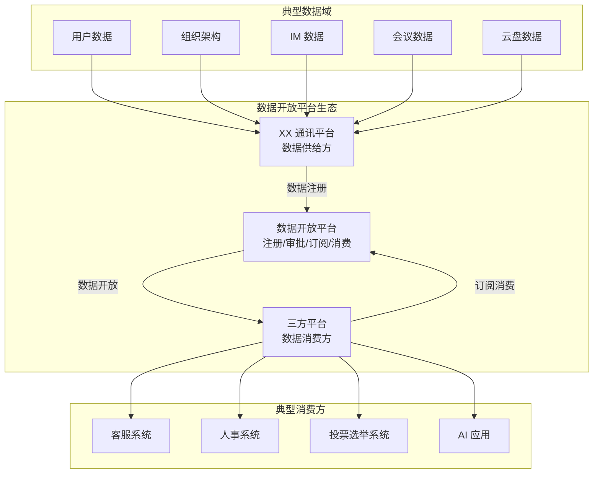
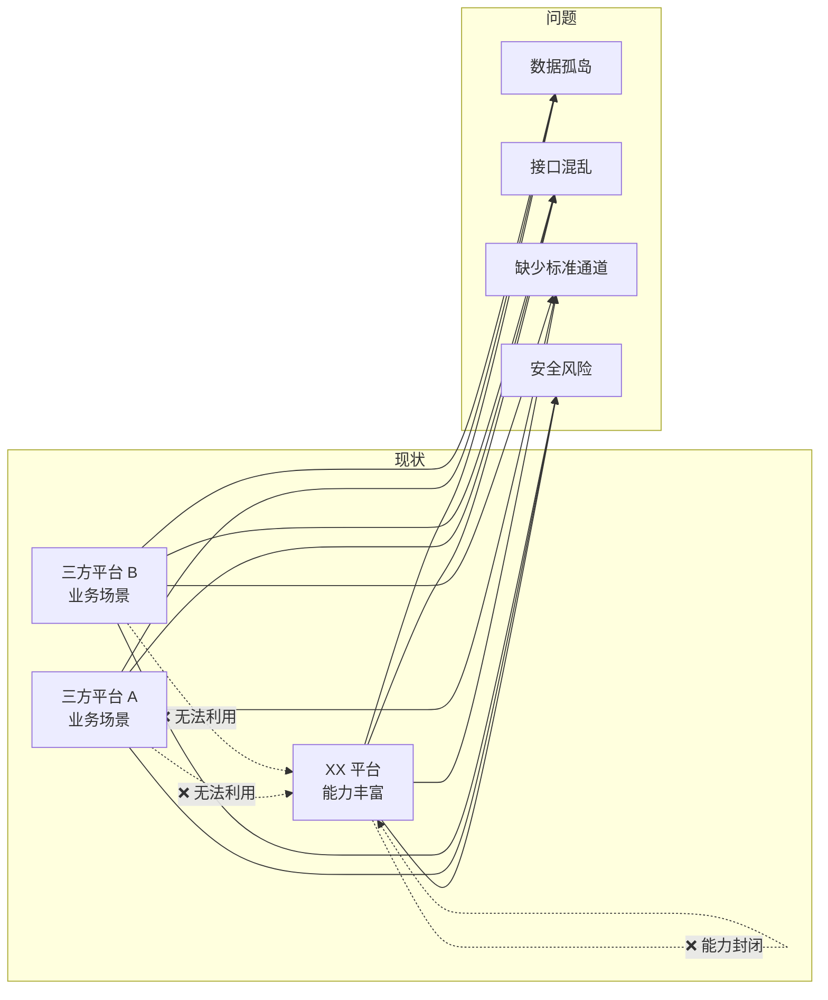
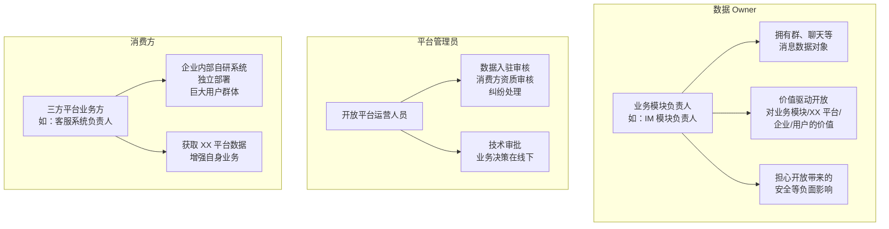
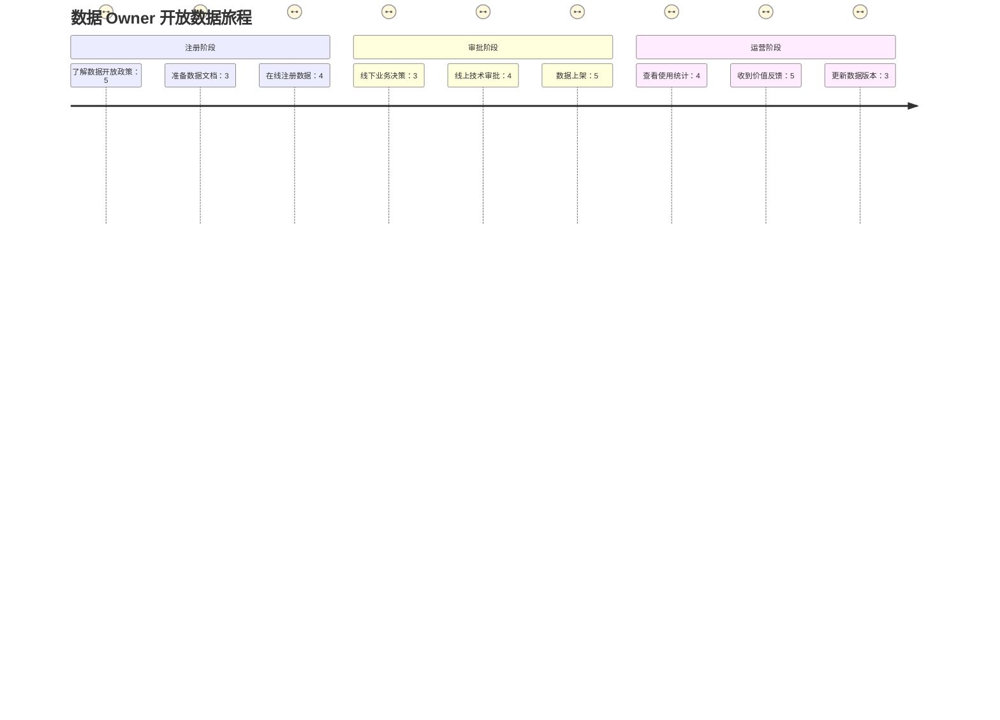
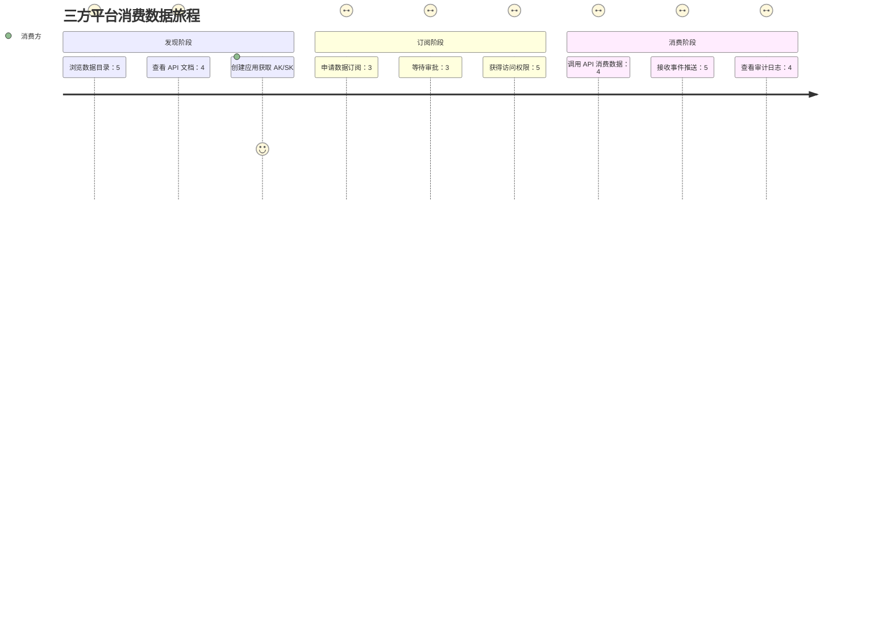
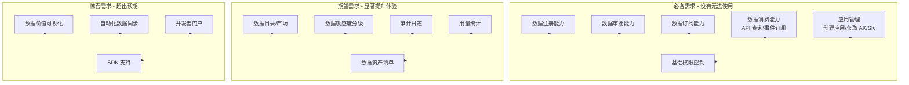
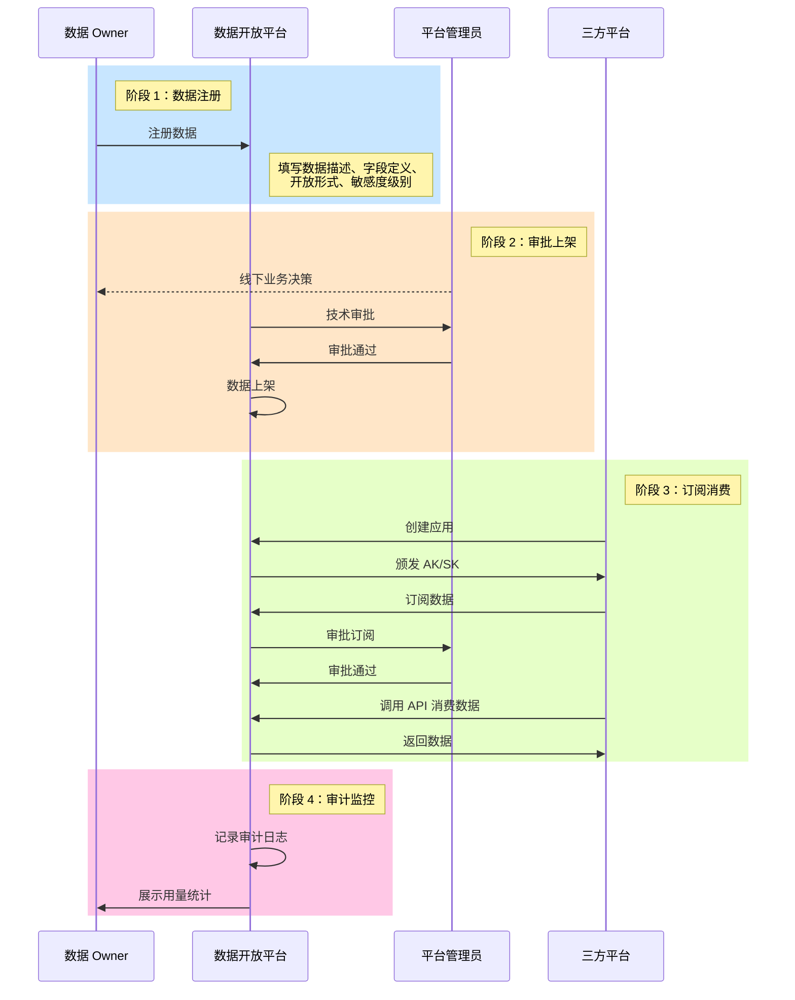
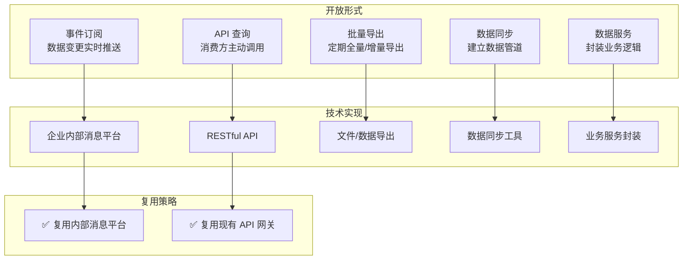
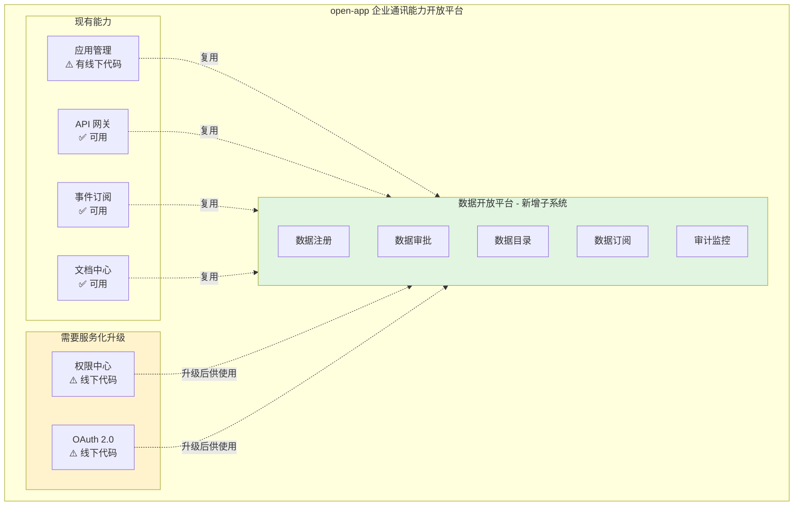
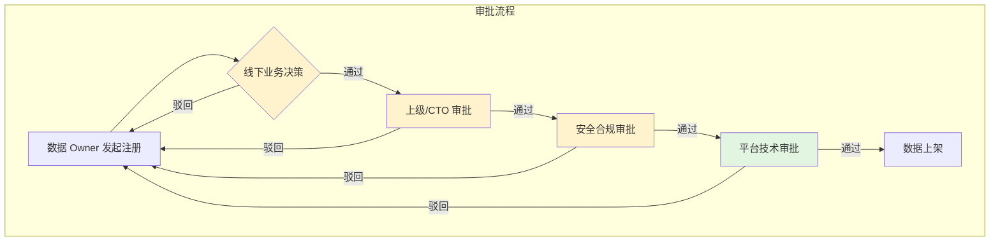

# 需求挖掘报告：数据开放平台

**报告 ID**: DISCOVERY-001  
**创建时间**: 2026-04-03  
**阶段**: 0.discovery（需求挖掘）  
**状态**: ✅ 已完成  
**会话 ID**: feature-session-001

---

## 一、执行摘要

### 1.1 核心定位

**数据开放平台**是 open-app 体系下的子平台，聚焦 XX 通讯平台的数据开放管理，将企业内部 XX 平台的数据开放给企业内部其它三方平台消费使用。

### 1.2 核心问题

| 维度 | 描述 |
|------|------|
| **核心痛点** | 能力封闭：XX 平台的数据和能力无法被企业内部其他三方平台有效利用 |
| **现状** | AI 大行其道，XX 平台 AI 能力薄弱；平台能力局限在内部使用；三方平台无法利用 XX 平台资源开展业务 |
| **目标** | 生态开放：让三方平台能利用 XX 平台资源开展业务，形成企业内部的能力生态 |
| **价值主张** | 提供标准统一的数据开放通道，解决数据孤岛和接口混乱问题 |

### 1.3 目标用户

| 角色 | 职责 | 诉求 |
|------|------|------|
| **数据 Owner** | 业务模块负责人 | 注册数据、生产数据；通过开放数据实现业务价值 |
| **开放平台管理员** | 平台运营人员 | 审批数据注册信息；确保数据符合平台规范 |
| **三方平台业务方** | 企业内部自研系统负责人 | 订阅数据、消费数据；利用 XX 平台数据增强自身业务 |

---

## 二、问题空间分析

### 2.1 现状痛点

| 痛点维度 | 具体描述 |
|---------|---------|
| **能力封闭** | XX 平台的能力多数局限在平台内部使用，外部无法获取 |
| **缺少标准通道** | 三方平台可能已经在消费数据，但是没有标准统一的通道（私下对接） |
| **数据资产不清** | XX 平台内部没有统一的地方定义数据敏感度，甚至没有数据对象清单 |
| **接入效率低** | 没有统一的数据开放平台，三方平台接入数据成本高 |

### 2.2 业务驱动

| 驱动因素 | 说明 |
|---------|------|
| **AI 趋势** | AI 大行其道，企业内有 AI 应用需求，需要获取 XX 平台数据 |
| **生态建设** | 希望通过数据开放吸引更多三方应用，形成企业内部生态 |
| **业务规划** | 企业数字化转型的基础设施建设 |

### 2.3 不做会怎样

| 影响维度 | 后果 |
|---------|------|
| **业务影响** | 三方平台无法利用 XX 平台资源开展新业务 |
| **效率影响** | 数据对接继续依赖私下对接，效率低、风险高 |
| **竞争影响** | 相比飞书/钉钉等竞品，企业通讯平台能力开放程度落后 |

---

## 三、用户画像与场景

### 3.1 用户画像

### 3.2 典型场景

| 场景编号 | 场景名称 | 描述 |
|---------|---------|------|
| **S1** | 数据 Owner 开放数据 | IM 模块负责人注册 IM 数据（群、聊天消息），经过审批后开放给客服系统使用 |
| **S2** | 三方平台订阅数据 | 客服系统浏览数据目录，订阅用户信息和 IM 消息数据，用于客服会话集成 |
| **S3** | AI 应用消费数据 | AI 助手应用通过标准 API 获取日程、会议数据，用于智能问答和推荐 |
| **S4** | 人事系统数据同步 | 人事系统订阅组织架构数据，用于员工信息同步、入职离职通知 |

### 3.3 用户旅程地图

---

## 四、需求分层与优先级

### 4.1 需求分层

### 4.2 需求清单

#### Must Have（必备）

| 需求编号 | 需求描述 | 验收标准 |
|---------|---------|---------|
| **MH-01** | 数据 Owner 能够注册数据 | 支持填写数据描述、字段定义、开放形式、敏感度级别 |
| **MH-02** | 平台管理员能够审批数据注册 | 支持审批通过/驳回，记录审批意见 |
| **MH-03** | 三方平台能够创建应用 | 创建应用后获取 AK/SK |
| **MH-04** | 三方平台能够订阅数据 | 选择数据后提交订阅申请 |
| **MH-05** | 三方平台能够通过 API 消费数据 | 使用 AK/SK 调用 API 获取数据 |
| **MH-06** | 支持事件订阅形式 | 数据变更时推送给订阅方 |
| **MH-07** | 基础权限控制 | 未授权应用无法访问数据 |

#### Should Have（期望）

| 需求编号 | 需求描述 | 验收标准 |
|---------|---------|---------|
| **SH-01** | 数据目录/市场 | 浏览可订阅的数据列表，支持搜索和分类 |
| **SH-02** | 数据敏感度分级 | 支持定义和管理数据敏感度级别 |
| **SH-03** | 审计日志 | 记录所有数据访问行为 |
| **SH-04** | 用量统计 | 展示数据被调用的次数、调用方等 |
| **SH-05** | 数据资产清单 | 统一记录 XX 平台有哪些数据对象 |

#### Could Have（惊喜）

| 需求编号 | 需求描述 | 验收标准 |
|---------|---------|---------|
| **CH-01** | 数据价值可视化 | 数据 Owner 能看到开放数据带来的业务价值 |
| **CH-02** | 自动化数据同步 | 支持配置数据管道，自动同步到消费方 |
| **CH-03** | 开发者门户 | 提供开发者文档、SDK 下载、示例代码 |
| **CH-04** | 多开放形式支持 | 支持批量导出、数据同步等形式 |

---

## 五、核心流程设计

### 5.1 数据开放消费全流程

### 5.2 数据开放形式

### 5.3 与现有 open-app 的关系

---

## 六、数据治理与合规

### 6.1 数据敏感度分级

| 级别 | 定义 | 典型数据示例 | 开放策略 |
|------|------|-------------|---------|
| **L1-公开** | 可对企业内所有用户公开 | 公司组织架构、部门名称 | 所有认证应用可访问 |
| **L2-内部** | 限于企业内部使用 | 用户基本信息、邮箱、电话 | 需要审批，限制使用场景 |
| **L3-敏感** | 涉及个人隐私或业务敏感 | 薪资、绩效、考勤记录 | 严格管控，仅限特定场景 |
| **L4-个人** | 个人私密数据 | 聊天记录、日程、私人文件 | 需要用户授权，或完全不开放 |
| **L5-机密** | 商业机密、战略信息 | 未公开的战略信息 | 不开放 |

> ⚠️ **注意**: 当前 XX 平台没有统一的数据敏感度定义，需要建立数据资产清单和分级标准。

### 6.2 审批机制

| 审批环节 | 审批内容 | 线上/线下 |
|---------|---------|----------|
| **业务决策** | 是否应该开放此数据 | 线下 |
| **上级/CTO 审批** | 业务价值评估 | 线下 |
| **安全合规审批** | 数据安全风险评估 | 线下 |
| **平台技术审批** | 数据是否符合平台规范 | 线上 |

### 6.3 权限控制

| 控制维度 | 说明 |
|---------|------|
| **应用级权限** | 三方平台需创建应用，获取 AK/SK |
| **数据级权限** | 不同敏感度数据有不同的访问权限 |
| **用户级权限** | 消费个人数据时可能需要用户 OAuth 授权 |
| **场景级权限** | 限制数据使用场景（如：仅限内部使用） |

---

## 七、竞品对标

### 7.1 飞书/钉钉对标分析

| 对标维度 | 飞书做法 | 钉钉做法 | 我们的借鉴 |
|---------|---------|---------|-----------|
| **数据目录** | API 文档中心，分类清晰 | API 文档中心，分类清晰 | ✅ 在现有 API 中心基础上增强 |
| **数据注册** | 开发者提交 API 申请 | ISV 提交应用审核 | ✅ 数据 Owner 在线注册 |
| **审批机制** | 平台审核 + 管理员授权 | 平台审核 + 管理员授权 | ✅ 线下业务决策 + 线上技术审批 |
| **权限粒度** | 细粒度权限控制 | 分级授权 | ✅ 支持数据敏感度分级 |
| **开放形式** | API + 事件订阅 + Webhook | API + 事件订阅 + Webhook | ✅ 支持多种形式 |
| **开发者体验** | 文档完善、SDK 支持好 | 文档完善、生态成熟 | ✅ 复用现有文档中心，增强 SDK |
| **计费模式** | 部分 API 收费 | 部分 API 收费 | ❌ 企业内部使用，不涉及计费 |

### 7.2 差异化定位

| 维度 | 飞书/钉钉 | 我们 |
|------|---------|------|
| **目标市场** | 公开市场，多企业 | 企业内部，单一企业 |
| **计费** | 部分收费 | 免费 |
| **部署** | 云端 SaaS | 企业内部部署 |
| **合规** | 通用合规 | 企业特定合规要求 |

---

## 八、成功标准

### 8.1 定性指标

| 角色 | 成功标准 |
|------|---------|
| **数据 Owner** | 开放数据更方便了，能收到价值反馈 |
| **三方平台** | 获取数据更容易了，接入成本降低了 |
| **平台方** | 数据更安全可控了，有完整的审计日志 |

### 8.2 定量指标（系统提供度量能力）

| 指标类型 | 可能的指标 | 说明 |
|---------|-----------|------|
| **规模指标** | 开放的数据接口数量、数据域数量 | 取决于运营推广力度 |
| **接入规模** | 订阅数据的三方平台数量 | 取决于运营推广力度 |
| **活跃指标** | 每天/每月 API 调用量 | 取决于运营推广力度 |
| **效率指标** | 三方平台接入数据的时间 | 从 X 天降低到 Y 天 |
| **治理指标** | 经过审批的数据开放比例 | 目标 100% |

> ⚠️ **注意**: 具体目标值取决于业务运营推广的投入力度，系统首先需要具备度量能力。

---

## 九、风险与假设

### 9.1 关键假设

| 假设 | 风险等级 | 验证方式 |
|------|---------|---------|
| 数据 Owner 有开放数据的意愿 | 中 | 试点项目验证 |
| 企业内部三方平台有使用 XX 平台数据的需求 | 低 | 已有私下对接案例 |
| 现有 open-app 代码可以服务化改造 | 中 | 技术评估 |
| 线下业务决策流程可以配合 | 中 | 与业务方沟通 |

### 9.2 潜在风险

| 风险 | 影响 | 缓解措施 |
|------|------|---------|
| 数据 Owner 担心数据安全责任 | 高 | 提供完善的权限控制和审计日志 |
| 数据分级标准难以统一 | 中 | 支持可配置的分级标准 |
| 服务化改造工作量大 | 中 | 分阶段实施，优先核心能力 |
| 业务决策流程复杂 | 中 | 明确线上/线下边界，平台聚焦技术审批 |

---

## 十、待调研事项

| 事项 | 说明 | 优先级 |
|------|------|--------|
| **消费方业务场景** | 三方平台具体想用数据做什么业务 | P1 |
| **当前替代方案** | 没有平台之前，三方平台如何获取数据 | P1 |
| **具体 AI 应用规划** | 企业内部是否有具体的 AI 应用需求 | P2 |
| **竞品深度调研** | 飞书/钉钉数据开放的具体流程细节 | P2 |
| **数据资产清单** | XX 平台内部有哪些数据对象 | P1 |

---

## 十一、下一步建议

### 11.1 进入规范编写阶段

运行 `@sdd-spec 数据开放平台` 进入规范编写阶段，产出：
- 产品需求文档（PRD）
- 用户故事地图
- 详细功能规格

### 11.2 并行业务调研

在规范编写阶段，建议同步进行：
- 访谈 2-3 个典型三方平台负责人，了解具体业务场景
- 梳理 XX 平台现有数据对象清单
- 深度调研飞书/钉钉的数据开放流程

### 11.3 技术预研

- 评估 open-app 现有代码的服务化改造方案
- 评估与内部消息平台的集成方案
- 设计数据敏感度分级和权限控制模型

---

## 附录

### A. 会话记录

完整对话记录见：`.specs/feature-session-001/session-log.md`

### B. 分析笔记

分析总结见：`.specs/feature-session-001/discovery-analysis.md`

### C. 参考资料

- 飞书&钉钉开放平台对比调研报告
- 飞书&钉钉数据开放能力对比调研报告
- 飞书&钉钉开放价值与维度对比调研报告
- open-app 业务架构文档

---

**报告状态**: ✅ 需求挖掘完成  
**下一步**: 运行 `@sdd-spec 数据开放平台` 开始规范编写

**最后更新**: 2026-04-03
